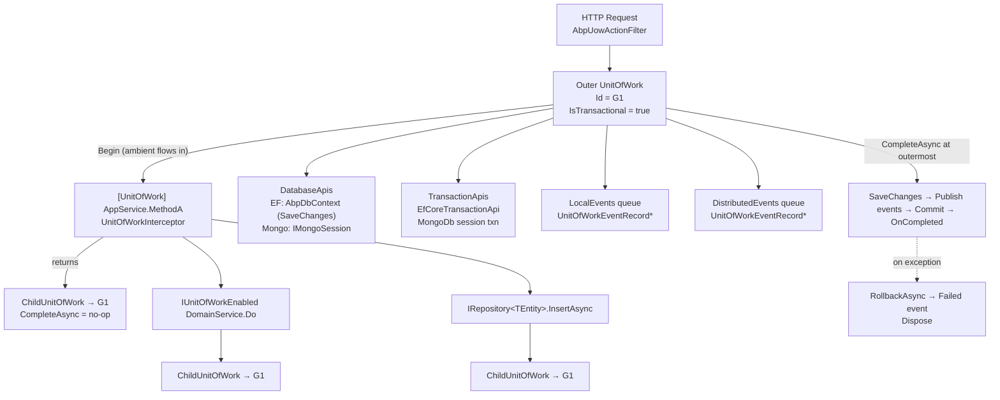

ABP's Unit of Work (UoW) is the framework-level scope that brackets every application-service call, controller action, and Razor Page handler into a single atomic operation. It is implemented by the `Volo.Abp.Uow` package and integrates with the [event bus](/events/overview), [repositories](/ddd/repositories), and the [data layer](/data/overview) so that database writes, local events, and distributed event records are flushed together when the UoW completes — or rolled back together when it fails.

This page introduces the moving parts: the `AbpUnitOfWorkModule`, the `UnitOfWorkAttribute` that declares UoW boundaries, the `AmbientUnitOfWork` that flows the current scope through `AsyncLocal<T>`, and the way ABP nests UoWs so an inner method participates in an outer transaction instead of starting its own.

## What the UoW does

An ABP UoW is a transient scope that owns:

- A set of **database APIs** (`IDatabaseApi`) — one per provider/connection — that batch `SaveChangesAsync` calls.
- A set of **transaction APIs** (`ITransactionApi`) — one per provider — that are committed or rolled back together.
- An ordered queue of **local events** and **distributed events** (`UnitOfWorkEventRecord`) that are only published when the UoW successfully completes.
- A bag of **completion handlers** (`OnCompleted(Func<Task>)`) that run after all events are flushed and transactions are committed.
- A typed **items dictionary** for ad-hoc per-scope state (see `UnitOfWorkExtensions.AddItem<T>`).

The defining file is `framework/src/Volo.Abp.Uow/Volo/Abp/Uow/IUnitOfWork.cs`:

```csharp title="framework/src/Volo.Abp.Uow/Volo/Abp/Uow/IUnitOfWork.cs"
public interface IUnitOfWork : IDatabaseApiContainer, ITransactionApiContainer, IDisposable
{
    Guid Id { get; }
    Dictionary<string, object> Items { get; }

    event EventHandler<UnitOfWorkFailedEventArgs> Failed;
    event EventHandler<UnitOfWorkEventArgs> Disposed;

    IAbpUnitOfWorkOptions Options { get; }
    IUnitOfWork? Outer { get; }

    bool IsReserved { get; }
    bool IsDisposed { get; }
    bool IsCompleted { get; }
    string? ReservationName { get; }

    void SetOuter(IUnitOfWork? outer);
    void Initialize(AbpUnitOfWorkOptions options);
    void Reserve(string reservationName);

    Task SaveChangesAsync(CancellationToken cancellationToken = default);
    Task CompleteAsync(CancellationToken cancellationToken = default);
    Task RollbackAsync(CancellationToken cancellationToken = default);

    void OnCompleted(Func<Task> handler);

    void AddOrReplaceLocalEvent(UnitOfWorkEventRecord eventRecord,
        Predicate<UnitOfWorkEventRecord>? replacementSelector = null);

    void AddOrReplaceDistributedEvent(UnitOfWorkEventRecord eventRecord,
        Predicate<UnitOfWorkEventRecord>? replacementSelector = null);
}
```

Every concrete UoW (the default `UnitOfWork` and the wrapping `ChildUnitOfWork`) implements this contract, and every collaborator — EF Core's `AbpDbContext`, MongoDB's session-backed repositories, the `LocalEventBus`, the `DistributedEventBus`, audit log savers — talks to it through this single interface.

## The `AbpUnitOfWorkModule`

`AbpUnitOfWorkModule` is the bootstrapping module. Its only responsibility is to register the dynamic-proxy interceptor that turns `[UnitOfWork]` (and `IUnitOfWorkEnabled`) into actual UoW scopes.

```csharp title="framework/src/Volo.Abp.Uow/Volo/Abp/Uow/AbpUnitOfWorkModule.cs"
public class AbpUnitOfWorkModule : AbpModule
{
    public override void PreConfigureServices(ServiceConfigurationContext context)
    {
        context.Services.OnRegistered(UnitOfWorkInterceptorRegistrar.RegisterIfNeeded);
    }
}
```

`UnitOfWorkInterceptorRegistrar.RegisterIfNeeded` attaches `UnitOfWorkInterceptor` to every service whose implementation type satisfies `UnitOfWorkHelper.IsUnitOfWorkType` — meaning the class, one of its methods, or one of its interfaces carries `[UnitOfWork]`, or it implements the marker interface `IUnitOfWorkEnabled`:

```csharp title="framework/src/Volo.Abp.Uow/Volo/Abp/Uow/UnitOfWorkInterceptorRegistrar.cs"
public static void RegisterIfNeeded(IOnServiceRegistredContext context)
{
    if (ShouldIntercept(context.ImplementationType))
    {
        context.Interceptors.TryAdd<UnitOfWorkInterceptor>();
    }
}

private static bool ShouldIntercept(Type type)
{
    return !DynamicProxyIgnoreTypes.Contains(type)
        && UnitOfWorkHelper.IsUnitOfWorkType(type.GetTypeInfo());
}
```

Application services, domain services, and repositories therefore become UoW-aware automatically. Controllers and Razor Pages are *not* intercepted; they use the MVC/Page filter (described below) instead, so the UoW lives for the entire HTTP request.

## `UnitOfWorkAttribute`

`UnitOfWorkAttribute` is the declarative way to mark a method (or a whole class/interface) as a unit of work and to tune its options.

```csharp title="framework/src/Volo.Abp.Uow/Volo/Abp/Uow/UnitOfWorkAttribute.cs"
[AttributeUsage(AttributeTargets.Method | AttributeTargets.Class | AttributeTargets.Interface)]
public class UnitOfWorkAttribute : Attribute
{
    public bool? IsTransactional { get; set; }
    public int? Timeout { get; set; }              // milliseconds
    public IsolationLevel? IsolationLevel { get; set; }
    public bool IsDisabled { get; set; }

    public UnitOfWorkAttribute() { }
    public UnitOfWorkAttribute(bool isTransactional) { ... }
    public UnitOfWorkAttribute(bool isTransactional, IsolationLevel isolationLevel) { ... }
    public UnitOfWorkAttribute(bool isTransactional, IsolationLevel isolationLevel, int timeout) { ... }

    public virtual void SetOptions(AbpUnitOfWorkOptions options)
    {
        if (IsTransactional.HasValue) options.IsTransactional = IsTransactional.Value;
        if (Timeout.HasValue) options.Timeout = Timeout;
        if (IsolationLevel.HasValue) options.IsolationLevel = IsolationLevel;
    }
}
```

The attribute's own XML doc emphasises a subtle but critical rule:

> *This attribute has no effect if there is already a unit of work before calling this method. It uses the ambient UOW in this case.*

Setting `IsTransactional = true` on a nested service call does **not** start a new transaction — it joins the outer UoW. To force a new top-level UoW, call `IUnitOfWorkManager.Begin(options, requiresNew: true)` directly.

`IsDisabled = true` short-circuits the interceptor entirely (the method runs without a new UoW, but a pre-existing ambient UoW remains intact). This is how `[UnitOfWork(IsDisabled = true)]` lets you opt a single method out of the automatic interception while keeping the surrounding `IUnitOfWorkEnabled` class behaviour.

## `IUnitOfWorkEnabled` — the conventional opt-in

Instead of writing `[UnitOfWork]` on every class, the framework treats the empty marker interface `IUnitOfWorkEnabled` as an opt-in:

```csharp title="framework/src/Volo.Abp.Uow/Volo/Abp/Uow/IUnitOfWorkEnabled.cs"
public interface IUnitOfWorkEnabled
{
}
```

ABP's `ApplicationService`, `DomainService`, and `IRepository` types implement (transitively) this interface, which is why their public methods are wrapped in a UoW with zero configuration. `UnitOfWorkHelper.IsUnitOfWorkType` checks for this interface as the conventional path:

```csharp title="framework/src/Volo.Abp.Uow/Volo/Abp/Uow/UnitOfWorkHelper.cs"
public static bool IsUnitOfWorkType(TypeInfo implementationType)
{
    if (HasUnitOfWorkAttribute(implementationType) ||
        AnyMethodHasUnitOfWorkAttribute(implementationType))
    {
        return true;
    }

    if (typeof(IUnitOfWorkEnabled).GetTypeInfo().IsAssignableFrom(implementationType))
    {
        return true;
    }

    return false;
}
```

## `AmbientUnitOfWork` — the AsyncLocal pattern

Every active UoW must be discoverable from arbitrary call sites (a repository deep inside a domain event handler, a saga step, a background job continuation). ABP solves this with `AmbientUnitOfWork`, an `AsyncLocal<IUnitOfWork?>` exposed as both `IAmbientUnitOfWork` and `IUnitOfWorkAccessor`:

```csharp title="framework/src/Volo.Abp.Uow/Volo/Abp/Uow/AmbientUnitOfWork.cs"
[ExposeServices(typeof(IAmbientUnitOfWork), typeof(IUnitOfWorkAccessor))]
public class AmbientUnitOfWork : IAmbientUnitOfWork, ISingletonDependency
{
    public IUnitOfWork? UnitOfWork => _currentUow.Value;

    private readonly AsyncLocal<IUnitOfWork?> _currentUow;

    public AmbientUnitOfWork()
    {
        _currentUow = new AsyncLocal<IUnitOfWork?>();
    }

    public void SetUnitOfWork(IUnitOfWork? unitOfWork)
    {
        _currentUow.Value = unitOfWork;
    }

    public IUnitOfWork? GetCurrentByChecking()
    {
        var uow = UnitOfWork;

        //Skip reserved unit of work
        while (uow != null && (uow.IsReserved || uow.IsDisposed || uow.IsCompleted))
        {
            uow = uow.Outer;
        }

        return uow;
    }
}
```

Two implementation details matter:

1. **`AsyncLocal<T>` semantics** — the current UoW flows across `await` boundaries and into spawned `Task`s, exactly like .NET's logical call context. It is *not* a thread-local: parallel tasks each see the value captured at fork time.
2. **`GetCurrentByChecking()` skips reserved/disposed/completed UoWs** — when an ASP.NET filter reserves a UoW that has not yet been initialized, application code calling `_uowManager.Current` should not see the reservation; it should fall through to the outer real UoW (or null).

`IUnitOfWorkManager.Current` is implemented as a thin wrapper over this method:

```csharp title="framework/src/Volo.Abp.Uow/Volo/Abp/Uow/UnitOfWorkManager.cs"
public IUnitOfWork? Current => _ambientUnitOfWork.GetCurrentByChecking();
```

## Nested UoWs: outer, inner, and `ChildUnitOfWork`

When a UoW is already active and another `[UnitOfWork]` method is called, `UnitOfWorkManager.Begin` does *not* create a new UoW. It returns a `ChildUnitOfWork` that delegates every operation to the outer one — except `CompleteAsync`, which becomes a no-op:

```csharp title="framework/src/Volo.Abp.Uow/Volo/Abp/Uow/UnitOfWorkManager.cs"
public IUnitOfWork Begin(AbpUnitOfWorkOptions options, bool requiresNew = false)
{
    Check.NotNull(options, nameof(options));

    var currentUow = Current;
    if (currentUow != null && !requiresNew)
    {
        return new ChildUnitOfWork(currentUow);
    }

    var unitOfWork = CreateNewUnitOfWork();
    unitOfWork.Initialize(options);

    return unitOfWork;
}
```

```csharp title="framework/src/Volo.Abp.Uow/Volo/Abp/Uow/ChildUnitOfWork.cs"
public Task CompleteAsync(CancellationToken cancellationToken = default)
{
    return Task.CompletedTask;
}
```

The result is a single physical transaction with multiple logical "complete" calls. Only the outermost UoW actually commits — see [Transactions & SaveChanges](/uow/transactions-and-savechanges) for the commit/rollback sequence.

### Tree of UoWs and transactions



The outer UoW holds all the real state. Every child is just a façade that:

- Returns the outer's `Id`, `Options`, `Outer`, `IsReserved`, `IsDisposed`, `IsCompleted`, and `ServiceProvider`.
- Forwards `SaveChangesAsync`, `RollbackAsync`, `OnCompleted`, event-record additions, and the `IDatabaseApi`/`ITransactionApi` containers.
- Suppresses `CompleteAsync` and its own `Dispose` so the outermost using-block remains the single point of commit and disposal.

## Where the outermost UoW comes from

In a normal ABP web request, the *outermost* UoW is created by the MVC action filter (or the Razor Pages filter) — not by the application service interceptor. The filter pre-creates a reserved UoW under the well-known name `UnitOfWork.UnitOfWorkReservationName = "_AbpActionUnitOfWork"`, and the service-level interceptor later "joins" it via `TryBeginReserved`:

```csharp title="framework/src/Volo.Abp.AspNetCore.Mvc/Volo/Abp/AspNetCore/Mvc/Uow/AbpUowActionFilter.cs"
//Trying to begin a reserved UOW by AbpUnitOfWorkMiddleware
if (unitOfWorkManager.TryBeginReserved(UnitOfWork.UnitOfWorkReservationName, options))
{
    var result = await next();
    if (Succeed(result))
    {
        await SaveChangesAsync(context, unitOfWorkManager);
    }
    else
    {
        await RollbackAsync(context, unitOfWorkManager);
    }

    return;
}

using (var uow = unitOfWorkManager.Begin(options))
{
    var result = await next();
    if (Succeed(result))
    {
        await uow.CompleteAsync(context.HttpContext.RequestAborted);
    }
    else
    {
        await uow.RollbackAsync(context.HttpContext.RequestAborted);
    }
}
```

The same pattern appears in `AbpUowPageFilter`. Outside of ASP.NET, background workers, console hosts, and tests typically open a UoW directly:

```csharp
using (var uow = _uowManager.Begin(requiresNew: true, isTransactional: true))
{
    // ... work ...
    await uow.CompleteAsync();
}
```

## File map: `Volo.Abp.Uow`

| File | Role |
| --- | --- |
| `AbpUnitOfWorkModule.cs` | Bootstraps the UoW interceptor via `OnRegistered`. |
| `AbpUnitOfWorkDefaultOptions.cs` | Global defaults (`TransactionBehavior`, `IsolationLevel`, `Timeout`). |
| `AbpUnitOfWorkOptions.cs` / `IAbpUnitOfWorkOptions.cs` | Per-UoW options (mutable / read-only views). |
| `UnitOfWorkTransactionBehavior.cs` | `Auto` / `Enabled` / `Disabled` enum. |
| `UnitOfWorkAttribute.cs` | Method/class attribute declaring a UoW boundary. |
| `IUnitOfWorkEnabled.cs` | Marker interface for conventional UoW types. |
| `IUnitOfWork.cs` / `UnitOfWork.cs` | Core contract + default implementation. |
| `ChildUnitOfWork.cs` | Façade returned for nested `Begin` calls. |
| `IUnitOfWorkManager.cs` / `UnitOfWorkManager.cs` | Begin/Reserve/Current API. |
| `AlwaysDisableTransactionsUnitOfWorkManager.cs` | Decorator forcing `IsTransactional = false`. |
| `IAmbientUnitOfWork.cs` / `AmbientUnitOfWork.cs` | `AsyncLocal<IUnitOfWork?>` ambient context. |
| `IUnitOfWorkAccessor.cs` | Get/set abstraction for the ambient slot. |
| `IUnitOfWorkManagerAccessor.cs` | Helper for components that need the manager. |
| `IDatabaseApi.cs` / `IDatabaseApiContainer.cs` | Per-provider session abstraction. |
| `ITransactionApi.cs` / `ITransactionApiContainer.cs` | Per-provider transaction abstraction. |
| `ISupportsSavingChanges.cs` | DB-API capability surfaced during `SaveChangesAsync`. |
| `ISupportsRollback.cs` | Capability used during `RollbackAsync`. |
| `IUnitOfWorkEventPublisher.cs` / `NullUnitOfWorkEventPublisher.cs` | Event-flush contract + no-op default. |
| `UnitOfWorkEventArgs.cs` / `UnitOfWorkFailedEventArgs.cs` | Event payloads for `Disposed` / `Failed`. |
| `UnitOfWorkEventRecord.cs` | Queued event entry (`EventType`, `EventData`, `EventOrder`, `UseOutbox`). |
| `EventOrderGenerator.cs` | Monotonic `Interlocked.Increment` order tag. |
| `IUnitOfWorkTransactionBehaviourProvider.cs` / `NullUnitOfWorkTransactionBehaviourProvider.cs` | Hook to override `Auto` behaviour per context. |
| `UnitOfWorkInterceptor.cs` | Castle interceptor that wraps `[UnitOfWork]` / `IUnitOfWorkEnabled` calls. |
| `UnitOfWorkInterceptorRegistrar.cs` | `OnRegistered` callback that attaches the interceptor. |
| `UnitOfWorkHelper.cs` | Reflection helpers for the attribute and marker interface. |
| `UnitOfWorkExtensions.cs` | `IsReservedFor`, `AddItem`, `GetItemOrDefault`, `GetOrAddItem`, `RemoveItem`. |
| `UnitOfWorkManagerExtensions.cs` | `Begin(requiresNew, isTransactional, isolationLevel, timeout)` sugar. |
| `UnitOfWorkCollectionExtensions.cs` | `AddAlwaysDisableUnitOfWorkTransaction()` DI helper. |

## The interceptor in one screen

```csharp title="framework/src/Volo.Abp.Uow/Volo/Abp/Uow/UnitOfWorkInterceptor.cs"
public override async Task InterceptAsync(IAbpMethodInvocation invocation)
{
    if (!UnitOfWorkHelper.IsUnitOfWorkMethod(invocation.Method, out var unitOfWorkAttribute))
    {
        await invocation.ProceedAsync();
        return;
    }

    using (var scope = _serviceScopeFactory.CreateScope())
    {
        var options = CreateOptions(scope.ServiceProvider, invocation, unitOfWorkAttribute);

        var unitOfWorkManager = scope.ServiceProvider.GetRequiredService<IUnitOfWorkManager>();

        //Trying to begin a reserved UOW by AbpUnitOfWorkMiddleware
        if (unitOfWorkManager.TryBeginReserved(UnitOfWork.UnitOfWorkReservationName, options))
        {
            await invocation.ProceedAsync();

            if (unitOfWorkManager.Current != null)
            {
                await unitOfWorkManager.Current.SaveChangesAsync();
            }

            return;
        }

        using (var uow = unitOfWorkManager.Begin(options))
        {
            await invocation.ProceedAsync();
            await uow.CompleteAsync();
        }
    }
}
```

Key observations:

- Each interception opens its **own DI scope** via `IServiceScopeFactory`. The resolved `IUnitOfWork` (registered as `ITransientDependency`) lives only as long as that scope.
- `CreateOptions` reads `UnitOfWorkAttribute` first, then falls back to `AbpUnitOfWorkDefaultOptions.CalculateIsTransactional` with an `autoValue` derived from `IUnitOfWorkTransactionBehaviourProvider.IsTransactional` or — as a last resort — the heuristic `!method.Name.StartsWith("Get", InvariantCultureIgnoreCase)`.
- When a reserved UoW is in flight (the MVC filter case), the interceptor *joins* it and only calls `SaveChangesAsync` — the filter remains responsible for `CompleteAsync` / `RollbackAsync`.
- Otherwise it opens a fresh UoW, runs the method, and calls `CompleteAsync` in the `using` scope.

## Auto-transactionality (the `Auto` rule)

`UnitOfWorkTransactionBehavior` resolves whether a UoW is transactional when the attribute does not say:

```csharp title="framework/src/Volo.Abp.Uow/Volo/Abp/Uow/UnitOfWorkTransactionBehavior.cs"
public enum UnitOfWorkTransactionBehavior
{
    Auto,
    Enabled,
    Disabled
}
```

```csharp title="framework/src/Volo.Abp.Uow/Volo/Abp/Uow/AbpUnitOfWorkDefaultOptions.cs"
public bool CalculateIsTransactional(bool autoValue)
{
    switch (TransactionBehavior)
    {
        case UnitOfWorkTransactionBehavior.Enabled:  return true;
        case UnitOfWorkTransactionBehavior.Disabled: return false;
        case UnitOfWorkTransactionBehavior.Auto:     return autoValue;
        default:
            throw new AbpException("Not implemented TransactionBehavior value: " + TransactionBehavior);
    }
}
```

Concrete `autoValue` sources:

- **Interceptor:** `!method.Name.StartsWith("Get", ...)` — i.e. `Get*` methods default to non-transactional, write methods to transactional.
- **MVC filter / Page filter:** `!HttpContext.Request.Method == GET` — non-GET requests get a transaction.

You can override the rule globally:

```csharp
Configure<AbpUnitOfWorkDefaultOptions>(options =>
{
    options.TransactionBehavior = UnitOfWorkTransactionBehavior.Disabled;
    options.IsolationLevel = IsolationLevel.ReadCommitted;
    options.Timeout = 30_000;
});
```

…or per-tenant/per-scenario via a custom `IUnitOfWorkTransactionBehaviourProvider`. To turn transactions off framework-wide (for example, in distributed test fixtures), call:

```csharp title="framework/src/Volo.Abp.Uow/Volo/Abp/Uow/UnitOfWorkCollectionExtensions.cs"
public static IServiceCollection AddAlwaysDisableUnitOfWorkTransaction(this IServiceCollection services)
{
    return services.Replace(ServiceDescriptor.Singleton<IUnitOfWorkManager,
        AlwaysDisableTransactionsUnitOfWorkManager>());
}
```

`AlwaysDisableTransactionsUnitOfWorkManager` is a decorator that delegates to the real `UnitOfWorkManager` but mutates `options.IsTransactional = false` on every `Begin` / `BeginReserved` / `TryBeginReserved` call.

## What lives on a UoW vs. what doesn't

<Note>
The UoW is the lifetime owner for *database-side* work and *event* publication. It is not a general-purpose ambient transaction over arbitrary side-effects. Outbound HTTP calls, file writes, and external queues are not enrolled — use [outbox/distributed events](/events/distributed-event-bus) for cross-system atomicity.
</Note>

| Owned by the UoW | Not owned |
| --- | --- |
| Per-provider `IDatabaseApi` sessions (EF DbContext, Mongo session) | Outbound HTTP calls via `HttpClient` |
| Per-provider `ITransactionApi` (DB transaction, Mongo session txn) | File system writes |
| Queued local + distributed event records | Direct calls to external message brokers (use the distributed event bus instead) |
| `OnCompleted` post-commit handlers | Background job *execution* (the *enqueue* call uses the UoW) |
| `Items` per-scope dictionary | Cache writes (the cache module integrates separately) |

## Where to go next

<CardGroup cols={2}>
  <Card title="UnitOfWorkManager API" icon="boxes-stacked" href="/uow/unit-of-work-manager">
    The full surface area of `IUnitOfWorkManager`, `AbpUnitOfWorkOptions`, and reserved UoWs.
  </Card>
  <Card title="SaveChanges & transactions" icon="database" href="/uow/transactions-and-savechanges">
    How `SaveChangesAsync`, `ITransactionApi`, and child UoWs flush and commit.
  </Card>
  <Card title="Event publisher integration" icon="paper-plane" href="/uow/event-publisher-integration">
    How `UnitOfWorkEventPublisher` flushes queued local & distributed events on completion.
  </Card>
  <Card title="Repositories" icon="layer-group" href="/ddd/repositories">
    How `IRepository<T>` participates in the ambient UoW via `IDatabaseApi`.
  </Card>
</CardGroup>
