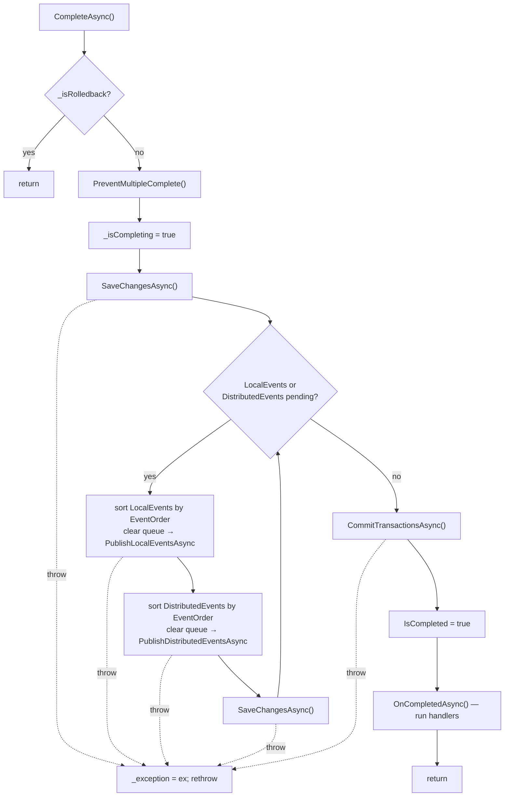
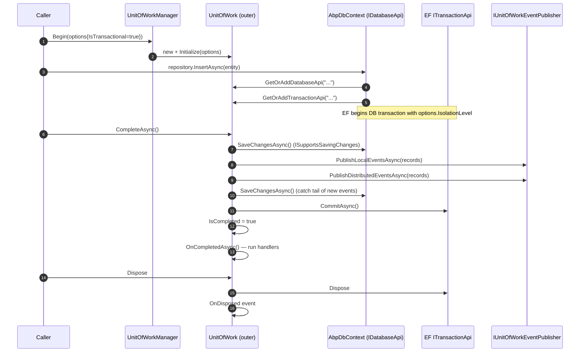

When an ABP application service finishes, a chain of well-defined steps pushes pending changes to every enrolled data source, flushes queued events, commits every transaction, and runs post-commit handlers — all under the same atomicity guarantees. This page documents that sequence as it actually runs in `Volo.Abp.Uow.UnitOfWork`, the role of `ITransactionApi` and `IDatabaseApi`, the contract between outer and child UoWs, and how rollback unwinds the same chain.

For higher-level context, see the [UoW overview](/uow/overview) and [`IUnitOfWorkManager` API](/uow/unit-of-work-manager).

## The two containers a UoW owns

Every `IUnitOfWork` is both an `IDatabaseApiContainer` and an `ITransactionApiContainer`. The first tracks per-provider *sessions* (e.g. an EF Core `AbpDbContext`, a MongoDB session); the second tracks per-provider *transactions*.

```csharp title="framework/src/Volo.Abp.Uow/Volo/Abp/Uow/IDatabaseApiContainer.cs"
public interface IDatabaseApiContainer : IServiceProviderAccessor
{
    IDatabaseApi? FindDatabaseApi([NotNull] string key);
    void AddDatabaseApi([NotNull] string key, [NotNull] IDatabaseApi api);
    [NotNull] IDatabaseApi GetOrAddDatabaseApi([NotNull] string key, [NotNull] Func<IDatabaseApi> factory);
}
```

```csharp title="framework/src/Volo.Abp.Uow/Volo/Abp/Uow/ITransactionApiContainer.cs"
public interface ITransactionApiContainer
{
    ITransactionApi? FindTransactionApi([NotNull] string key);
    void AddTransactionApi([NotNull] string key, [NotNull] ITransactionApi api);
    [NotNull] ITransactionApi GetOrAddTransactionApi([NotNull] string key, [NotNull] Func<ITransactionApi> factory);
}
```

The keys are provider-specific strings (the EF integration uses the connection-string identifier; the Mongo integration uses the database name). Each provider integration calls `GetOrAdd*Api` lazily, so a UoW that never touches Mongo never allocates a Mongo session.

### The marker `IDatabaseApi`

`IDatabaseApi` itself is an empty marker:

```csharp title="framework/src/Volo.Abp.Uow/Volo/Abp/Uow/IDatabaseApi.cs"
public interface IDatabaseApi
{
}
```

It becomes interesting through *capability interfaces*:

```csharp title="framework/src/Volo.Abp.Uow/Volo/Abp/Uow/ISupportsSavingChanges.cs"
public interface ISupportsSavingChanges
{
    Task SaveChangesAsync(CancellationToken cancellationToken = default);
}
```

```csharp title="framework/src/Volo.Abp.Uow/Volo/Abp/Uow/ISupportsRollback.cs"
public interface ISupportsRollback
{
    Task RollbackAsync(CancellationToken cancellationToken = default);
}
```

A provider integration implements `IDatabaseApi` plus whichever capabilities it supports. EF Core's wrapper implements both. A read-only or no-op provider can implement just the marker.

### `ITransactionApi`

```csharp title="framework/src/Volo.Abp.Uow/Volo/Abp/Uow/ITransactionApi.cs"
public interface ITransactionApi : IDisposable
{
    Task CommitAsync(CancellationToken cancellationToken = default);
}
```

A transaction API only has to commit and dispose; rollback is optional and surfaced through `ISupportsRollback`. (`Dispose` on a transaction that has not been committed is what most providers translate into a rollback at the storage layer, but the explicit `RollbackAsync` is what ABP calls when failure is detected.)

## `SaveChangesAsync` — the per-step flush

`UnitOfWork.SaveChangesAsync` walks every active database API and invokes `ISupportsSavingChanges.SaveChangesAsync` on the ones that support it:

```csharp title="framework/src/Volo.Abp.Uow/Volo/Abp/Uow/UnitOfWork.cs"
public virtual async Task SaveChangesAsync(CancellationToken cancellationToken = default)
{
    if (_isRolledback)
    {
        return;
    }

    foreach (var databaseApi in GetAllActiveDatabaseApis())
    {
        if (databaseApi is ISupportsSavingChanges supportsSavingChangesDatabaseApi)
        {
            await supportsSavingChangesDatabaseApi.SaveChangesAsync(cancellationToken);
        }
    }
}
```

`GetAllActiveDatabaseApis()` returns an immutable snapshot so adding new APIs during a save (e.g. when a domain event handler triggers a lazy DbContext) is safe:

```csharp title="framework/src/Volo.Abp.Uow/Volo/Abp/Uow/UnitOfWork.cs"
public virtual IReadOnlyList<IDatabaseApi> GetAllActiveDatabaseApis()
{
    return _databaseApis.Values.ToImmutableList();
}
```

### Important: `SaveChangesAsync` does *not* commit

Calling `SaveChangesAsync` on a transactional UoW does *not* commit the transaction. It only flushes the in-memory change tracker(s) to the database server **inside the open transaction**. The transaction is only committed when `CompleteAsync` runs to completion — see below.

This is why ASP.NET filters can call `currentUow.SaveChangesAsync()` between actions without prematurely committing: the work becomes durable only when the outermost `CompleteAsync` succeeds.

## `CompleteAsync` — the outermost commit

`CompleteAsync` is the orchestration method that gathers everything together. It runs only on the *outermost* UoW (because `ChildUnitOfWork.CompleteAsync` is a no-op — see below). The full body:

```csharp title="framework/src/Volo.Abp.Uow/Volo/Abp/Uow/UnitOfWork.cs"
public virtual async Task CompleteAsync(CancellationToken cancellationToken = default)
{
    if (_isRolledback)
    {
        return;
    }

    PreventMultipleComplete();

    try
    {
        _isCompleting = true;
        await SaveChangesAsync(cancellationToken);

        while (LocalEvents.Any() || DistributedEvents.Any())
        {
            if (LocalEvents.Any())
            {
                var localEventsToBePublished = LocalEvents.OrderBy(e => e.EventOrder).ToArray();
                LocalEvents.Clear();
                await UnitOfWorkEventPublisher.PublishLocalEventsAsync(
                    localEventsToBePublished
                );
            }

            if (DistributedEvents.Any())
            {
                var distributedEventsToBePublished = DistributedEvents.OrderBy(e => e.EventOrder).ToArray();
                DistributedEvents.Clear();
                await UnitOfWorkEventPublisher.PublishDistributedEventsAsync(
                    distributedEventsToBePublished
                );
            }

            await SaveChangesAsync(cancellationToken);
        }

        await CommitTransactionsAsync(cancellationToken);
        IsCompleted = true;
        await OnCompletedAsync();
    }
    catch (Exception ex)
    {
        _exception = ex;
        throw;
    }
}
```

### Step-by-step



Three things worth pulling out:

1. **The save/publish loop.** `SaveChangesAsync` may queue new events (for example, EF Core's `DistributedEntityChangeTrackerHelper` inspects the change tracker). Those new events have a higher `EventOrder` (via `EventOrderGenerator.GetNext`) and are emitted on the next iteration, which may in turn cause more saves. The loop terminates when both queues are empty after the latest publish round.
2. **`CommitTransactionsAsync` runs once.** The transaction APIs are committed only after every event has been published and every subsequent save has succeeded — guaranteeing that an event-handler exception aborts the entire UoW.
3. **`OnCompletedAsync` is post-commit.** Handlers registered with `OnCompleted(Func<Task>)` run *after* the transaction commits. They are the right place to fire side-effects that must not be undone if the transaction rolls back (clearing distributed locks, refreshing caches, emitting telemetry).

### Commit all transactions

```csharp title="framework/src/Volo.Abp.Uow/Volo/Abp/Uow/UnitOfWork.cs"
protected virtual async Task CommitTransactionsAsync(CancellationToken cancellationToken)
{
    foreach (var transaction in GetAllActiveTransactionApis())
    {
        await transaction.CommitAsync(cancellationToken);
    }
}
```

The commit order is the order in which providers were enlisted. There is **no two-phase commit** — each `ITransactionApi.CommitAsync` is independent. If the first commit succeeds and the second throws, you are left in a partially-committed state. This is the classic distributed-transaction trade-off; for cross-DB atomicity, use the [distributed event bus + outbox](/events/distributed-event-bus) rather than relying on multi-provider UoWs.

### Post-commit handlers

```csharp title="framework/src/Volo.Abp.Uow/Volo/Abp/Uow/UnitOfWork.cs"
public virtual void OnCompleted(Func<Task> handler)
{
    CompletedHandlers.Add(handler);
}

protected virtual async Task OnCompletedAsync()
{
    foreach (var handler in CompletedHandlers)
    {
        await handler.Invoke();
    }
}
```

Handlers run sequentially in registration order. An exception from a handler propagates out of `CompleteAsync` (the UoW is already `IsCompleted = true` at this point, so `Dispose` will not fire the `Failed` event).

## `RollbackAsync` and failure handling

```csharp title="framework/src/Volo.Abp.Uow/Volo/Abp/Uow/UnitOfWork.cs"
public virtual async Task RollbackAsync(CancellationToken cancellationToken = default)
{
    if (_isRolledback)
    {
        return;
    }

    _isRolledback = true;

    await RollbackAllAsync(cancellationToken);
}

protected virtual async Task RollbackAllAsync(CancellationToken cancellationToken)
{
    foreach (var databaseApi in GetAllActiveDatabaseApis())
    {
        if (databaseApi is ISupportsRollback supportsRollbackDatabaseApi)
        {
            try   { await supportsRollbackDatabaseApi.RollbackAsync(cancellationToken); }
            catch { }
        }
    }

    foreach (var transactionApi in GetAllActiveTransactionApis())
    {
        if (transactionApi is ISupportsRollback supportsRollbackTransactionApi)
        {
            try   { await supportsRollbackTransactionApi.RollbackAsync(cancellationToken); }
            catch { }
        }
    }
}
```

Once `_isRolledback` is set, subsequent calls to `SaveChangesAsync` and `CompleteAsync` short-circuit and return immediately — the UoW is sealed.

Note that exceptions during rollback are **swallowed**: the framework does not want a secondary rollback failure to mask the original error. The `Failed` event (raised from `Dispose`) carries both the original exception and the `IsRolledback` flag:

```csharp title="framework/src/Volo.Abp.Uow/Volo/Abp/Uow/UnitOfWork.cs"
public virtual void Dispose()
{
    if (IsDisposed) return;

    IsDisposed = true;

    DisposeTransactions();

    if (!IsCompleted || _exception != null)
    {
        OnFailed();
    }

    OnDisposed();
}

private void DisposeTransactions()
{
    foreach (var transactionApi in GetAllActiveTransactionApis())
    {
        try   { transactionApi.Dispose(); }
        catch { }
    }
}
```

`OnFailed` fires `Failed` with a `UnitOfWorkFailedEventArgs`:

```csharp title="framework/src/Volo.Abp.Uow/Volo/Abp/Uow/UnitOfWorkFailedEventArgs.cs"
public class UnitOfWorkFailedEventArgs : UnitOfWorkEventArgs
{
    public Exception? Exception { get; }
    public bool IsRolledback { get; }

    public UnitOfWorkFailedEventArgs(IUnitOfWork unitOfWork, Exception? exception, bool isRolledback)
        : base(unitOfWork)
    {
        Exception = exception;
        IsRolledback = isRolledback;
    }
}
```

`Disposed` fires unconditionally afterwards. Listeners that need to react to UoW termination (e.g. clearing scoped caches) should hook `Disposed`; listeners that only care about failure should hook `Failed`.

## Child UoWs: every operation is a passthrough — except completion

`ChildUnitOfWork` is the façade returned by `UnitOfWorkManager.Begin` when there is already an ambient UoW and `requiresNew == false`. Every member except `CompleteAsync` and `Dispose` forwards to the parent:

```csharp title="framework/src/Volo.Abp.Uow/Volo/Abp/Uow/ChildUnitOfWork.cs"
internal class ChildUnitOfWork : IUnitOfWork
{
    public Guid Id => _parent.Id;
    public IAbpUnitOfWorkOptions Options => _parent.Options;
    public IUnitOfWork? Outer => _parent.Outer;
    public bool IsReserved => _parent.IsReserved;
    public bool IsDisposed => _parent.IsDisposed;
    public bool IsCompleted => _parent.IsCompleted;
    public string? ReservationName => _parent.ReservationName;

    public Task SaveChangesAsync(CancellationToken cancellationToken = default)
        => _parent.SaveChangesAsync(cancellationToken);

    public Task CompleteAsync(CancellationToken cancellationToken = default)
        => Task.CompletedTask;          // <-- the only suppression

    public Task RollbackAsync(CancellationToken cancellationToken = default)
        => _parent.RollbackAsync(cancellationToken);

    public void OnCompleted(Func<Task> handler)         => _parent.OnCompleted(handler);
    public void AddOrReplaceLocalEvent(...)             => _parent.AddOrReplaceLocalEvent(...);
    public void AddOrReplaceDistributedEvent(...)       => _parent.AddOrReplaceDistributedEvent(...);
    public IDatabaseApi? FindDatabaseApi(string key)    => _parent.FindDatabaseApi(key);
    public void AddDatabaseApi(...)                     => _parent.AddDatabaseApi(...);
    public IDatabaseApi GetOrAddDatabaseApi(...)        => _parent.GetOrAddDatabaseApi(...);
    public ITransactionApi? FindTransactionApi(...)     => _parent.FindTransactionApi(...);
    public void AddTransactionApi(...)                  => _parent.AddTransactionApi(...);
    public ITransactionApi GetOrAddTransactionApi(...)  => _parent.GetOrAddTransactionApi(...);

    public void Dispose() { }
}
```

The two non-forwarded members produce the *outermost-commits-everything* invariant:

- **`CompleteAsync` is a no-op.** Inner code can write `await uow.CompleteAsync()` after its work, and the parent's transaction is untouched.
- **`Dispose` is a no-op.** The `using` block around a child UoW does not dispose the parent, so the ambient slot stays valid until the *real* outermost block exits.

Notice that `SaveChangesAsync` and `RollbackAsync` *do* forward. That means:

- An inner method can call `uow.SaveChangesAsync()` (or rely on the interceptor's call) to materialize identity columns and FK constraints mid-transaction.
- Any inner `uow.RollbackAsync()` rolls back the *whole* outer transaction — every method participating in the same UoW shares its fate.

Event forwarding via `AddOrReplaceLocalEvent` / `AddOrReplaceDistributedEvent` means a domain entity emitting an event from inside a nested call still queues it on the outer UoW, so the event order and the "publish-on-complete" semantics hold across the entire call chain. See [event publisher integration](/uow/event-publisher-integration).

### `Failed` and `Disposed` propagation

The child UoW *does* propagate the parent's events:

```csharp title="framework/src/Volo.Abp.Uow/Volo/Abp/Uow/ChildUnitOfWork.cs"
public ChildUnitOfWork([NotNull] IUnitOfWork parent)
{
    Check.NotNull(parent, nameof(parent));

    _parent = parent;

    _parent.Failed += (sender, args) => { Failed.InvokeSafely(sender!, args); };
    _parent.Disposed += (sender, args) => { Disposed.InvokeSafely(sender!, args); };
}
```

So a subscriber that attaches to the child sees the parent's lifecycle events; subscribers should still take care to subscribe only once.

## Where transactions get enrolled

The `Volo.Abp.Uow` package itself doesn't open any transaction — it only owns the container. Provider integrations register their `ITransactionApi` lazily inside their session-creation code. Two paths to be aware of:

- **EF Core integration.** `AbpDbContext` (in `Volo.Abp.EntityFrameworkCore`) registers an `IDatabaseApi` keyed by the connection string when the first repository accesses it. If `Options.IsTransactional == true`, it also begins an EF Core transaction and registers a matching `ITransactionApi` that wraps the EF transaction, honouring `Options.IsolationLevel` and `Options.Timeout`.
- **MongoDB integration.** `Volo.Abp.MongoDB` does the same with a Mongo `IClientSession`; transactions require a replica set / sharded cluster, which is why MongoDB UoWs default to non-transactional in standalone setups.

You can register your own provider — for example, a Dapper-based one — by implementing `IDatabaseApi` (+ `ISupportsSavingChanges` / `ISupportsRollback`), `ITransactionApi`, and adding them via `GetOrAddDatabaseApi` / `GetOrAddTransactionApi` from inside your data-access layer.

## "Outermost UoW" — how to detect it

There is no public `IsOutermost` property, but the rule is straightforward:

| Question | How to test |
| --- | --- |
| Am I in a UoW at all? | `IUnitOfWorkManager.Current != null` |
| Am I a child of an existing UoW? | The instance returned by `Begin(...)` is a `ChildUnitOfWork`. Use `uow is ChildUnitOfWork`, *or* inspect `Outer` (a fresh outermost UoW has `Outer == null` — but only if no other UoW exists above it). |
| Was my UoW pre-reserved by a filter? | `uow.IsReservedFor(UnitOfWork.UnitOfWorkReservationName)` before `Initialize` runs. |

In practice, application code rarely needs to know — design your work assuming you might be participating in a larger UoW.

## End-to-end sequence



If any step throws between `Begin` and the final `Commit`, the `using` scope will dispose the UoW *without* `IsCompleted = true`, which calls `OnFailed` then `OnDisposed`. If `RollbackAsync` was called explicitly, every active `ISupportsRollback` DB/transaction API is rolled back inside `RollbackAllAsync`.

## Pitfalls and patterns

<AccordionGroup>
<Accordion title="Calling SaveChangesAsync alone does not commit">
A common mistake is to assume that `await _uowManager.Current!.SaveChangesAsync();` makes data durable. It only flushes to the open transaction. Either call `CompleteAsync()` on the UoW you opened, or rely on the MVC action filter / interceptor to do it for you.
</Accordion>

<Accordion title="Throwing inside an OnCompleted handler bypasses rollback">
By the time `OnCompletedAsync` runs, the transaction has already committed and `IsCompleted` is `true`. An exception here will *not* roll the data back; it will just propagate to the caller and the `Failed` event will *not* fire (since `IsCompleted` is true). Use `OnCompleted` only for idempotent side-effects.
</Accordion>

<Accordion title="`requiresNew: true` does not nest transactions inside the outer one">
With `requiresNew: true`, a fresh top-level UoW is started. Its `Outer` points at the previous current, but its database session and transaction are entirely independent — committing or rolling back the inner UoW has no effect on the outer. If you need a savepoint-style sub-transaction, use EF Core's `BeginTransaction` directly.
</Accordion>

<Accordion title="Multi-provider commits are not atomic">
`CommitTransactionsAsync` walks providers sequentially. If you mix EF Core and Mongo in the same UoW with `IsTransactional = true`, a failure during the second commit leaves the first committed. Plan for compensation, or use distributed events with the outbox pattern from [the events module](/events/distributed-event-bus).
</Accordion>

<Accordion title="The interceptor saves but the filter completes">
Inside an HTTP request, the dynamic-proxy interceptor reaches `TryBeginReserved`, sees the reservation, and only calls `SaveChangesAsync`. Don't add `await uow.CompleteAsync()` calls inside your service — they will throw `PreventMultipleComplete()` when the MVC filter tries to complete.
</Accordion>
</AccordionGroup>

## File inventory for this page

| File | Symbols documented here |
| --- | --- |
| `UnitOfWork.cs` | `SaveChangesAsync`, `CompleteAsync`, `RollbackAsync`, `RollbackAllAsync`, `CommitTransactionsAsync`, `OnCompletedAsync`, `OnFailed`, `OnDisposed`, `Dispose`, `DisposeTransactions`, `PreventMultipleComplete`, `GetAllActiveDatabaseApis`, `GetAllActiveTransactionApis`. |
| `ChildUnitOfWork.cs` | All forwarded members; suppressed `CompleteAsync` and `Dispose`. |
| `IDatabaseApi.cs`, `IDatabaseApiContainer.cs` | Per-provider session contracts. |
| `ITransactionApi.cs`, `ITransactionApiContainer.cs` | Per-provider transaction contracts. |
| `ISupportsSavingChanges.cs`, `ISupportsRollback.cs` | Capability mixins. |
| `UnitOfWorkFailedEventArgs.cs`, `UnitOfWorkEventArgs.cs` | Failure / dispose payloads. |
| `EventOrderGenerator.cs` | Provides the monotonic `EventOrder` used to sort the in-flight queues. |

## Related pages

<CardGroup cols={2}>
  <Card title="UoW overview" icon="circle-info" href="/uow/overview">
    Concepts, attribute, ambient pattern, module wiring.
  </Card>
  <Card title="Manager API" icon="boxes-stacked" href="/uow/unit-of-work-manager">
    Begin, Reserve, options, every interface in `Volo.Abp.Uow`.
  </Card>
  <Card title="Event publisher" icon="paper-plane" href="/uow/event-publisher-integration">
    What happens to queued events inside `CompleteAsync`.
  </Card>
  <Card title="Data layer" icon="database" href="/data/overview">
    How EF Core and MongoDB integrations register `IDatabaseApi` / `ITransactionApi`.
  </Card>
</CardGroup>
