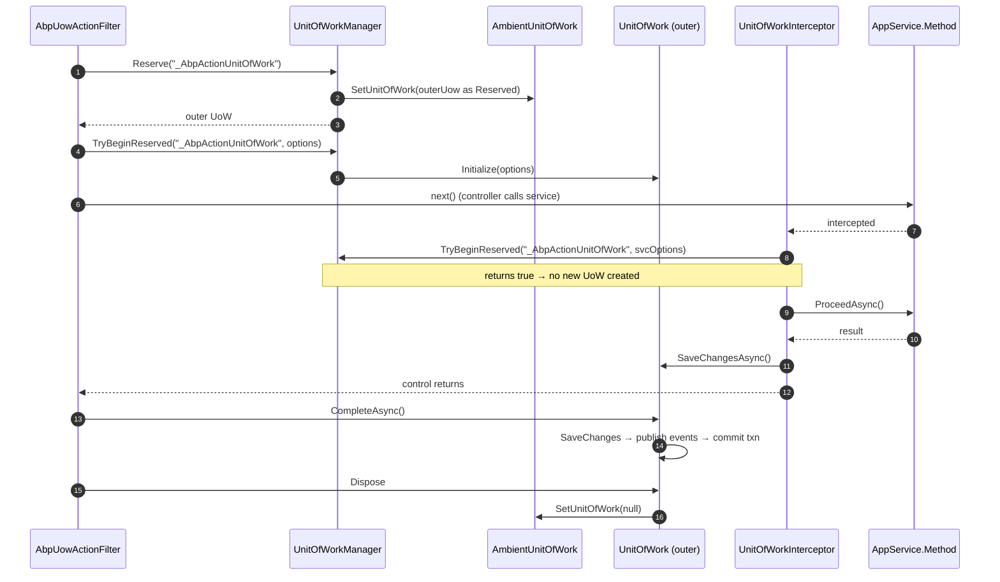

`IUnitOfWorkManager` is the public entry point into ABP's Unit of Work system. Everything else in `Volo.Abp.Uow` — the `[UnitOfWork]` attribute, the MVC action filter, the dynamic-proxy interceptor — ultimately calls into it to start, reserve, or look up the current UoW. This page is the API reference: every method, every option, every interface and class in the package.

If you only need conceptual orientation, start with the [UoW overview](/uow/overview); if you need the commit/rollback flow, jump to [transactions and SaveChanges](/uow/transactions-and-savechanges).

## `IUnitOfWorkManager`

```csharp title="framework/src/Volo.Abp.Uow/Volo/Abp/Uow/IUnitOfWorkManager.cs"
public interface IUnitOfWorkManager
{
    IUnitOfWork? Current { get; }

    [NotNull]
    IUnitOfWork Begin([NotNull] AbpUnitOfWorkOptions options, bool requiresNew = false);

    [NotNull]
    IUnitOfWork Reserve([NotNull] string reservationName, bool requiresNew = false);

    void BeginReserved([NotNull] string reservationName, [NotNull] AbpUnitOfWorkOptions options);

    bool TryBeginReserved([NotNull] string reservationName, [NotNull] AbpUnitOfWorkOptions options);
}
```

### `Current`

Returns the currently-active, non-reserved, non-disposed, non-completed UoW or `null`. Internally calls `IAmbientUnitOfWork.GetCurrentByChecking()` so reserved-but-uninitialized UoWs are skipped:

```csharp title="framework/src/Volo.Abp.Uow/Volo/Abp/Uow/UnitOfWorkManager.cs"
public IUnitOfWork? Current => _ambientUnitOfWork.GetCurrentByChecking();
```

### `Begin(options, requiresNew = false)`

Starts a UoW or returns a `ChildUnitOfWork` joining the ambient one.

```csharp title="framework/src/Volo.Abp.Uow/Volo/Abp/Uow/UnitOfWorkManager.cs"
public IUnitOfWork Begin(AbpUnitOfWorkOptions options, bool requiresNew = false)
{
    Check.NotNull(options, nameof(options));

    var currentUow = Current;
    if (currentUow != null && !requiresNew)
    {
        return new ChildUnitOfWork(currentUow);
    }

    var unitOfWork = CreateNewUnitOfWork();
    unitOfWork.Initialize(options);

    return unitOfWork;
}
```

Behaviour matrix:

| `Current` | `requiresNew` | Result |
| --- | --- | --- |
| `null` | `false` | New `UnitOfWork`, initialized with `options`, ambient slot set to it. |
| `null` | `true`  | Same as above. |
| non-null | `false` | `ChildUnitOfWork(currentUow)` — `options` is **ignored**. |
| non-null | `true`  | New `UnitOfWork` whose `Outer` is the previous current; ambient slot now points to the new one until `Dispose`. |

<Warning>
With `requiresNew: false`, the `options` argument is silently discarded when there is an ambient UoW. If you need a different `IsolationLevel` or timeout for a sub-operation, you must pass `requiresNew: true`.
</Warning>

A convenience overload lives in `UnitOfWorkManagerExtensions`:

```csharp title="framework/src/Volo.Abp.Uow/Volo/Abp/Uow/UnitOfWorkManagerExtensions.cs"
[NotNull]
public static IUnitOfWork Begin(
    [NotNull] this IUnitOfWorkManager unitOfWorkManager,
    bool requiresNew = false,
    bool isTransactional = false,
    IsolationLevel? isolationLevel = null,
    int? timeout = null)
{
    Check.NotNull(unitOfWorkManager, nameof(unitOfWorkManager));

    return unitOfWorkManager.Begin(new AbpUnitOfWorkOptions
    {
        IsTransactional = isTransactional,
        IsolationLevel = isolationLevel,
        Timeout = timeout
    }, requiresNew);
}
```

### `Reserve(reservationName, requiresNew = false)`

A *reservation* creates a UoW slot in the ambient context without initializing its options. It is how the ASP.NET filters arrange for the outermost UoW to be created before the application service interceptor runs, while still letting the eventual `[UnitOfWork]` attribute on the action method supply the options.

```csharp title="framework/src/Volo.Abp.Uow/Volo/Abp/Uow/UnitOfWorkManager.cs"
public IUnitOfWork Reserve(string reservationName, bool requiresNew = false)
{
    Check.NotNull(reservationName, nameof(reservationName));

    if (!requiresNew &&
        _ambientUnitOfWork.UnitOfWork != null &&
        _ambientUnitOfWork.UnitOfWork.IsReservedFor(reservationName))
    {
        return new ChildUnitOfWork(_ambientUnitOfWork.UnitOfWork);
    }

    var unitOfWork = CreateNewUnitOfWork();
    unitOfWork.Reserve(reservationName);

    return unitOfWork;
}
```

`IsReservedFor` (in `UnitOfWorkExtensions`) just compares the stored `ReservationName`:

```csharp title="framework/src/Volo.Abp.Uow/Volo/Abp/Uow/UnitOfWorkExtensions.cs"
public static bool IsReservedFor([NotNull] this IUnitOfWork unitOfWork, string reservationName)
{
    Check.NotNull(unitOfWork, nameof(unitOfWork));

    return unitOfWork.IsReserved && unitOfWork.ReservationName == reservationName;
}
```

The constant used by the framework is `UnitOfWork.UnitOfWorkReservationName = "_AbpActionUnitOfWork"`.

### `BeginReserved` / `TryBeginReserved`

`TryBeginReserved` walks from the ambient UoW outward looking for one reserved under the given name, initializes it with the supplied options, and returns whether it found anything:

```csharp title="framework/src/Volo.Abp.Uow/Volo/Abp/Uow/UnitOfWorkManager.cs"
public bool TryBeginReserved(string reservationName, AbpUnitOfWorkOptions options)
{
    Check.NotNull(reservationName, nameof(reservationName));

    var uow = _ambientUnitOfWork.UnitOfWork;

    //Find reserved unit of work starting from current and going to outers
    while (uow != null && !uow.IsReservedFor(reservationName))
    {
        uow = uow.Outer;
    }

    if (uow == null)
    {
        return false;
    }

    uow.Initialize(options);

    return true;
}

public void BeginReserved(string reservationName, AbpUnitOfWorkOptions options)
{
    if (!TryBeginReserved(reservationName, options))
    {
        throw new AbpException($"Could not find a reserved unit of work with reservation name: {reservationName}");
    }
}
```

Two extension shortcuts skip the explicit options object:

```csharp title="framework/src/Volo.Abp.Uow/Volo/Abp/Uow/UnitOfWorkManagerExtensions.cs"
public static void BeginReserved(this IUnitOfWorkManager unitOfWorkManager, string reservationName)
    => unitOfWorkManager.BeginReserved(reservationName, new AbpUnitOfWorkOptions());

public static void TryBeginReserved(this IUnitOfWorkManager unitOfWorkManager, string reservationName)
    => unitOfWorkManager.TryBeginReserved(reservationName, new AbpUnitOfWorkOptions());
```

## `UnitOfWorkManager` internals

The default singleton implementation is straightforward:

```csharp title="framework/src/Volo.Abp.Uow/Volo/Abp/Uow/UnitOfWorkManager.cs"
public class UnitOfWorkManager : IUnitOfWorkManager, ISingletonDependency
{
    public IUnitOfWork? Current => _ambientUnitOfWork.GetCurrentByChecking();

    private readonly IServiceScopeFactory _serviceScopeFactory;
    private readonly IAmbientUnitOfWork _ambientUnitOfWork;

    public UnitOfWorkManager(
        IAmbientUnitOfWork ambientUnitOfWork,
        IServiceScopeFactory serviceScopeFactory)
    {
        _ambientUnitOfWork = ambientUnitOfWork;
        _serviceScopeFactory = serviceScopeFactory;
    }
    /* Begin / Reserve / BeginReserved / TryBeginReserved as shown above */
}
```

`CreateNewUnitOfWork()` is where the DI scope is created — every UoW lives inside its own `IServiceScope`, and disposing the UoW disposes the scope:

```csharp title="framework/src/Volo.Abp.Uow/Volo/Abp/Uow/UnitOfWorkManager.cs"
private IUnitOfWork CreateNewUnitOfWork()
{
    var scope = _serviceScopeFactory.CreateScope();
    try
    {
        var outerUow = _ambientUnitOfWork.UnitOfWork;

        var unitOfWork = scope.ServiceProvider.GetRequiredService<IUnitOfWork>();

        unitOfWork.SetOuter(outerUow);

        _ambientUnitOfWork.SetUnitOfWork(unitOfWork);

        unitOfWork.Disposed += (sender, args) =>
        {
            _ambientUnitOfWork.SetUnitOfWork(outerUow);
            scope.Dispose();
        };

        return unitOfWork;
    }
    catch
    {
        scope.Dispose();
        throw;
    }
}
```

Two contracts to take away:

- The ambient slot is **restored to the outer UoW** when the inner is disposed — so nested `using` blocks unwind correctly.
- `IUnitOfWork` is `ITransientDependency`, but it is *always* resolved from a fresh DI scope. Singletons asking for `IUnitOfWork` directly will get an unwired instance — always go through `IUnitOfWorkManager`.

## Decorator: `AlwaysDisableTransactionsUnitOfWorkManager`

Registered by `UnitOfWorkCollectionExtensions.AddAlwaysDisableUnitOfWorkTransaction()`, this decorator mutates options to force `IsTransactional = false` before delegating to the real manager. Useful for in-memory test fixtures and for some replicated-read connection strategies:

```csharp title="framework/src/Volo.Abp.Uow/Volo/Abp/Uow/AlwaysDisableTransactionsUnitOfWorkManager.cs"
[DisableConventionalRegistration]
public class AlwaysDisableTransactionsUnitOfWorkManager : IUnitOfWorkManager
{
    private readonly UnitOfWorkManager _unitOfWorkManager;

    public AlwaysDisableTransactionsUnitOfWorkManager(UnitOfWorkManager unitOfWorkManager)
    {
        _unitOfWorkManager = unitOfWorkManager;
    }

    public IUnitOfWork? Current => _unitOfWorkManager.Current;

    public IUnitOfWork Begin(AbpUnitOfWorkOptions options, bool requiresNew = false)
    {
        options.IsTransactional = false;
        return _unitOfWorkManager.Begin(options, requiresNew);
    }

    public IUnitOfWork Reserve(string reservationName, bool requiresNew = false)
        => _unitOfWorkManager.Reserve(reservationName, requiresNew);

    public void BeginReserved(string reservationName, AbpUnitOfWorkOptions options)
    {
        options.IsTransactional = false;
        _unitOfWorkManager.BeginReserved(reservationName, options);
    }

    public bool TryBeginReserved(string reservationName, AbpUnitOfWorkOptions options)
    {
        options.IsTransactional = false;
        return _unitOfWorkManager.TryBeginReserved(reservationName, options);
    }
}
```

## `AbpUnitOfWorkOptions`

The per-UoW options object:

```csharp title="framework/src/Volo.Abp.Uow/Volo/Abp/Uow/AbpUnitOfWorkOptions.cs"
public class AbpUnitOfWorkOptions : IAbpUnitOfWorkOptions
{
    /// <summary>Default: false.</summary>
    public bool IsTransactional { get; set; }

    public IsolationLevel? IsolationLevel { get; set; }

    /// <summary>Milliseconds</summary>
    public int? Timeout { get; set; }

    public AbpUnitOfWorkOptions() { }

    public AbpUnitOfWorkOptions(bool isTransactional = false, IsolationLevel? isolationLevel = null, int? timeout = null)
    {
        IsTransactional = isTransactional;
        IsolationLevel = isolationLevel;
        Timeout = timeout;
    }

    public AbpUnitOfWorkOptions Clone() => new AbpUnitOfWorkOptions
    {
        IsTransactional = IsTransactional,
        IsolationLevel = IsolationLevel,
        Timeout = Timeout
    };
}
```

The read-only interface that the active UoW exposes is `IAbpUnitOfWorkOptions`:

```csharp title="framework/src/Volo.Abp.Uow/Volo/Abp/Uow/IAbpUnitOfWorkOptions.cs"
public interface IAbpUnitOfWorkOptions
{
    bool IsTransactional { get; }
    IsolationLevel? IsolationLevel { get; }
    int? Timeout { get; }   // Milliseconds
}
```

### Property semantics

| Property | Default | Meaning |
| --- | --- | --- |
| `IsTransactional` | `false` on the type, but rewritten by `CalculateIsTransactional` when the attribute or filter resolves `Auto`. | If `true`, the data-layer integration is expected to allocate an `ITransactionApi` and commit/roll it back together with the UoW. |
| `IsolationLevel` | `null` (use the data layer's default). | A `System.Data.IsolationLevel` (e.g. `ReadCommitted`, `Serializable`). Honoured by EF Core integration when a transaction is started. |
| `Timeout` | `null`. | Milliseconds. Surfaced to integrations that support a transaction or command timeout. |

## Global defaults: `AbpUnitOfWorkDefaultOptions`

These are the application-wide defaults configured at startup. They are merged into every `AbpUnitOfWorkOptions` via `Normalize` before the UoW is initialized:

```csharp title="framework/src/Volo.Abp.Uow/Volo/Abp/Uow/AbpUnitOfWorkDefaultOptions.cs"
public class AbpUnitOfWorkDefaultOptions
{
    public UnitOfWorkTransactionBehavior TransactionBehavior { get; set; }
        = UnitOfWorkTransactionBehavior.Auto;

    public IsolationLevel? IsolationLevel { get; set; }

    public int? Timeout { get; set; }

    internal AbpUnitOfWorkOptions Normalize(AbpUnitOfWorkOptions options)
    {
        if (options.IsolationLevel == null) options.IsolationLevel = IsolationLevel;
        if (options.Timeout == null)        options.Timeout = Timeout;
        return options;
    }

    public bool CalculateIsTransactional(bool autoValue)
    {
        switch (TransactionBehavior)
        {
            case UnitOfWorkTransactionBehavior.Enabled:  return true;
            case UnitOfWorkTransactionBehavior.Disabled: return false;
            case UnitOfWorkTransactionBehavior.Auto:     return autoValue;
            default:
                throw new AbpException("Not implemented TransactionBehavior value: " + TransactionBehavior);
        }
    }
}
```

Configure them in your module:

```csharp
public override void ConfigureServices(ServiceConfigurationContext context)
{
    Configure<AbpUnitOfWorkDefaultOptions>(options =>
    {
        options.TransactionBehavior = UnitOfWorkTransactionBehavior.Auto;
        options.IsolationLevel = IsolationLevel.ReadCommitted;
        options.Timeout = 30_000;
    });
}
```

## `UnitOfWorkAttribute` parameters

```csharp title="framework/src/Volo.Abp.Uow/Volo/Abp/Uow/UnitOfWorkAttribute.cs"
[AttributeUsage(AttributeTargets.Method | AttributeTargets.Class | AttributeTargets.Interface)]
public class UnitOfWorkAttribute : Attribute
{
    public bool? IsTransactional { get; set; }
    public int? Timeout { get; set; }            // milliseconds
    public IsolationLevel? IsolationLevel { get; set; }
    public bool IsDisabled { get; set; }

    public UnitOfWorkAttribute() { }
    public UnitOfWorkAttribute(bool isTransactional) { /* sets IsTransactional */ }
    public UnitOfWorkAttribute(bool isTransactional, IsolationLevel isolationLevel) { /* … */ }
    public UnitOfWorkAttribute(bool isTransactional, IsolationLevel isolationLevel, int timeout) { /* … */ }

    public virtual void SetOptions(AbpUnitOfWorkOptions options)
    {
        if (IsTransactional.HasValue) options.IsTransactional = IsTransactional.Value;
        if (Timeout.HasValue)         options.Timeout = Timeout;
        if (IsolationLevel.HasValue)  options.IsolationLevel = IsolationLevel;
    }
}
```

`SetOptions` is what the interceptor and MVC filters call to copy the attribute values onto an `AbpUnitOfWorkOptions` before opening or joining the UoW. Note that `IsDisabled` is **not** copied — it short-circuits the wrapper at a higher level (the interceptor checks it before calling `Begin`).

### Targets

| Target | Effect |
| --- | --- |
| `[UnitOfWork]` on a method | Just this method opens a UoW (or joins the ambient one). |
| `[UnitOfWork]` on a class | Every method in the class becomes UoW-wrapped, unless individually overridden. |
| `[UnitOfWork]` on an interface | Applied by reflection through declaring-type lookup; useful for typed clients. |
| `[UnitOfWork(IsDisabled = true)]` | Opt this method out of UoW wrapping even when the class is `IUnitOfWorkEnabled`. |

### Discovery

`UnitOfWorkHelper` is the reflection helper:

```csharp title="framework/src/Volo.Abp.Uow/Volo/Abp/Uow/UnitOfWorkHelper.cs"
public static bool IsUnitOfWorkMethod(MethodInfo methodInfo, out UnitOfWorkAttribute? unitOfWorkAttribute)
{
    var attrs = methodInfo.GetCustomAttributes(true).OfType<UnitOfWorkAttribute>().ToArray();
    if (attrs.Any())
    {
        unitOfWorkAttribute = attrs.First();
        return !unitOfWorkAttribute.IsDisabled;
    }

    if (methodInfo.DeclaringType != null)
    {
        attrs = methodInfo.DeclaringType.GetTypeInfo()
            .GetCustomAttributes(true).OfType<UnitOfWorkAttribute>().ToArray();
        if (attrs.Any())
        {
            unitOfWorkAttribute = attrs.First();
            return !unitOfWorkAttribute.IsDisabled;
        }

        if (typeof(IUnitOfWorkEnabled).GetTypeInfo()
            .IsAssignableFrom(methodInfo.DeclaringType))
        {
            unitOfWorkAttribute = null;
            return true;
        }
    }

    unitOfWorkAttribute = null;
    return false;
}
```

`GetUnitOfWorkAttributeOrNull(methodInfo)` is the same lookup without the `IsDisabled` short-circuit — it is what the MVC and Page filters use so they can honour `IsDisabled` themselves.

## Per-call hook: `IUnitOfWorkTransactionBehaviourProvider`

When the attribute leaves `IsTransactional` unset and `TransactionBehavior` is `Auto`, the interceptor consults this provider:

```csharp title="framework/src/Volo.Abp.Uow/Volo/Abp/Uow/IUnitOfWorkTransactionBehaviourProvider.cs"
public interface IUnitOfWorkTransactionBehaviourProvider
{
    bool? IsTransactional { get; }
}
```

```csharp title="framework/src/Volo.Abp.Uow/Volo/Abp/Uow/NullUnitOfWorkTransactionBehaviourProvider.cs"
public class NullUnitOfWorkTransactionBehaviourProvider
    : IUnitOfWorkTransactionBehaviourProvider, ISingletonDependency
{
    public bool? IsTransactional => null;
}
```

The interceptor wires this in as follows:

```csharp title="framework/src/Volo.Abp.Uow/Volo/Abp/Uow/UnitOfWorkInterceptor.cs"
if (unitOfWorkAttribute?.IsTransactional == null)
{
    var defaultOptions = serviceProvider
        .GetRequiredService<IOptions<AbpUnitOfWorkDefaultOptions>>().Value;

    options.IsTransactional = defaultOptions.CalculateIsTransactional(
        autoValue: serviceProvider
            .GetRequiredService<IUnitOfWorkTransactionBehaviourProvider>().IsTransactional
            ?? !invocation.Method.Name.StartsWith("Get", StringComparison.InvariantCultureIgnoreCase)
    );
}
```

A scoped `IUnitOfWorkTransactionBehaviourProvider` is the right place to encode rules like "this tenant always runs non-transactional" or "GraphQL queries always non-transactional, mutations always transactional".

## Ambient accessors

`IUnitOfWorkAccessor` is the minimal get/set contract over the ambient slot:

```csharp title="framework/src/Volo.Abp.Uow/Volo/Abp/Uow/IUnitOfWorkAccessor.cs"
public interface IUnitOfWorkAccessor
{
    IUnitOfWork? UnitOfWork { get; }
    void SetUnitOfWork(IUnitOfWork? unitOfWork);
}
```

`IAmbientUnitOfWork` adds the skip-reserved/disposed/completed walk:

```csharp title="framework/src/Volo.Abp.Uow/Volo/Abp/Uow/IAmbientUnitOfWork.cs"
public interface IAmbientUnitOfWork : IUnitOfWorkAccessor
{
    IUnitOfWork? GetCurrentByChecking();
}
```

Components that need *both* the manager and the ambient slot can take an `IUnitOfWorkManagerAccessor`:

```csharp title="framework/src/Volo.Abp.Uow/Volo/Abp/Uow/IUnitOfWorkManagerAccessor.cs"
public interface IUnitOfWorkManagerAccessor
{
    IUnitOfWorkManager UnitOfWorkManager { get; }
}
```

## `Items` and per-UoW state

`IUnitOfWork.Items` is a typed dictionary scoped to the UoW. Use the extensions to keep call sites tidy:

```csharp title="framework/src/Volo.Abp.Uow/Volo/Abp/Uow/UnitOfWorkExtensions.cs"
public static void AddItem<TValue>(this IUnitOfWork unitOfWork, string key, TValue value)
    where TValue : class { unitOfWork.Items[key] = value; }

public static TValue GetItemOrDefault<TValue>(this IUnitOfWork unitOfWork, string key)
    where TValue : class
    => unitOfWork.Items.FirstOrDefault(x => x.Key == key).Value.As<TValue>();

public static TValue GetOrAddItem<TValue>(this IUnitOfWork unitOfWork, string key,
    Func<string, TValue> factory) where TValue : class
    => unitOfWork.Items.GetOrAdd(key, factory).As<TValue>();

public static void RemoveItem(this IUnitOfWork unitOfWork, string key)
    => unitOfWork.Items.RemoveAll(x => x.Key == key);
```

`Items` is preserved across child UoWs — `ChildUnitOfWork.Items => _parent.Items`.

## Begin / Reserve / Join — call flow



## Complete API surface — every interface and class

### Interfaces

| Symbol | File | Purpose |
| --- | --- | --- |
| `IUnitOfWork` | `IUnitOfWork.cs` | Core contract: lifecycle, events, item bag, DB/transaction containers. |
| `IUnitOfWorkManager` | `IUnitOfWorkManager.cs` | `Current`, `Begin`, `Reserve`, `BeginReserved`, `TryBeginReserved`. |
| `IUnitOfWorkAccessor` | `IUnitOfWorkAccessor.cs` | Get/set the ambient slot. |
| `IAmbientUnitOfWork` | `IAmbientUnitOfWork.cs` | `IUnitOfWorkAccessor` + `GetCurrentByChecking()`. |
| `IUnitOfWorkManagerAccessor` | `IUnitOfWorkManagerAccessor.cs` | Exposes the manager (used by infrastructure). |
| `IUnitOfWorkEnabled` | `IUnitOfWorkEnabled.cs` | Marker for conventional UoW wrapping. |
| `IUnitOfWorkEventPublisher` | `IUnitOfWorkEventPublisher.cs` | Flush queued local/distributed events. |
| `IUnitOfWorkTransactionBehaviourProvider` | `IUnitOfWorkTransactionBehaviourProvider.cs` | Overrides the `Auto` decision. |
| `IAbpUnitOfWorkOptions` | `IAbpUnitOfWorkOptions.cs` | Read-only view of `IsTransactional`, `IsolationLevel`, `Timeout`. |
| `IDatabaseApi` | `IDatabaseApi.cs` | Marker for a per-provider session. |
| `IDatabaseApiContainer` | `IDatabaseApiContainer.cs` | `Find` / `Add` / `GetOrAdd` of `IDatabaseApi`. |
| `ITransactionApi` | `ITransactionApi.cs` | `Task CommitAsync(CancellationToken)` + `IDisposable`. |
| `ITransactionApiContainer` | `ITransactionApiContainer.cs` | `Find` / `Add` / `GetOrAdd` of `ITransactionApi`. |
| `ISupportsSavingChanges` | `ISupportsSavingChanges.cs` | Optional capability on a DB API. |
| `ISupportsRollback` | `ISupportsRollback.cs` | Optional capability on DB or transaction API. |

### Classes

| Symbol | File | Purpose |
| --- | --- | --- |
| `AbpUnitOfWorkModule` | `AbpUnitOfWorkModule.cs` | Registers the interceptor. |
| `UnitOfWork` | `UnitOfWork.cs` | Default `IUnitOfWork` implementation. |
| `ChildUnitOfWork` | `ChildUnitOfWork.cs` | Façade that joins an outer UoW. |
| `UnitOfWorkManager` | `UnitOfWorkManager.cs` | Default `IUnitOfWorkManager`. |
| `AlwaysDisableTransactionsUnitOfWorkManager` | `AlwaysDisableTransactionsUnitOfWorkManager.cs` | Forces `IsTransactional = false`. |
| `AmbientUnitOfWork` | `AmbientUnitOfWork.cs` | `AsyncLocal<IUnitOfWork?>` carrier. |
| `AbpUnitOfWorkOptions` | `AbpUnitOfWorkOptions.cs` | Per-UoW options. |
| `AbpUnitOfWorkDefaultOptions` | `AbpUnitOfWorkDefaultOptions.cs` | Global defaults. |
| `UnitOfWorkTransactionBehavior` | `UnitOfWorkTransactionBehavior.cs` | `Auto` / `Enabled` / `Disabled` enum. |
| `UnitOfWorkAttribute` | `UnitOfWorkAttribute.cs` | Declarative UoW boundary. |
| `UnitOfWorkInterceptor` | `UnitOfWorkInterceptor.cs` | Dynamic-proxy wrapper. |
| `UnitOfWorkInterceptorRegistrar` | `UnitOfWorkInterceptorRegistrar.cs` | `OnRegistered` hook. |
| `UnitOfWorkHelper` | `UnitOfWorkHelper.cs` | Reflection helpers. |
| `UnitOfWorkExtensions` | `UnitOfWorkExtensions.cs` | `IsReservedFor`, item helpers. |
| `UnitOfWorkManagerExtensions` | `UnitOfWorkManagerExtensions.cs` | `Begin(...)` / `BeginReserved(...)` sugar. |
| `UnitOfWorkCollectionExtensions` | `UnitOfWorkCollectionExtensions.cs` | `AddAlwaysDisableUnitOfWorkTransaction`. |
| `UnitOfWorkEventArgs` | `UnitOfWorkEventArgs.cs` | Payload for `Disposed`. |
| `UnitOfWorkFailedEventArgs` | `UnitOfWorkFailedEventArgs.cs` | Payload for `Failed`. |
| `UnitOfWorkEventRecord` | `UnitOfWorkEventRecord.cs` | Queued event. |
| `EventOrderGenerator` | `EventOrderGenerator.cs` | `Interlocked` monotonic counter. |
| `NullUnitOfWorkEventPublisher` | `NullUnitOfWorkEventPublisher.cs` | No-op when EventBus is absent. |
| `NullUnitOfWorkTransactionBehaviourProvider` | `NullUnitOfWorkTransactionBehaviourProvider.cs` | Returns `null` (use heuristic). |

## Typical usage patterns

### Open an explicit UoW in a background worker

```csharp
public class CleanupWorker : BackgroundWorkerBase
{
    private readonly IUnitOfWorkManager _uowManager;
    private readonly IRepository<Tenant, Guid> _tenants;

    public CleanupWorker(IUnitOfWorkManager uowManager, IRepository<Tenant, Guid> tenants)
    {
        _uowManager = uowManager;
        _tenants = tenants;
    }

    public override async Task DoWorkAsync(CancellationToken ct)
    {
        using var uow = _uowManager.Begin(requiresNew: true, isTransactional: true);
        await _tenants.DeleteAsync(t => t.IsDeleted, cancellationToken: ct);
        await uow.CompleteAsync(ct);
    }
}
```

### Force a fresh transaction with a stricter isolation level

```csharp
[UnitOfWork(IsTransactional = true, IsolationLevel = IsolationLevel.Serializable)]
public virtual async Task TransferAsync(Guid from, Guid to, decimal amount)
{
    using var uow = _uowManager.Begin(
        new AbpUnitOfWorkOptions(isTransactional: true, isolationLevel: IsolationLevel.Serializable),
        requiresNew: true);

    await _accounts.UpdateAsync(...);
    await uow.CompleteAsync();
}
```

### Disable the UoW for a method on a UoW-enabled class

```csharp
public class ReportAppService : ApplicationService   // IUnitOfWorkEnabled via base
{
    [UnitOfWork(IsDisabled = true)]
    public virtual Task<ReportDto> StreamReportAsync(Guid id) => /* … */ ;
}
```

## See also

<CardGroup cols={2}>
  <Card title="Overview" icon="circle-info" href="/uow/overview">
    What UoW is and how it integrates with ABP modules.
  </Card>
  <Card title="Transactions & SaveChanges" icon="database" href="/uow/transactions-and-savechanges">
    `SaveChangesAsync`, commit, rollback, child-UoW behaviour.
  </Card>
  <Card title="Event publisher integration" icon="paper-plane" href="/uow/event-publisher-integration">
    How `UnitOfWorkEventPublisher` flushes queued events.
  </Card>
  <Card title="Repositories" icon="layer-group" href="/ddd/repositories">
    How `IRepository<T>` uses the ambient UoW.
  </Card>
</CardGroup>
