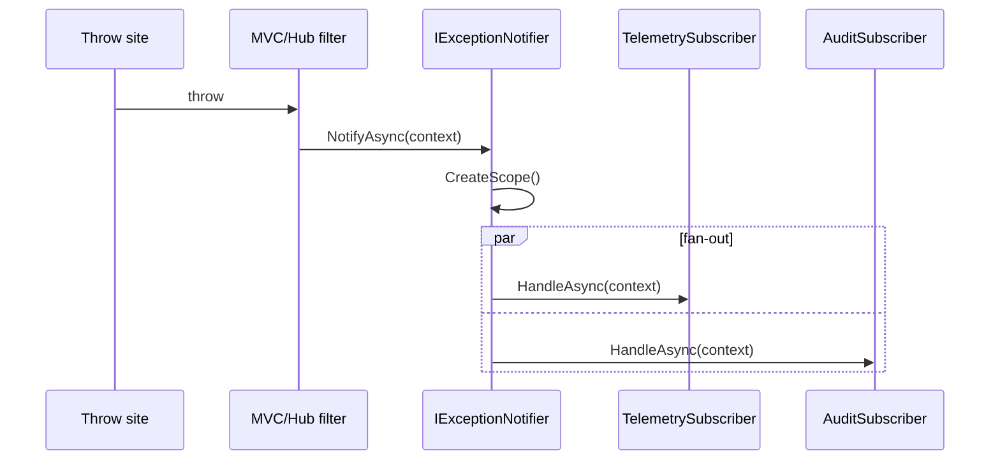
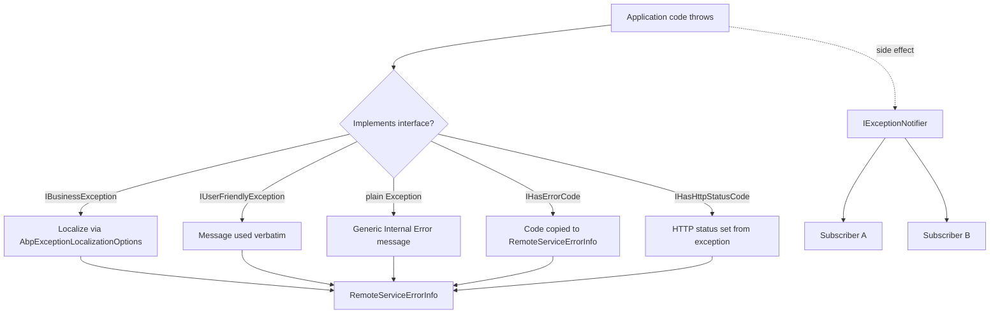

ABP draws a hard distinction between **expected** failures (a domain rule was broken, a user tried to do something they cannot) and **unexpected** failures (a NullReference, a connection drop, a serialization bug). Expected failures should reach the user, with a localized message and a stable error code. Unexpected ones should be logged with full detail server-side and exposed to the client only as opaque "something went wrong" messages — unless the host has explicitly opted into developer-mode error responses. This page walks the building blocks: the marker interfaces, the notifier/subscriber pipeline, the error-info converter, and the options that gate localization.

## File inventory

The contracts live in `framework/src/Volo.Abp.Core` because every layer needs them; the converter and module live in `framework/src/Volo.Abp.ExceptionHandling`; the localization-options bag lives in `framework/src/Volo.Abp.Localization`.

| File | Role |
| --- | --- |
| `Volo.Abp.Core/Volo/Abp/IBusinessException.cs` | Empty marker for "expected" exceptions. |
| `Volo.Abp.Core/Volo/Abp/IUserFriendlyException.cs` | Marker (extends `IBusinessException`) — message goes verbatim to the client. |
| `Volo.Abp.Core/Volo/Abp/BusinessException.cs` | Concrete base — `Code`, `Details`, `LogLevel`, `WithData`. |
| `Volo.Abp.Core/Volo/Abp/UserFriendlyException.cs` | Concrete `IUserFriendlyException` implementation. |
| `Volo.Abp.Core/Volo/Abp/ExceptionHandling/IHasErrorCode.cs` | `Code` property contract. |
| `Volo.Abp.Core/Volo/Abp/ExceptionHandling/IHasErrorDetails.cs` | `Details` property contract. |
| `Volo.Abp.Core/Volo/Abp/ExceptionHandling/IHasHttpStatusCode.cs` | `HttpStatusCode` integer. |
| `Volo.Abp.Core/Volo/Abp/ExceptionHandling/ILocalizeErrorMessage.cs` | `LocalizeMessage(LocalizationContext)` callback for self-localizing exceptions. |
| `Volo.Abp.Core/Volo/Abp/ExceptionHandling/IExceptionNotifier.cs` | `NotifyAsync(context)`. |
| `Volo.Abp.Core/Volo/Abp/ExceptionHandling/ExceptionNotifier.cs` | Default fan-out implementation. |
| `Volo.Abp.Core/Volo/Abp/ExceptionHandling/IExceptionSubscriber.cs` | `HandleAsync(context)` — your subscriber surface. |
| `Volo.Abp.Core/Volo/Abp/ExceptionHandling/ExceptionSubscriber.cs` | Abstract base — auto-registers as `IExceptionSubscriber`. |
| `Volo.Abp.Core/Volo/Abp/ExceptionHandling/ExceptionNotificationContext.cs` | `Exception`, `LogLevel`, `Handled`. |
| `Volo.Abp.Core/Volo/Abp/ExceptionHandling/NullExceptionNotifier.cs` | No-op notifier — used as default in early-init contexts. |
| `Volo.Abp.ExceptionHandling/Volo/Abp/AspNetCore/ExceptionHandling/IExceptionToErrorInfoConverter.cs` | Converts `Exception` → `RemoteServiceErrorInfo`. |
| `Volo.Abp.ExceptionHandling/Volo/Abp/AspNetCore/ExceptionHandling/DefaultExceptionToErrorInfoConverter.cs` | Default conversion logic — localization, sensitive-detail gating. |
| `Volo.Abp.ExceptionHandling/Volo/Abp/AspNetCore/ExceptionHandling/AbpExceptionHandlingOptions.cs` | `SendExceptionsDetailsToClients`, `SendStackTraceToClients`. |
| `Volo.Abp.ExceptionHandling/Volo/Abp/ExceptionHandling/AbpExceptionHandlingModule.cs` | Module wiring (depends on `AbpLocalizationModule`, `AbpDataModule`). |
| `Volo.Abp.Localization/Volo/Abp/Localization/ExceptionHandling/AbpExceptionLocalizationOptions.cs` | `MapCodeNamespace(prefix, resource)` for error-code localization. |

## The classification: IBusinessException and IUserFriendlyException

Both interfaces are empty markers. That is intentional — a marker means "any exception type, anywhere in any module, can opt in by implementing this" without dragging in a base-class dependency.

```csharp framework/src/Volo.Abp.Core/Volo/Abp/IBusinessException.cs
public interface IBusinessException
{
}
```

```csharp framework/src/Volo.Abp.Core/Volo/Abp/IUserFriendlyException.cs
public interface IUserFriendlyException : IBusinessException
{
}
```

| Marker | What the framework does when it sees it |
| --- | --- |
| *Plain* `Exception` | Treated as a server error. Stack trace logged. Generic "internal server error" returned to the client unless `SendExceptionsDetailsToClients` is on. Status code defaults to 500. |
| `IBusinessException` | Treated as a domain rule violation. Code/message gets localized through `AbpExceptionLocalizationOptions`. Status code defaults to 403/400 depending on subtype. The original message is **not** sent verbatim. |
| `IUserFriendlyException` | The `Message` is considered already-formatted, already-translated user copy. Sent verbatim. |
| `+ IHasErrorCode` | `Code` is copied to `RemoteServiceErrorInfo.Code`. |
| `+ IHasErrorDetails` | `Details` is copied to `RemoteServiceErrorInfo.Details`. |
| `+ IHasHttpStatusCode` | Overrides the default HTTP status. |
| `+ ILocalizeErrorMessage` | The exception self-localizes via the callback. |

### BusinessException — the concrete base

`BusinessException` already implements `IBusinessException`, `IHasErrorCode`, `IHasErrorDetails`, and `IHasLogLevel`. It is the right base class for most rule violations:

```csharp framework/src/Volo.Abp.Core/Volo/Abp/BusinessException.cs
[Serializable]
public class BusinessException : Exception,
    IBusinessException,
    IHasErrorCode,
    IHasErrorDetails,
    IHasLogLevel
{
    public string? Code { get; set; }
    public string? Details { get; set; }
    public LogLevel LogLevel { get; set; }

    public BusinessException(
        string? code = null,
        string? message = null,
        string? details = null,
        Exception? innerException = null,
        LogLevel logLevel = LogLevel.Warning)
        : base(message, innerException)
    {
        Code = code;
        Details = details;
        LogLevel = logLevel;
    }

    public BusinessException(SerializationInfo serializationInfo, StreamingContext context)
        : base(serializationInfo, context)
    {
    }

    public BusinessException WithData(string name, object value)
    {
        Data[name] = value;
        return this;
    }
}
```

`WithData` is a fluent shortcut for `exception.Data[name] = value`. The `Data` dictionary is what `DefaultExceptionToErrorInfoConverter` reads when localizing — every entry can be substituted into a localized format string via `{name}` placeholders. The pattern in practice:

```csharp Example
throw new BusinessException(MyDomainErrorCodes.QuotaExceeded)
    .WithData("Limit", quota.MaxItems)
    .WithData("Current", currentCount);
```

…with the matching localization entry:

```json myproject/Resources/Errors.json
{
    "MyDomain:001": "You have reached the quota of {Limit} items (currently {Current})."
}
```

<Note>
`LogLevel` defaults to `Warning`. That is the right choice for business exceptions — they are noteworthy but expected. Bumping it to `Error` for repeatable abuse patterns is a useful telemetry signal.
</Note>

## ExceptionNotificationContext

Every exception that reaches the framework's "I observed an exception" point gets wrapped:

```csharp framework/src/Volo.Abp.Core/Volo/Abp/ExceptionHandling/ExceptionNotificationContext.cs
public class ExceptionNotificationContext
{
    /// <summary>The exception object.</summary>
    [NotNull]
    public Exception Exception { get; }

    public LogLevel LogLevel { get; }

    /// <summary>True, if it is handled.</summary>
    public bool Handled { get; }

    public ExceptionNotificationContext(
        [NotNull] Exception exception,
        LogLevel? logLevel = null,
        bool handled = true)
    {
        Exception = Check.NotNull(exception, nameof(exception));
        LogLevel = logLevel ?? exception.GetLogLevel();
        Handled = handled;
    }
}
```

- `LogLevel` is sourced from the exception's `IHasLogLevel` if it implements it, otherwise from `Exception.GetLogLevel()` (a framework extension that falls back to `Error` for unknown exceptions, `Warning` for known business ones).
- `Handled` indicates whether the framework caught and translated the exception into a response. `false` means "this is going to crash the request pipeline anyway" — relevant for subscribers that decide whether to alert.

## IExceptionNotifier and ExceptionNotifier

```csharp framework/src/Volo.Abp.Core/Volo/Abp/ExceptionHandling/IExceptionNotifier.cs
public interface IExceptionNotifier
{
    Task NotifyAsync([NotNull] ExceptionNotificationContext context);
}
```

The default implementation creates a child service scope, resolves every registered `IExceptionSubscriber`, and invokes each one — swallowing per-subscriber exceptions so a buggy subscriber cannot break the pipeline:

```csharp framework/src/Volo.Abp.Core/Volo/Abp/ExceptionHandling/ExceptionNotifier.cs
public class ExceptionNotifier : IExceptionNotifier, ITransientDependency
{
    public ILogger<ExceptionNotifier> Logger { get; set; }
    protected IServiceScopeFactory ServiceScopeFactory { get; }

    public ExceptionNotifier(IServiceScopeFactory serviceScopeFactory)
    {
        ServiceScopeFactory = serviceScopeFactory;
        Logger = NullLogger<ExceptionNotifier>.Instance;
    }

    public virtual async Task NotifyAsync([NotNull] ExceptionNotificationContext context)
    {
        Check.NotNull(context, nameof(context));

        using (var scope = ServiceScopeFactory.CreateScope())
        {
            var exceptionSubscribers = scope.ServiceProvider
                .GetServices<IExceptionSubscriber>();

            foreach (var exceptionSubscriber in exceptionSubscribers)
            {
                try
                {
                    await exceptionSubscriber.HandleAsync(context);
                }
                catch (Exception e)
                {
                    Logger.LogWarning($"Exception subscriber of type {exceptionSubscriber.GetType().AssemblyQualifiedName} has thrown an exception!");
                    Logger.LogException(e, LogLevel.Warning);
                }
            }
        }
    }
}
```

<Tip>
The notifier opens its own DI scope — that means subscriber dependencies do not share state with the failing request's scope. If you need request-scoped state inside a subscriber, capture it explicitly into the `ExceptionNotificationContext` before notification time, or look it up via your own ambient accessor.
</Tip>

There is also a no-op:

```csharp framework/src/Volo.Abp.Core/Volo/Abp/ExceptionHandling/NullExceptionNotifier.cs
public class NullExceptionNotifier : IExceptionNotifier
{
    public static NullExceptionNotifier Instance { get; } = new NullExceptionNotifier();

    private NullExceptionNotifier() { }

    public Task NotifyAsync(ExceptionNotificationContext context) => Task.CompletedTask;
}
```

`NullExceptionNotifier.Instance` is what `AbpAsyncTimer` (see [threading](/concurrency/threading)) holds before the DI-resolved notifier replaces it via property injection.

## Subscribing — IExceptionSubscriber

The subscriber surface is one method:

```csharp framework/src/Volo.Abp.Core/Volo/Abp/ExceptionHandling/IExceptionSubscriber.cs
public interface IExceptionSubscriber
{
    Task HandleAsync([NotNull] ExceptionNotificationContext context);
}
```

The abstract base auto-registers as the interface — you do not need to use `[ExposeServices]` yourself:

```csharp framework/src/Volo.Abp.Core/Volo/Abp/ExceptionHandling/ExceptionSubscriber.cs
[ExposeServices(typeof(IExceptionSubscriber))]
public abstract class ExceptionSubscriber : IExceptionSubscriber, ITransientDependency
{
    public abstract Task HandleAsync(ExceptionNotificationContext context);
}
```

A telemetry subscriber that forwards unhandled exceptions to Application Insights:

```csharp Example
public class TelemetryExceptionSubscriber : ExceptionSubscriber
{
    private readonly TelemetryClient _telemetry;

    public TelemetryExceptionSubscriber(TelemetryClient telemetry)
        => _telemetry = telemetry;

    public override Task HandleAsync(ExceptionNotificationContext context)
    {
        if (context.Exception is IBusinessException)
        {
            return Task.CompletedTask; // business errors aren't outages
        }

        _telemetry.TrackException(context.Exception, new Dictionary<string, string>
        {
            ["LogLevel"] = context.LogLevel.ToString(),
            ["Handled"] = context.Handled.ToString()
        });

        return Task.CompletedTask;
    }
}
```



## IExceptionToErrorInfoConverter

When the host writes a response, it needs a structured payload — not an `Exception`. That is the job of `IExceptionToErrorInfoConverter`:

```csharp framework/src/Volo.Abp.ExceptionHandling/Volo/Abp/AspNetCore/ExceptionHandling/IExceptionToErrorInfoConverter.cs
public interface IExceptionToErrorInfoConverter
{
    [Obsolete("Use other Convert method.")]
    RemoteServiceErrorInfo Convert(Exception exception, bool includeSensitiveDetails);

    RemoteServiceErrorInfo Convert(Exception exception, Action<AbpExceptionHandlingOptions>? options = null);
}
```

The result type is `RemoteServiceErrorInfo` (the same one MVC, controller actions, and the dynamic HTTP client all serialize). The `Action<AbpExceptionHandlingOptions>` parameter lets callers override the host-level options on a per-call basis (useful for the dynamic proxy client, which wants stack traces locally even when production hides them).

### AbpExceptionHandlingOptions

```csharp framework/src/Volo.Abp.ExceptionHandling/Volo/Abp/AspNetCore/ExceptionHandling/AbpExceptionHandlingOptions.cs
public class AbpExceptionHandlingOptions
{
    public bool SendExceptionsDetailsToClients { get; set; } = false;

    public bool SendStackTraceToClients { get; set; } = true;
}
```

| Option | Default | Effect |
| --- | --- | --- |
| `SendExceptionsDetailsToClients` | `false` | When `true`, the converter copies the full exception type, message, inner-exception chain, and `Data` to the client. **Only safe in development.** |
| `SendStackTraceToClients` | `true` | Only honoured when `SendExceptionsDetailsToClients` is also `true`. |

In production, leave both at their defaults. In development:

```csharp Example
Configure<AbpExceptionHandlingOptions>(options =>
{
    options.SendExceptionsDetailsToClients = true;
    options.SendStackTraceToClients = true;
});
```

### DefaultExceptionToErrorInfoConverter

The default conversion logic short-circuits on three cases (`AbpRemoteCallException` — keep the upstream error verbatim, `AbpDbConcurrencyException` — translated to a localized friendly message, `EntityNotFoundException` — special-cased to a 404-style response), then falls through to the generic localization path:

```csharp framework/src/Volo.Abp.ExceptionHandling/Volo/Abp/AspNetCore/ExceptionHandling/DefaultExceptionToErrorInfoConverter.cs
public RemoteServiceErrorInfo Convert(
    Exception exception,
    Action<AbpExceptionHandlingOptions>? options = null)
{
    var exceptionHandlingOptions = CreateDefaultOptions();
    options?.Invoke(exceptionHandlingOptions);

    var errorInfo = CreateErrorInfoWithoutCode(exception, exceptionHandlingOptions);

    if (exception is IHasErrorCode hasErrorCodeException)
    {
        errorInfo.Code = hasErrorCodeException.Code;
    }

    return errorInfo;
}
```

The interesting part is `CreateErrorInfoWithoutCode`. When `SendExceptionsDetailsToClients` is true, it dumps the full exception tree. Otherwise it walks special cases:

```csharp framework/src/Volo.Abp.ExceptionHandling/Volo/Abp/AspNetCore/ExceptionHandling/DefaultExceptionToErrorInfoConverter.cs
protected virtual RemoteServiceErrorInfo CreateErrorInfoWithoutCode(
    Exception exception, AbpExceptionHandlingOptions options)
{
    if (options.SendExceptionsDetailsToClients)
    {
        return CreateDetailedErrorInfoFromException(exception, options.SendStackTraceToClients);
    }

    exception = TryToGetActualException(exception);

    if (exception is AbpRemoteCallException remoteCallException && remoteCallException.Error != null)
    {
        return remoteCallException.Error;
    }

    if (exception is AbpDbConcurrencyException)
    {
        return new RemoteServiceErrorInfo(L["AbpDbConcurrencyErrorMessage"]);
    }

    if (exception is EntityNotFoundException)
    {
        return CreateEntityNotFoundError((exception as EntityNotFoundException)!);
    }

    var errorInfo = new RemoteServiceErrorInfo();

    if (exception is IUserFriendlyException || exception is AbpRemoteCallException)
    {
        errorInfo.Message = exception.Message;
        // ...
    }
    // ... etc.
}
```

The localization path uses `IHasErrorCode.Code` to look up a resource entry, with the code structured as `<namespace>:<key>` and the namespace mapped to a resource via `AbpExceptionLocalizationOptions`.

## AbpExceptionLocalizationOptions

```csharp framework/src/Volo.Abp.Localization/Volo/Abp/Localization/ExceptionHandling/AbpExceptionLocalizationOptions.cs
public class AbpExceptionLocalizationOptions
{
    public Dictionary<string, Type> ErrorCodeNamespaceMappings { get; }

    public AbpExceptionLocalizationOptions()
    {
        ErrorCodeNamespaceMappings = new Dictionary<string, Type>();
    }

    public void MapCodeNamespace(string errorCodeNamespace, Type type)
    {
        ErrorCodeNamespaceMappings[errorCodeNamespace] = type;
    }
}
```

`Type` is the localization-resource type (e.g. `IssueTrackerResource`). The converter looks up `ErrorCodeNamespaceMappings[prefix]`, resolves an `IStringLocalizer<TResource>` for it, and asks the localizer for the code (full, with `:key`). Example:

```csharp Example
public override void ConfigureServices(ServiceConfigurationContext context)
{
    Configure<AbpExceptionLocalizationOptions>(options =>
    {
        options.MapCodeNamespace("IssueTracker", typeof(IssueTrackerResource));
    });
}
```

…lets you throw `new BusinessException("IssueTracker:001")` and the framework will look up `"IssueTracker:001"` inside `IssueTrackerResource` (with `Data[...]` entries substituted into the resulting string).

The framework itself uses this to localize its own modules — for example, `AbpGlobalFeaturesModule` does `options.MapCodeNamespace("Volo.GlobalFeature", typeof(AbpGlobalFeatureResource))`.

## Module wiring

```csharp framework/src/Volo.Abp.ExceptionHandling/Volo/Abp/ExceptionHandling/AbpExceptionHandlingModule.cs
[DependsOn(
    typeof(AbpLocalizationModule),
    typeof(AbpDataModule)
    )]
public class AbpExceptionHandlingModule : AbpModule
{
    public override void ConfigureServices(ServiceConfigurationContext context)
    {
        Configure<AbpVirtualFileSystemOptions>(options =>
        {
            options.FileSets.AddEmbedded<AbpExceptionHandlingModule>();
        });

        Configure<AbpLocalizationOptions>(options =>
        {
            options.Resources
                .Add<AbpExceptionHandlingResource>("en")
                .AddVirtualJson("/Volo/Abp/ExceptionHandling/Localization");
        });
    }
}
```

The module is small because all the heavy lifting happens through convention-based DI scanning — `ExceptionNotifier`, `DefaultExceptionToErrorInfoConverter`, and `ExceptionSubscriber` derivatives are `ITransientDependency` and register themselves.

## Putting it together



## See also

<CardGroup cols={2}>
  <Card title="Web exception handling" href="/web/exception-handling">
    How the MVC and Razor Pages filters call `IExceptionToErrorInfoConverter` and write `RemoteServiceErrorResponse`.
  </Card>
  <Card title="Threading" href="/concurrency/threading">
    `AbpAsyncTimer` is the canonical caller of `IExceptionNotifier` for background ticks.
  </Card>
  <Card title="Modularity" href="/modularity">
    Where `AbpExceptionHandlingModule` slots in.
  </Card>
  <Card title="Specifications" href="/utilities/specifications">
    Composable predicates used inside domain services that frequently throw `BusinessException`.
  </Card>
</CardGroup>
