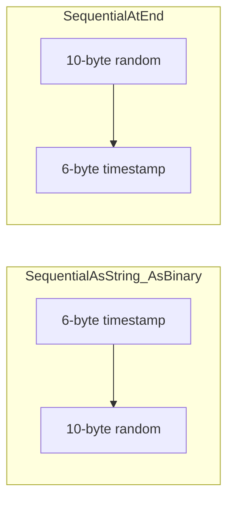
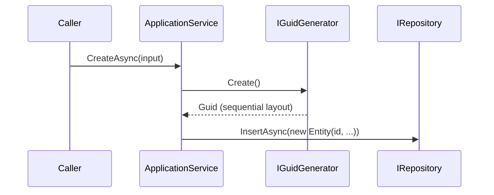

ABP entities whose primary key is a `Guid` are deliberately routed through an injected `IGuidGenerator` rather than `Guid.NewGuid()`. The reason is index locality: a freshly-randomised v4 GUID, written as the clustered key of a SQL Server / PostgreSQL / MySQL table, fragments the leaf pages on every insert. `SequentialGuidGenerator` produces values that sort monotonically, so the next insert always lands on the rightmost page — same ergonomics as `bigint identity`, but globally unique. This page covers the entire `Volo.Abp.Guids` package: the interface, the two implementations, the `SequentialGuidType` enum that picks the right layout for your database, and how the options bag is configured.

## File inventory

All files live in `framework/src/Volo.Abp.Guids/Volo/Abp/Guids`.

| File | Role |
| --- | --- |
| `IGuidGenerator.cs` | Single-method abstraction: `Guid Create()`. |
| `SequentialGuidGenerator.cs` | Default `ITransientDependency` implementation; produces sort-friendly Guids. |
| `SequentialGuidType.cs` | Enum: `SequentialAsString`, `SequentialAsBinary`, `SequentialAtEnd`. |
| `AbpSequentialGuidGeneratorOptions.cs` | One-property options bag wrapping the default type. |
| `SimpleGuidGenerator.cs` | Singleton fallback over `Guid.NewGuid()` — used by infrastructure that runs before DI is available. |
| `AbpGuidsModule.cs` | Empty module — registration happens via the convention-based `ITransientDependency` scanning. |

## IGuidGenerator

The interface is two lines:

```csharp framework/src/Volo.Abp.Guids/Volo/Abp/Guids/IGuidGenerator.cs
/// <summary>
/// Used to generate Ids.
/// </summary>
public interface IGuidGenerator
{
    /// <summary>
    /// Creates a new <see cref="Guid"/>.
    /// </summary>
    Guid Create();
}
```

Why bother? Three reasons:

<CardGroup cols={2}>
  <Card title="Index-friendly inserts">
    The default implementation produces sequential Guids that sort in approximately insert order, so clustered-key inserts stay on the trailing page.
  </Card>
  <Card title="Testability">
    Tests substitute a fake `IGuidGenerator` that returns a fixed sequence, making it possible to assert on entity Ids without snapshotting random values.
  </Card>
  <Card title="Per-database layout">
    SQL Server compares Guids differently from MySQL/PostgreSQL. The `SequentialGuidType` enum lets you pick the byte layout that matches your store.
  </Card>
  <Card title="One place to swap">
    Replace `IGuidGenerator` in DI and every aggregate-creating call site picks up the new behaviour automatically.
  </Card>
</CardGroup>

## SequentialGuidGenerator — the default

`SequentialGuidGenerator` is taken from John H. Todd's well-known sequential-Guid implementation (the comment at the top of the file credits the source). It is registered automatically via `ITransientDependency`:

```csharp framework/src/Volo.Abp.Guids/Volo/Abp/Guids/SequentialGuidGenerator.cs
/* This code is taken from jhtodd/SequentialGuid
 * https://github.com/jhtodd/SequentialGuid/blob/master/SequentialGuid/Classes/SequentialGuid.cs */

public class SequentialGuidGenerator : IGuidGenerator, ITransientDependency
{
    public AbpSequentialGuidGeneratorOptions Options { get; }

    private static readonly RandomNumberGenerator RandomNumberGenerator
        = RandomNumberGenerator.Create();

    public SequentialGuidGenerator(IOptions<AbpSequentialGuidGeneratorOptions> options)
    {
        Options = options.Value;
    }

    public Guid Create()
    {
        return Create(Options.GetDefaultSequentialGuidType());
    }

    public Guid Create(SequentialGuidType guidType)
    {
        // We start with 16 bytes of cryptographically strong random data.
        var randomBytes = new byte[10];
        RandomNumberGenerator.GetBytes(randomBytes);

        long timestamp = DateTime.UtcNow.Ticks / 10000L;
        byte[] timestampBytes = BitConverter.GetBytes(timestamp);
        if (BitConverter.IsLittleEndian)
        {
            Array.Reverse(timestampBytes);
        }

        byte[] guidBytes = new byte[16];

        switch (guidType)
        {
            case SequentialGuidType.SequentialAsString:
            case SequentialGuidType.SequentialAsBinary:
                Buffer.BlockCopy(timestampBytes, 2, guidBytes, 0, 6);
                Buffer.BlockCopy(randomBytes, 0, guidBytes, 6, 10);

                if (guidType == SequentialGuidType.SequentialAsString && BitConverter.IsLittleEndian)
                {
                    Array.Reverse(guidBytes, 0, 4);
                    Array.Reverse(guidBytes, 4, 2);
                }
                break;

            case SequentialGuidType.SequentialAtEnd:
                Buffer.BlockCopy(randomBytes, 0, guidBytes, 0, 10);
                Buffer.BlockCopy(timestampBytes, 2, guidBytes, 10, 6);
                break;
        }

        return new Guid(guidBytes);
    }
}
```

The algorithm:

<Steps>
  <Step title="10 cryptographically random bytes">
    `RandomNumberGenerator.Create()` is cached as a `static readonly` — a single instance, reused across calls; the underlying primitive is thread-safe.
  </Step>
  <Step title="48-bit timestamp">
    `DateTime.UtcNow.Ticks / 10000L` gives milliseconds since `DateTime.MinValue`. The high-bytes give you about 5 900 years of monotonic prefix before the counter wraps.
  </Step>
  <Step title="Layout chosen by the type">
    Either the 6-byte timestamp goes at the front (`SequentialAsString`/`SequentialAsBinary`) or at the end (`SequentialAtEnd`), depending on how the target database compares Guids.
  </Step>
  <Step title="Little-endian fix-up for string layouts">
    The .NET `Guid` constructor reads the first three fields in little-endian, so for `SequentialAsString` the first 4 and next 2 bytes are reversed so the *string representation* still sorts.
  </Step>
</Steps>

<Note>
The random portion is 10 bytes — not the full 16. Inside a single millisecond, you still get 80 bits of entropy, which is enough to make collisions vanishingly improbable. But this is **not** a v4 Guid: do not feed it into protocols (like signed-cookie nonces) that require RFC 4122-conformant random bits.
</Note>

## SequentialGuidType

This enum is the contract between "what the generator produces" and "what your database treats as monotonically increasing":

```csharp framework/src/Volo.Abp.Guids/Volo/Abp/Guids/SequentialGuidType.cs
/// <summary>
/// Describes the type of a sequential GUID value.
/// </summary>
public enum SequentialGuidType
{
    /// <summary>
    /// The GUID should be sequential when formatted using the Guid.ToString() method.
    /// Used by MySql and PostgreSql.
    /// </summary>
    SequentialAsString,

    /// <summary>
    /// The GUID should be sequential when formatted using the Guid.ToByteArray method.
    /// Used by Oracle.
    /// </summary>
    SequentialAsBinary,

    /// <summary>
    /// The sequential portion of the GUID should be located at the end of the Data4 block.
    /// Used by SqlServer.
    /// </summary>
    SequentialAtEnd
}
```

| Database | Pick |
| --- | --- |
| Microsoft SQL Server | `SequentialAtEnd` |
| Oracle | `SequentialAsBinary` |
| MySQL | `SequentialAsString` |
| PostgreSQL | `SequentialAsString` |

Picking the wrong layout still yields valid Guids — just non-sequential ones from the database's perspective, which negates the locality benefit.



## AbpSequentialGuidGeneratorOptions

The options bag carries the configured layout. It defaults to `null` and falls back to `SequentialAtEnd` (SQL Server) when read through `GetDefaultSequentialGuidType()`:

```csharp framework/src/Volo.Abp.Guids/Volo/Abp/Guids/AbpSequentialGuidGeneratorOptions.cs
public class AbpSequentialGuidGeneratorOptions
{
    /// <summary>
    /// Default value: null (unspecified).
    /// Use <see cref="GetDefaultSequentialGuidType"/> method
    /// to get the value on use, since it fall backs to a default value.
    /// </summary>
    public SequentialGuidType? DefaultSequentialGuidType { get; set; }

    /// <summary>
    /// Get the <see cref="DefaultSequentialGuidType"/> value
    /// or returns <see cref="SequentialGuidType.SequentialAtEnd"/>
    /// if <see cref="DefaultSequentialGuidType"/> was null.
    /// </summary>
    public SequentialGuidType GetDefaultSequentialGuidType()
    {
        return DefaultSequentialGuidType ??
               SequentialGuidType.SequentialAtEnd;
    }
}
```

Configure it from any module that knows what database the application uses:

```csharp Example — MySQL or PostgreSQL host
public override void ConfigureServices(ServiceConfigurationContext context)
{
    Configure<AbpSequentialGuidGeneratorOptions>(options =>
    {
        options.DefaultSequentialGuidType = SequentialGuidType.SequentialAsString;
    });
}
```

<Tip>
The EF Core integration packages (`Volo.Abp.EntityFrameworkCore.MySQL`, `Volo.Abp.EntityFrameworkCore.PostgreSql`, etc.) configure this automatically. You only need to set it explicitly when you are mixing providers or when you bypass those integration packages.
</Tip>

## SimpleGuidGenerator

There is also a non-sequential implementation, used by code that runs before DI is available — for example, the `ScopeItem.Id` inside `AmbientDataContextAmbientScopeProvider`:

```csharp framework/src/Volo.Abp.Guids/Volo/Abp/Guids/SimpleGuidGenerator.cs
/// <summary>
/// Implements <see cref="IGuidGenerator"/> by using <see cref="Guid.NewGuid"/>.
/// </summary>
public class SimpleGuidGenerator : IGuidGenerator
{
    public static SimpleGuidGenerator Instance { get; } = new SimpleGuidGenerator();

    public virtual Guid Create()
    {
        return Guid.NewGuid();
    }
}
```

Two things to notice:

- The class is **not** marked with any lifestyle attribute. It is not auto-registered, and DI consumers should not resolve it as `IGuidGenerator` — `SequentialGuidGenerator` will win, which is the intent.
- It exposes a static `Instance`, so framework code that needs to mint a Guid before the container is built (the threading layer is the prime example) can do `SimpleGuidGenerator.Instance.Create()`.

If you specifically want non-sequential Guids in your own code, replace the registration:

```csharp Example — opt out of sequential Guids
[Dependency(ReplaceServices = true)]
public class MyRandomGuidGenerator : IGuidGenerator, ITransientDependency
{
    public Guid Create() => Guid.NewGuid();
}
```

This is rarely a good idea for entity primary keys. It is, however, sensible if `IGuidGenerator` is being used to mint identifiers that escape your database (correlation Ids, message Ids), where guessability matters more than insert locality.

## AbpGuidsModule

The module file is intentionally empty:

```csharp framework/src/Volo.Abp.Guids/Volo/Abp/Guids/AbpGuidsModule.cs
public class AbpGuidsModule : AbpModule
{
}
```

Both `SequentialGuidGenerator` and the options bag are picked up by the convention-based `ITransientDependency` scanning that runs during module configuration. There is nothing else to wire — which is exactly the point: as soon as a module depends on `AbpGuidsModule` (directly or transitively, which every framework module does), `IGuidGenerator` becomes available.

## How entities consume it

Aggregate roots in `Volo.Abp.Ddd.Domain` receive `IGuidGenerator` via the `DomainService` and `ApplicationService` base classes. The common pattern in a creating handler:

```csharp Example
public class IssueAppService : ApplicationService, IIssueAppService
{
    private readonly IRepository<Issue, Guid> _issueRepo;

    public IssueAppService(IRepository<Issue, Guid> issueRepo) => _issueRepo = issueRepo;

    public async Task<IssueDto> CreateAsync(CreateIssueDto input)
    {
        var issue = new Issue(
            GuidGenerator.Create(),  // inherited from ApplicationService
            input.Title);

        await _issueRepo.InsertAsync(issue);
        return ObjectMapper.Map<Issue, IssueDto>(issue);
    }
}
```

`ApplicationService.GuidGenerator` is just `IGuidGenerator` resolved from the request scope. Always prefer that over `Guid.NewGuid()` so the configured layout, and any test substitutions, take effect.



## See also

<CardGroup cols={2}>
  <Card title="Security and current user" href="/utilities/security-and-current-user">
    `ICurrentUser.Id` is a `Guid?` — generated through this provider when users are created.
  </Card>
  <Card title="Specifications" href="/utilities/specifications">
    Composable LINQ predicates over entities keyed by the Guids you generate here.
  </Card>
  <Card title="Modularity" href="/modularity">
    Where `AbpGuidsModule` slots into the dependency graph.
  </Card>
  <Card title="Multitenancy" href="/multitenancy">
    `TenantId` is another `Guid?` resolved through ABP's identity layer.
  </Card>
</CardGroup>
