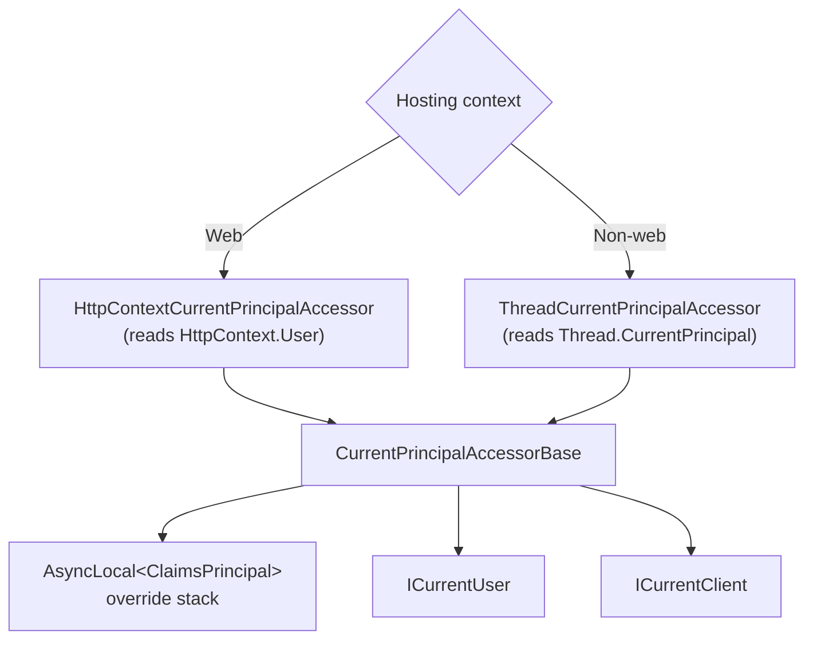

ABP application code rarely touches `HttpContext.User` directly. Instead it talks to two abstractions: `ICurrentUser` for "who is the human?" and `ICurrentClient` for "what OAuth client / API is calling?". Both read from a single, swappable `ICurrentPrincipalAccessor` that wraps the ambient `ClaimsPrincipal`. That indirection is the reason ABP code is symmetric across web requests, background jobs, integration-event handlers, hosted services, and tests — none of those have an `HttpContext`, all of them have an ambient principal. This page enumerates every type in `Volo.Abp.Security` that participates.

## File inventory

All paths are under `framework/src/Volo.Abp.Security`.

| File | Role |
| --- | --- |
| `Volo/Abp/Security/AbpSecurityModule.cs` | Module: registers contributors, configures `AbpStringEncryptionOptions` from config. |
| `Volo/Abp/Security/Claims/ICurrentPrincipalAccessor.cs` | Two-member contract: `Principal` + `Change(principal)`. |
| `Volo/Abp/Security/Claims/CurrentPrincipalAccessorBase.cs` | Abstract base; manages the `AsyncLocal<ClaimsPrincipal>` override. |
| `Volo/Abp/Security/Claims/ThreadCurrentPrincipalAccessor.cs` | Default implementation outside the web; falls back to `Thread.CurrentPrincipal`. |
| `Volo/Abp/Security/Claims/AbpClaimTypes.cs` | Static mutable claim-type names — `UserId`, `Role`, `TenantId`, `ClientId`, etc. |
| `Volo/Abp/Security/Claims/CurrentPrincipalAccessorExtensions.cs` | Convenience `Change(userId, ...)` overloads. |
| `Volo/Abp/Security/Claims/IAbpClaimsPrincipalContributor.cs` | Plug-in for building a `ClaimsPrincipal` from a user. |
| `System/Security/Principal/AbpClaimsIdentityExtensions.cs` | `FindUserId`, `FindTenantId`, `FindClientId` claim extractors. |
| `Volo/Abp/Users/ICurrentUser.cs` | The human-facing facade: `Id`, `UserName`, `Email`, roles, claims. |
| `Volo/Abp/Users/CurrentUser.cs` | Default implementation reading claims via the principal accessor. |
| `Volo/Abp/Users/CurrentUserExtensions.cs` | Helpers like `FindClaimValue`. |
| `Volo/Abp/Clients/ICurrentClient.cs` | OAuth client facade: `Id`, `IsAuthenticated`. |
| `Volo/Abp/Clients/CurrentClient.cs` | Default implementation. |
| `Volo/Abp/SecurityLog/ISecurityLogManager.cs` | Auditing of security-sensitive events (sign-in, lockout, …). |

## ICurrentPrincipalAccessor

The interface is the entry point to everything else. It has two members:

```csharp framework/src/Volo.Abp.Security/Volo/Abp/Security/Claims/ICurrentPrincipalAccessor.cs
public interface ICurrentPrincipalAccessor
{
    ClaimsPrincipal Principal { get; }

    IDisposable Change(ClaimsPrincipal principal);
}
```

| Member | Use |
| --- | --- |
| `Principal` | The "current" `ClaimsPrincipal`. Never null — implementations either build one from the host (HTTP context, thread, etc.) or return `new ClaimsPrincipal(new ClaimsIdentity())` for unauthenticated callers. |
| `Change(principal)` | Pushes a new principal onto an `AsyncLocal` stack and returns an `IDisposable` that pops it. Used heavily by background workers and integration-event handlers that need to "impersonate" a user for the duration of a unit of work. |

### CurrentPrincipalAccessorBase

The override stack lives in the abstract base:

```csharp framework/src/Volo.Abp.Security/Volo/Abp/Security/Claims/CurrentPrincipalAccessorBase.cs
public abstract class CurrentPrincipalAccessorBase : ICurrentPrincipalAccessor
{
    public ClaimsPrincipal Principal => _currentPrincipal.Value ?? GetClaimsPrincipal();

    private readonly AsyncLocal<ClaimsPrincipal> _currentPrincipal = new AsyncLocal<ClaimsPrincipal>();

    protected abstract ClaimsPrincipal GetClaimsPrincipal();

    public virtual IDisposable Change(ClaimsPrincipal principal)
    {
        return SetCurrent(principal);
    }

    private IDisposable SetCurrent(ClaimsPrincipal principal)
    {
        var parent = Principal;
        _currentPrincipal.Value = principal;

        return new DisposeAction<ValueTuple<AsyncLocal<ClaimsPrincipal>, ClaimsPrincipal>>(static (state) =>
        {
            var (currentPrincipal, parent) = state;
            currentPrincipal.Value = parent;
        }, (_currentPrincipal, parent));
    }
}
```

Two things to notice:

<Steps>
  <Step title="AsyncLocal — not HttpContextAccessor">
    The override stack flows through `await`, `Task.Run`, and `Parallel.ForEachAsync` because `AsyncLocal<T>` does. That is why a background job started via `Change(...)` keeps the impersonated identity through every layer of repositories, domain services, and downstream HTTP calls.
  </Step>
  <Step title="Fallback is per-host">
    When no override is active, `Principal` calls the abstract `GetClaimsPrincipal()`. That is the only abstract member; everything else is reusable. Subclasses are tiny.
  </Step>
</Steps>

### ThreadCurrentPrincipalAccessor — the default outside the web

```csharp framework/src/Volo.Abp.Security/Volo/Abp/Security/Claims/ThreadCurrentPrincipalAccessor.cs
public class ThreadCurrentPrincipalAccessor : CurrentPrincipalAccessorBase, ISingletonDependency
{
    protected override ClaimsPrincipal GetClaimsPrincipal()
    {
        return (Thread.CurrentPrincipal as ClaimsPrincipal)!;
    }
}
```

In a console app, worker service, or unit test, `Thread.CurrentPrincipal` is the natural fallback. The web integration replaces this with an `IHttpContextAccessor`-backed version (`HttpContextCurrentPrincipalAccessor` in `Volo.Abp.AspNetCore`) so `HttpContext.User` is the source of truth there.



## AbpClaimTypes

`AbpClaimTypes` is a static class of mutable `string` properties that name the framework's claim types. The defaults map to BCL `ClaimTypes`, but you can replace any of them on application startup if your identity provider emits a different name.

```csharp framework/src/Volo.Abp.Security/Volo/Abp/Security/Claims/AbpClaimTypes.cs
public static class AbpClaimTypes
{
    /// <summary>Default: <see cref="ClaimTypes.Name"/></summary>
    public static string UserName { get; set; } = ClaimTypes.Name;

    /// <summary>Default: <see cref="ClaimTypes.GivenName"/></summary>
    public static string Name { get; set; } = ClaimTypes.GivenName;

    /// <summary>Default: <see cref="ClaimTypes.Surname"/></summary>
    public static string SurName { get; set; } = ClaimTypes.Surname;

    /// <summary>Default: <see cref="ClaimTypes.NameIdentifier"/></summary>
    public static string UserId { get; set; } = ClaimTypes.NameIdentifier;

    /// <summary>Default: <see cref="ClaimTypes.Role"/></summary>
    public static string Role { get; set; } = ClaimTypes.Role;

    /// <summary>Default: <see cref="ClaimTypes.Email"/></summary>
    public static string Email { get; set; } = ClaimTypes.Email;

    // ... + EmailVerified, PhoneNumber, PhoneNumberVerified,
    // TenantId, ClientId, EditionId, SessionId, ImpersonatorUserId, etc.
}
```

The `AbpClaimsIdentityExtensions` class (in the `System.Security.Principal` namespace, by convention) reads those constants when extracting structured values from a principal:

```csharp framework/src/Volo.Abp.Security/System/Security/Principal/AbpClaimsIdentityExtensions.cs
public static Guid? FindUserId([NotNull] this ClaimsPrincipal principal)
{
    Check.NotNull(principal, nameof(principal));

    var userIdOrNull = principal.Claims?
        .FirstOrDefault(c => c.Type == AbpClaimTypes.UserId);

    if (userIdOrNull == null || userIdOrNull.Value.IsNullOrWhiteSpace())
    {
        return null;
    }

    if (Guid.TryParse(userIdOrNull.Value, out Guid guid))
    {
        return guid;
    }

    return null;
}
```

`FindTenantId`, `FindClientId`, `FindSessionId`, `FindEditionId`, and `FindImpersonatorUserId` all follow the same pattern.

## ICurrentUser

This is the type application code actually injects. It is a small, typed window onto whatever claims `ICurrentPrincipalAccessor.Principal` happens to hold.

```csharp framework/src/Volo.Abp.Security/Volo/Abp/Users/ICurrentUser.cs
public interface ICurrentUser
{
    bool IsAuthenticated { get; }

    [CanBeNull]
    Guid? Id { get; }

    string? UserName { get; }
    string? Name { get; }
    string? SurName { get; }

    string? PhoneNumber { get; }
    bool PhoneNumberVerified { get; }

    string? Email { get; }
    bool EmailVerified { get; }

    Guid? TenantId { get; }

    [NotNull]
    string[] Roles { get; }

    Claim? FindClaim(string claimType);

    [NotNull]
    Claim[] FindClaims(string claimType);

    [NotNull]
    Claim[] GetAllClaims();

    bool IsInRole(string roleName);
}
```

### CurrentUser — the default

The default implementation is a pure projection — no caching, no state — over the principal accessor:

```csharp framework/src/Volo.Abp.Security/Volo/Abp/Users/CurrentUser.cs
public class CurrentUser : ICurrentUser, ITransientDependency
{
    private static readonly Claim[] EmptyClaimsArray = new Claim[0];

    public virtual bool IsAuthenticated => Id.HasValue;

    public virtual Guid? Id => _principalAccessor.Principal?.FindUserId();

    public virtual string? UserName => this.FindClaimValue(AbpClaimTypes.UserName);
    public virtual string? Name     => this.FindClaimValue(AbpClaimTypes.Name);
    public virtual string? SurName  => this.FindClaimValue(AbpClaimTypes.SurName);

    public virtual string? PhoneNumber => this.FindClaimValue(AbpClaimTypes.PhoneNumber);
    public virtual bool PhoneNumberVerified
        => string.Equals(this.FindClaimValue(AbpClaimTypes.PhoneNumberVerified),
                         "true", StringComparison.InvariantCultureIgnoreCase);

    public virtual string? Email => this.FindClaimValue(AbpClaimTypes.Email);
    public virtual bool EmailVerified
        => string.Equals(this.FindClaimValue(AbpClaimTypes.EmailVerified),
                         "true", StringComparison.InvariantCultureIgnoreCase);

    public virtual Guid? TenantId => _principalAccessor.Principal?.FindTenantId();

    public virtual string[] Roles
        => FindClaims(AbpClaimTypes.Role).Select(c => c.Value).Distinct().ToArray();

    private readonly ICurrentPrincipalAccessor _principalAccessor;

    public CurrentUser(ICurrentPrincipalAccessor principalAccessor)
        => _principalAccessor = principalAccessor;

    public virtual Claim? FindClaim(string claimType)
        => _principalAccessor.Principal?.Claims.FirstOrDefault(c => c.Type == claimType);

    public virtual Claim[] FindClaims(string claimType)
        => _principalAccessor.Principal?.Claims.Where(c => c.Type == claimType).ToArray()
           ?? EmptyClaimsArray;

    public virtual Claim[] GetAllClaims()
        => _principalAccessor.Principal?.Claims.ToArray() ?? EmptyClaimsArray;

    public virtual bool IsInRole(string roleName)
        => FindClaims(AbpClaimTypes.Role).Any(c => c.Value == roleName);
}
```

Key behaviours:

<Note>
`IsAuthenticated` is derived from `Id.HasValue`, **not** from `Principal.Identity.IsAuthenticated`. That deliberate difference catches the case where you have a `ClaimsPrincipal` with a valid authentication type but no parsable user-id claim — ABP treats that as unauthenticated for the purposes of authorization policies that read `ICurrentUser`.
</Note>

`PhoneNumberVerified` / `EmailVerified` are string-equality-against-`"true"`. The verification claims are stored as string `"true"` / `"false"` to round-trip cleanly through JWTs. Locale-invariant comparison protects against Turkish-i issues.

`Roles` calls `Distinct()`: multiple role claims with the same value (which can happen when several `IAbpClaimsPrincipalContributor` plug-ins add the same role) get collapsed.

## ICurrentClient

OAuth-driven APIs need a different question answered: "what *application* is calling me?", independent of which user is acting through it. That is what `ICurrentClient` answers.

```csharp framework/src/Volo.Abp.Security/Volo/Abp/Clients/ICurrentClient.cs
public interface ICurrentClient
{
    string? Id { get; }

    bool IsAuthenticated { get; }
}
```

```csharp framework/src/Volo.Abp.Security/Volo/Abp/Clients/CurrentClient.cs
public class CurrentClient : ICurrentClient, ITransientDependency
{
    public virtual string? Id => _principalAccessor.Principal?.FindClientId();

    public virtual bool IsAuthenticated => Id != null;

    private readonly ICurrentPrincipalAccessor _principalAccessor;

    public CurrentClient(ICurrentPrincipalAccessor principalAccessor)
    {
        _principalAccessor = principalAccessor;
    }
}
```

The client id comes from the `AbpClaimTypes.ClientId` claim, which ABP's OpenIddict integration emits as the `client_id` claim on access tokens. The pattern lets you author authorization policies like "only the mobile client can call this endpoint" without coupling to a specific token format.

| | `ICurrentUser` | `ICurrentClient` |
| --- | --- | --- |
| Source claim | `AbpClaimTypes.UserId` (`ClaimTypes.NameIdentifier`) | `AbpClaimTypes.ClientId` (`"client_id"`) |
| Authenticated when | `Id.HasValue` | `Id != null` |
| Typical use | Multitenancy filters, audit fields, UI personalization | Granular API authorization, telemetry per integration |
| Mutually exclusive? | No — a token can carry both | No — pure user logins lack client claim |

## Changing the principal at runtime

Background workers and integration-event handlers need to attribute their work to a specific user. The pattern is always the same:

```csharp Example — impersonating a user inside a background job
public class CleanupHandler : AsyncBackgroundJob<CleanupArgs>, ITransientDependency
{
    private readonly ICurrentPrincipalAccessor _principal;
    private readonly IUserRepository _users;

    public CleanupHandler(ICurrentPrincipalAccessor principal, IUserRepository users)
    {
        _principal = principal;
        _users = users;
    }

    public override async Task ExecuteAsync(CleanupArgs args)
    {
        var user = await _users.GetAsync(args.UserId);
        var identity = new ClaimsIdentity("BackgroundJob");
        identity.AddClaim(new Claim(AbpClaimTypes.UserId, user.Id.ToString()));
        if (user.TenantId.HasValue)
        {
            identity.AddClaim(new Claim(AbpClaimTypes.TenantId, user.TenantId.Value.ToString()));
        }
        var principal = new ClaimsPrincipal(identity);

        using (_principal.Change(principal))
        {
            // ICurrentUser, ICurrentTenant, and audit fields now reflect the impersonated user.
            await DoWorkAsync();
        }
    }
}
```

Inside the `using`, every consumer of `ICurrentUser`, `ICurrentClient`, and `ICurrentTenant` sees the swapped-in claims. After the `using`, the original principal — whatever the host originally provided — is restored. See [authorization](/authz) for how policies layer on top of this and [multitenancy](/multitenancy) for the parallel `ICurrentTenant` accessor.

## AbpSecurityModule

The module's main jobs are (a) plumbing string-encryption defaults out of configuration and (b) auto-registering claims-principal contributors:

```csharp framework/src/Volo.Abp.Security/Volo/Abp/Security/AbpSecurityModule.cs
public class AbpSecurityModule : AbpModule
{
    public override void PostConfigureServices(ServiceConfigurationContext context)
    {
        AutoAddClaimsPrincipalContributors(context.Services);
    }

    public override void ConfigureServices(ServiceConfigurationContext context)
    {
        var applicationName = context.Services.GetApplicationName();
        if (!applicationName.IsNullOrEmpty())
        {
            Configure<AbpSecurityLogOptions>(options =>
            {
                options.ApplicationName = applicationName!;
            });
        }

        var configuration = context.Services.GetConfiguration();
        context.Services.Configure<AbpStringEncryptionOptions>(options =>
        {
            // KeySize / DefaultPassPhrase / InitVectorBytes / DefaultSalt read from
            // the "StringEncryption" config section.
        });
    }

    private static void AutoAddClaimsPrincipalContributors(IServiceCollection services)
    {
        var contributorTypes = new List<Type>();
        var dynamicContributorTypes = new List<Type>();

        services.OnRegistered(context =>
        {
            if (typeof(IAbpClaimsPrincipalContributor).IsAssignableFrom(context.ImplementationType))
                contributorTypes.Add(context.ImplementationType);

            if (typeof(IAbpDynamicClaimsPrincipalContributor).IsAssignableFrom(context.ImplementationType))
                dynamicContributorTypes.Add(context.ImplementationType);
        });

        services.Configure<AbpClaimsPrincipalFactoryOptions>(options =>
        {
            options.Contributors.AddIfNotContains(contributorTypes);
            options.DynamicContributors.AddIfNotContains(dynamicContributorTypes);
        });
    }
}
```

<Tip>
You do not have to manually register `IAbpClaimsPrincipalContributor` implementations. The module's `OnRegistered` hook collects every service registered before container build that implements the interface, and adds it to `AbpClaimsPrincipalFactoryOptions.Contributors`. This is the same pattern used by the dynamic-claim layer for tenant- and user-scoped claims.
</Tip>

## Reading user identity in tests

In integration tests there is no HTTP context and `Thread.CurrentPrincipal` is whatever the test runner left there. The clean pattern is to `Change(...)` the principal before exercising the code under test:

```csharp Example
[Fact]
public async Task Should_attribute_the_call_to_the_test_user()
{
    var accessor = GetRequiredService<ICurrentPrincipalAccessor>();

    var identity = new ClaimsIdentity("Test");
    identity.AddClaim(new Claim(AbpClaimTypes.UserId, Guid.NewGuid().ToString()));
    identity.AddClaim(new Claim(AbpClaimTypes.UserName, "alice"));

    using (accessor.Change(new ClaimsPrincipal(identity)))
    {
        var dto = await _issueAppService.CreateAsync(new CreateIssueDto { Title = "..." });

        // CreatorId etc. now point at the swapped-in user.
    }
}
```

## See also

<CardGroup cols={2}>
  <Card title="Authorization" href="/authz">
    Permissions and policies consume `ICurrentUser` and `ICurrentClient`.
  </Card>
  <Card title="Multitenancy" href="/multitenancy">
    `ICurrentTenant` is the sibling accessor; both read from the same claims.
  </Card>
  <Card title="Threading" href="/concurrency/threading">
    The `AsyncLocal`-based override stack `Change(...)` uses lives in the threading layer.
  </Card>
  <Card title="Guid generation" href="/utilities/guids">
    `ICurrentUser.Id` and `TenantId` are `Guid` values generated through `IGuidGenerator`.
  </Card>
</CardGroup>
