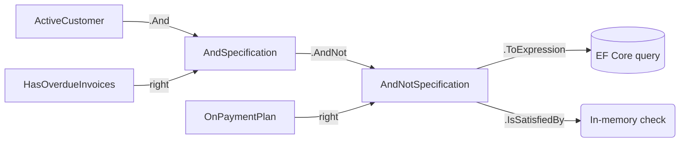

The specification pattern (Eric Evans / Martin Fowler) lets you name a business rule once, reuse it across queries and in-memory checks, and combine multiple rules with boolean operators without copy-pasting LINQ predicates. ABP's implementation is deliberately thin — a single `ISpecification<T>` interface, an abstract `Specification<T>` base, and a handful of composite types — but it is the building block every ABP repository extension (`GetListAsync(ISpecification<T>)`, IQueryable extensions, soft-delete-aware queries) ultimately calls. This page walks the entire package.

## File inventory

All files live in `framework/src/Volo.Abp.Specifications/Volo/Abp/Specifications`.

| File | Role |
| --- | --- |
| `ISpecification.cs` | The contract: `IsSatisfiedBy` + `ToExpression`. |
| `Specification.cs` | Base class — implements `IsSatisfiedBy` via `ToExpression().Compile()` and adds the implicit conversion to `Expression<Func<T, bool>>`. |
| `ICompositeSpecification.cs` | `Left` + `Right`. |
| `CompositeSpecification.cs` | Base for binary combinators. |
| `AndSpecification.cs` | Logical AND. |
| `OrSpecification.cs` | Logical OR. |
| `NotSpecification.cs` | Logical NOT. |
| `AndNotSpecification.cs` | `Left AND NOT Right`. |
| `AnySpecification.cs` | "Always satisfied" — the identity for AND-chains. |
| `NoneSpecification.cs` | "Never satisfied" — the identity for OR-chains. |
| `ExpressionSpecification.cs` | Wraps an existing `Expression<Func<T, bool>>` as a specification. |
| `ExpressionFuncExtender.cs` | Internal expression-tree combinators (`And`, `Or`, parameter rebinding). |
| `ParameterRebinder.cs` | Rewrites `ParameterExpression` instances so two predicates can share one parameter. |
| `SpecificationExtensions.cs` | Fluent `.And`, `.Or`, `.AndNot`, `.Not`. |
| `ISpecificationParser.cs` | Optional contract for converting a string/DSL into a specification. |
| `AbpSpecificationsModule.cs` | The module — empty (registration is via conventions, but no DI is needed for the pure value types). |

## ISpecification&lt;T&gt;

```csharp framework/src/Volo.Abp.Specifications/Volo/Abp/Specifications/ISpecification.cs
/// <summary>
/// Represents that the implemented classes are specifications.
/// </summary>
/// <typeparam name="T">The type of the object to which the specification is applied.</typeparam>
public interface ISpecification<T>
{
    /// <summary>
    /// Returns a <see cref="bool"/> value which indicates whether the specification
    /// is satisfied by the given object.
    /// </summary>
    bool IsSatisfiedBy(T obj);

    /// <summary>
    /// Gets the LINQ expression which represents the current specification.
    /// </summary>
    Expression<Func<T, bool>> ToExpression();
}
```

The two-method contract is the entire surface area:

| Member | Use |
| --- | --- |
| `IsSatisfiedBy(obj)` | In-memory check. Used in domain logic ("is this entity in a valid state?"), unit tests, and post-fetch filtering. |
| `ToExpression()` | The same predicate as a LINQ expression tree, suitable for translation by Entity Framework Core, MongoDB.Driver, etc. |

Keeping both as first-class members is what makes the pattern useful. A specification you wrote for the domain layer can be passed straight to a repository, and the query is executed in the database — not after materialising every row.

## Specification&lt;T&gt; — the base class

```csharp framework/src/Volo.Abp.Specifications/Volo/Abp/Specifications/Specification.cs
public abstract class Specification<T> : ISpecification<T>
{
    public virtual bool IsSatisfiedBy(T obj)
    {
        return ToExpression().Compile()(obj);
    }

    public abstract Expression<Func<T, bool>> ToExpression();

    public static implicit operator Expression<Func<T, bool>>(Specification<T> specification)
    {
        return specification.ToExpression();
    }
}
```

A few things to take from this:

<Steps>
  <Step title="Derive from Specification<T>, override ToExpression()">
    The base class handles `IsSatisfiedBy` automatically by compiling the expression and invoking it. That keeps your subclasses tiny.
  </Step>
  <Step title="Implicit conversion to expression">
    Because of the `implicit operator`, you can pass any `Specification<T>` instance directly to methods that take an `Expression<Func<T, bool>>` — no `.ToExpression()` call required. EF Core's `Where(...)` accepts it as-is.
  </Step>
  <Step title="Compile is not cached">
    `IsSatisfiedBy` calls `Compile()` on every invocation. For one-off domain checks this is fine; if you are running a specification against millions of in-memory objects, cache the compiled delegate yourself or use the expression directly.
  </Step>
</Steps>

### A worked example

```csharp Example — domain specifications
public class ActiveCustomerSpecification : Specification<Customer>
{
    public override Expression<Func<Customer, bool>> ToExpression()
        => c => c.Status == CustomerStatus.Active && c.DeletedAt == null;
}

public class CustomerWithOverdueInvoicesSpecification : Specification<Customer>
{
    private readonly DateTime _asOf;

    public CustomerWithOverdueInvoicesSpecification(DateTime asOf) => _asOf = asOf;

    public override Expression<Func<Customer, bool>> ToExpression()
        => c => c.Invoices.Any(i => i.DueAt < _asOf && i.PaidAt == null);
}
```

Used in a domain service:

```csharp Example — combining specifications
public class CollectionsDomainService
{
    private readonly IRepository<Customer, Guid> _customers;

    public async Task<List<Customer>> GetDelinquentAsync(DateTime asOf)
    {
        var spec = new ActiveCustomerSpecification()
            .And(new CustomerWithOverdueInvoicesSpecification(asOf));

        return await _customers.GetListAsync(spec.ToExpression());
    }

    public bool IsDelinquent(Customer customer, DateTime asOf)
        => new ActiveCustomerSpecification()
            .And(new CustomerWithOverdueInvoicesSpecification(asOf))
            .IsSatisfiedBy(customer);
}
```

`GetListAsync(spec.ToExpression())` runs as a single SQL query (EF Core translates the combined expression). `IsSatisfiedBy(customer)` runs the same logic locally.

## CompositeSpecification, And / Or / Not / AndNot

The combinators share a small base:

```csharp framework/src/Volo.Abp.Specifications/Volo/Abp/Specifications/CompositeSpecification.cs
public abstract class CompositeSpecification<T> : Specification<T>, ICompositeSpecification<T>
{
    protected CompositeSpecification(ISpecification<T> left, ISpecification<T> right)
    {
        Left = left;
        Right = right;
    }

    public ISpecification<T> Left { get; }
    public ISpecification<T> Right { get; }
}
```

```csharp framework/src/Volo.Abp.Specifications/Volo/Abp/Specifications/ICompositeSpecification.cs
public interface ICompositeSpecification<T> : ISpecification<T>
{
    ISpecification<T> Left { get; }
    ISpecification<T> Right { get; }
}
```

`Left`/`Right` are public so introspecting code (a debugger visualizer, a custom SQL translator, a UI that renders a rule as a tree) can walk the composition without breaking encapsulation.

### AndSpecification

```csharp framework/src/Volo.Abp.Specifications/Volo/Abp/Specifications/AndSpecification.cs
public class AndSpecification<T> : CompositeSpecification<T>
{
    public AndSpecification(ISpecification<T> left, ISpecification<T> right) : base(left, right)
    {
    }

    public override Expression<Func<T, bool>> ToExpression()
    {
        return Left.ToExpression().And(Right.ToExpression());
    }
}
```

### OrSpecification

```csharp framework/src/Volo.Abp.Specifications/Volo/Abp/Specifications/OrSpecification.cs
public class OrSpecification<T> : CompositeSpecification<T>
{
    public OrSpecification(ISpecification<T> left, ISpecification<T> right) : base(left, right)
    {
    }

    public override Expression<Func<T, bool>> ToExpression()
    {
        return Left.ToExpression().Or(Right.ToExpression());
    }
}
```

### NotSpecification

`NotSpecification<T>` is *not* a composite — it has a single inner specification. It rewrites the body of the inner expression with `Expression.Not`:

```csharp framework/src/Volo.Abp.Specifications/Volo/Abp/Specifications/NotSpecification.cs
public class NotSpecification<T> : Specification<T>
{
    private readonly ISpecification<T> _specification;

    public NotSpecification(ISpecification<T> specification)
    {
        _specification = specification;
    }

    public override Expression<Func<T, bool>> ToExpression()
    {
        var expression = _specification.ToExpression();
        return Expression.Lambda<Func<T, bool>>(
            Expression.Not(expression.Body),
            expression.Parameters
        );
    }
}
```

The same `Parameters` collection is reused, which is the cheap way to negate while keeping the lambda well-formed for EF Core translation.

## SpecificationExtensions

The fluent surface is one extension class. The operations all accept `ISpecification<T>`, so they work on both your hand-written `Specification<T>` subclasses and on `ExpressionSpecification<T>` instances.

```csharp framework/src/Volo.Abp.Specifications/Volo/Abp/Specifications/SpecificationExtensions.cs
public static class SpecificationExtensions
{
    public static ISpecification<T> And<T>(
        [NotNull] this ISpecification<T> specification,
        [NotNull] ISpecification<T> other)
    {
        Check.NotNull(specification, nameof(specification));
        Check.NotNull(other, nameof(other));
        return new AndSpecification<T>(specification, other);
    }

    public static ISpecification<T> Or<T>(
        [NotNull] this ISpecification<T> specification,
        [NotNull] ISpecification<T> other)
    {
        Check.NotNull(specification, nameof(specification));
        Check.NotNull(other, nameof(other));
        return new OrSpecification<T>(specification, other);
    }

    public static ISpecification<T> AndNot<T>(
        [NotNull] this ISpecification<T> specification,
        [NotNull] ISpecification<T> other)
    {
        Check.NotNull(specification, nameof(specification));
        Check.NotNull(other, nameof(other));
        return new AndNotSpecification<T>(specification, other);
    }

    public static ISpecification<T> Not<T>(
        [NotNull] this ISpecification<T> specification)
    {
        Check.NotNull(specification, nameof(specification));
        return new NotSpecification<T>(specification);
    }
}
```

| Extension | Reads as |
| --- | --- |
| `a.And(b)` | "Both `a` and `b`" |
| `a.Or(b)` | "`a` or `b`" |
| `a.AndNot(b)` | "`a` but not `b`" |
| `a.Not()` | "Not `a`" |



## ExpressionFuncExtender — how And/Or are stitched

Combining two predicates that each carry their own `ParameterExpression` is the only non-trivial part of the implementation. You cannot just do `Expression.AndAlso(left.Body, right.Body)` because the two bodies reference different parameter symbols. ABP's solution is `ParameterRebinder` — a `ExpressionVisitor` that walks one body and rewrites every `ParameterExpression` to point at the other lambda's parameter. The `And` / `Or` helpers in `ExpressionFuncExtender` apply it before building the new lambda:

```csharp Conceptual
public static Expression<Func<T, bool>> And<T>(
    this Expression<Func<T, bool>> left,
    Expression<Func<T, bool>> right)
{
    // Rebind right.Parameters[0] to left.Parameters[0]
    var rebound = ParameterRebinder.ReplaceParameters(map, right.Body);
    return Expression.Lambda<Func<T, bool>>(
        Expression.AndAlso(left.Body, rebound),
        left.Parameters);
}
```

The result is a single lambda with one parameter — perfectly translatable by EF Core or LINQ-to-Mongo. You rarely need to call this directly; the higher-level combinators do it for you.

## ExpressionSpecification — wrapping an inline lambda

Not every predicate deserves its own named class. When you have a one-off expression, wrap it:

```csharp framework/src/Volo.Abp.Specifications/Volo/Abp/Specifications/ExpressionSpecification.cs
public class ExpressionSpecification<T> : Specification<T>
{
    private readonly Expression<Func<T, bool>> _expression;

    public ExpressionSpecification(Expression<Func<T, bool>> expression)
    {
        _expression = expression;
    }

    public override Expression<Func<T, bool>> ToExpression()
    {
        return _expression;
    }
}
```

Usage:

```csharp Example
ISpecification<Customer> spec = new ExpressionSpecification<Customer>(
    c => c.Country == "DE" && c.SubscribedAt < threshold);

var dotnetSpec = spec.And(new ActiveCustomerSpecification());
```

`AnySpecification<T>` and `NoneSpecification<T>` are the trivial constants — `_ => true` and `_ => false` — useful as starting accumulators when you are folding a dynamic list of optional filters:

```csharp Example — fold optional filters
ISpecification<Customer> spec = new AnySpecification<Customer>();

if (!string.IsNullOrEmpty(country))
    spec = spec.And(new CountrySpecification(country));

if (status.HasValue)
    spec = spec.And(new StatusSpecification(status.Value));

var results = await _customers.GetListAsync(spec.ToExpression());
```

## ISpecificationParser&lt;out TCriteria&gt;

For projects that translate a specification into a domain-specific criteria object (the classic example in the XML doc is NHibernate's `ICriteria`, but the same shape works for any custom query API), `ISpecificationParser<out TCriteria>` is the extension point:

```csharp framework/src/Volo.Abp.Specifications/Volo/Abp/Specifications/ISpecificationParser.cs
public interface ISpecificationParser<out TCriteria>
{
    TCriteria Parse<T>(ISpecification<T> specification);
}
```

The framework does not ship a default implementation — it is intended for module authors who want to register their own parser per criteria type. Implementations typically walk the composite tree (`Left`, `Right` on `ICompositeSpecification<T>`) plus the wrapped expression on `ExpressionSpecification<T>` to emit the target criteria.

## AbpSpecificationsModule

The module is empty:

```csharp framework/src/Volo.Abp.Specifications/Volo/Abp/Specifications/AbpSpecificationsModule.cs
public class AbpSpecificationsModule : AbpModule
{
}
```

There is nothing to register because specifications are value types — you `new` them where you need them, or expose them as factory-returned instances. The module exists so other modules can `[DependsOn(typeof(AbpSpecificationsModule))]` and reference the assembly in a single line.

## Where the framework uses this

| Caller | Usage |
| --- | --- |
| `IRepository<TEntity, TKey>` extensions | `GetListAsync(Expression<Func<T,bool>>)` overloads accept the implicit conversion. |
| Soft-delete & multitenancy data filters | Stored as expressions and composed with caller predicates via `ExpressionFuncExtender`. |
| `IBlobContainer` listing predicates | The blob storage layer accepts specifications for content-type / size filters. |
| `Volo.Abp.Identity` user search | Searches built from name/email/role specifications combined with And/Or. |

## Testing specifications

Specifications are pure values: easy to unit-test, no DI needed.

```csharp Example
[Theory]
[InlineData(CustomerStatus.Active, null, true)]
[InlineData(CustomerStatus.Suspended, null, false)]
[InlineData(CustomerStatus.Active, "2023-04-01", false)]
public void ActiveCustomer_should_be_satisfied_correctly(
    CustomerStatus status, string? deletedAt, bool expected)
{
    var customer = new Customer
    {
        Status = status,
        DeletedAt = deletedAt is null ? null : DateTime.Parse(deletedAt)
    };

    new ActiveCustomerSpecification()
        .IsSatisfiedBy(customer)
        .ShouldBe(expected);
}
```

For composite assertions, materialize the combined expression and exercise it directly:

```csharp Example
var combined = new ActiveCustomerSpecification()
    .And(new CustomerWithOverdueInvoicesSpecification(today));

combined.IsSatisfiedBy(scenarioCustomer).ShouldBeTrue();
```

## See also

<CardGroup cols={2}>
  <Card title="Guid generation" href="/utilities/guids">
    The keys you filter on — generated through `IGuidGenerator`.
  </Card>
  <Card title="Exception handling" href="/utilities/exception-handling">
    Domain rules expressed as specifications often raise `BusinessException` when violated.
  </Card>
  <Card title="Multitenancy" href="/multitenancy">
    Tenant filtering is implemented as a data filter composed with caller expressions via the same `ExpressionFuncExtender`.
  </Card>
  <Card title="Modularity" href="/modularity">
    Where `AbpSpecificationsModule` slots into the dependency graph.
  </Card>
</CardGroup>
