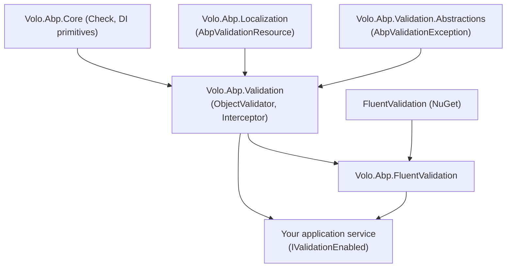

`Volo.Abp.FluentValidation` is a thin bridge module — three files — that lets
you keep using [FluentValidation](https://github.com/FluentValidation/FluentValidation)
the way you already know while reusing ABP's interception, exception type and
contributor pipeline. The module auto-registers every `IValidator<T>` it finds
in the assembly, then plugs an `IObjectValidationContributor` into
`AbpValidationOptions.ObjectValidationContributors` so the validators run for
every parameter of every `IValidationEnabled` service. This page walks the
three source files, the conventional-registrar trick that exposes
`IValidator<T>` automatically, and how the result combines with
[data-annotation validation](/validation/method-invocation-validation).

## File inventory

The package is `framework/src/Volo.Abp.FluentValidation`. Its `csproj` declares
one NuGet dependency (`FluentValidation`) and one project reference
(`Volo.Abp.Validation`).

| File | Role |
| --- | --- |
| `Volo.Abp.FluentValidation/Volo/Abp/FluentValidation/AbpFluentValidationModule.cs` | The module — installs the conventional registrar. |
| `Volo.Abp.FluentValidation/Volo/Abp/FluentValidation/AbpFluentValidationConventionalRegistrar.cs` | Auto-registers every `IValidator<T>` implementation as transient and exposes both the concrete type and `IValidator<TArg>`. |
| `Volo.Abp.FluentValidation/Volo/Abp/FluentValidation/FluentObjectValidationContributor.cs` | The contributor that resolves `IValidator<T>` and runs it against the validating object. |
| `Volo.Abp.FluentValidation/Volo.Abp.FluentValidation.csproj` | `PackageReference Include="FluentValidation"` + project reference to `Volo.Abp.Validation`. |

The contributor lives in `Volo.Abp.FluentValidation` but its base interface
`IObjectValidationContributor` is defined in `Volo.Abp.Validation`. See the
[validation overview](/validation/overview) for the contract.

## The module

`AbpFluentValidationModule` depends on `AbpValidationModule` and registers the
conventional registrar — that's it. No services, options or extension methods.

```csharp framework/src/Volo.Abp.FluentValidation/Volo/Abp/FluentValidation/AbpFluentValidationModule.cs
[DependsOn(
    typeof(AbpValidationModule)
    )]
public class AbpFluentValidationModule : AbpModule
{
    public override void PreConfigureServices(ServiceConfigurationContext context)
    {
        context.Services.AddConventionalRegistrar(new AbpFluentValidationConventionalRegistrar());
    }
}
```

A registrar added through `AddConventionalRegistrar` participates in ABP's
type-scan pipeline — see [conventional registration](/di/conventional-registration)
for how that works. The key behaviour: when an ABP module's `AddAssembly` is
called, every type in that assembly is offered to every registrar in turn.

## The conventional registrar

The registrar's job is two-fold:

1. *Filter* — only classes that implement some `IValidator<T>` should be
   conventionally registered.
2. *Expose* — register the type as both itself and as the closed generic
   `IValidator<TArg>`, with **transient** lifetime, so
   `IServiceProvider.GetService(typeof(IValidator<MyDto>))` works.

```csharp framework/src/Volo.Abp.FluentValidation/Volo/Abp/FluentValidation/AbpFluentValidationConventionalRegistrar.cs
public class AbpFluentValidationConventionalRegistrar : DefaultConventionalRegistrar
{
    protected override bool IsConventionalRegistrationDisabled(Type type)
    {
        return !type.GetInterfaces().Any(x => x.IsGenericType && x.GetGenericTypeDefinition() == typeof(IValidator<>)) ||
               base.IsConventionalRegistrationDisabled(type);
    }

    protected override ServiceLifetime? GetDefaultLifeTimeOrNull(Type type)
    {
        return ServiceLifetime.Transient;
    }

    protected override List<Type> GetExposedServiceTypes(Type type)
    {
        return new List<Type>()
            {
                type,
                typeof(IValidator<>).MakeGenericType(GetFirstGenericArgumentOrNull(type, 1)!)
            };
    }

    private static Type? GetFirstGenericArgumentOrNull(Type type, int depth)
    {
        const int maxFindDepth = 8;

        if (depth >= maxFindDepth)
        {
            return null;
        }

        if (type.IsGenericType && type.GetGenericArguments().Length >= 1)
        {
            return type.GetGenericArguments()[0];
        }

        return GetFirstGenericArgumentOrNull(type.BaseType!, depth + 1);
    }
}
```

What the helper does, step by step:

| Override | Effect |
| --- | --- |
| `IsConventionalRegistrationDisabled` | Disables the registrar for any type that does **not** implement `IValidator<>`; also respects the base disable rules ([`[DisableConventionalRegistration]`](/di/conventional-registration), abstracts, etc.). |
| `GetDefaultLifeTimeOrNull` | Forces transient lifetime — matches FluentValidation's default and avoids stateful validators. |
| `GetExposedServiceTypes` | Registers both the concrete type and the closed `IValidator<TArg>`. |
| `GetFirstGenericArgumentOrNull` | Walks the base class chain (capped at 8) to find the first generic argument — useful when a validator is `public class MyDtoValidator : AbstractValidator<MyDto>` (so the generic arg lives on the base class). |

<Note>
Because the registrar returns `transient`, every call to
`IServiceProvider.GetService(typeof(IValidator<MyDto>))` produces a fresh
validator instance — the same lifetime FluentValidation's own `ServiceCollection`
extensions use. Validator instances should never hold per-request state, but
they *do* benefit from this lifetime when they take scoped collaborators in
their constructors.
</Note>

## The contributor

`FluentObjectValidationContributor` is the bridge between the FluentValidation
world (`IValidator<T>`, `ValidationResult` with `Errors` of `ValidationFailure`)
and ABP's pipeline (`ObjectValidationContext.Errors` of
`System.ComponentModel.DataAnnotations.ValidationResult`).

```csharp framework/src/Volo.Abp.FluentValidation/Volo/Abp/FluentValidation/FluentObjectValidationContributor.cs
public class FluentObjectValidationContributor : IObjectValidationContributor, ITransientDependency
{
    private readonly IServiceProvider _serviceProvider;

    public FluentObjectValidationContributor(
        IServiceProvider serviceProvider)
    {
        _serviceProvider = serviceProvider;
    }

    public virtual async Task AddErrorsAsync(ObjectValidationContext context)
    {
        var serviceType = typeof(IValidator<>).MakeGenericType(context.ValidatingObject.GetType());
        var validator = _serviceProvider.GetService(serviceType) as IValidator;
        if (validator == null)
        {
            return;
        }

        var result = await validator.ValidateAsync((IValidationContext)Activator.CreateInstance(
            typeof(ValidationContext<>).MakeGenericType(context.ValidatingObject.GetType()),
            context.ValidatingObject)!);

        if (!result.IsValid)
        {
            context.Errors.AddRange(
                result.Errors.Select(
                    error =>
                        new ValidationResult(error.ErrorMessage, new[] { error.PropertyName })
                )
            );
        }
    }
}
```

What it does:

1. Builds the closed `IValidator<T>` service type from
   `context.ValidatingObject.GetType()`.
2. Tries to resolve it via `IServiceProvider.GetService` — note the
   `GetService` (not `GetRequiredService`): if there's no validator for the
   type, the contributor silently does nothing.
3. Activates a `ValidationContext<T>` over the object (`Activator.CreateInstance`
   because the generic argument is only known at runtime).
4. Calls `await validator.ValidateAsync(context)`.
5. Translates each FluentValidation `ValidationFailure` into a DataAnnotations
   `ValidationResult`, preserving `ErrorMessage` and the property name.

<Tip>
Because the contributor only fires when a matching `IValidator<T>` exists, you
can combine FluentValidation rules with `[Required]` / `[StringLength]`
attributes on the same DTO. The data-annotation contributor and the FluentValidation
contributor each contribute their errors to the same list.
</Tip>

### What the contributor is, at the type level

```csharp framework/src/Volo.Abp.Validation/Volo/Abp/Validation/IObjectValidationContributor.cs
public interface IObjectValidationContributor
{
    Task AddErrorsAsync(ObjectValidationContext context);
}
```

Because `FluentObjectValidationContributor` implements
`IObjectValidationContributor` and is `ITransientDependency`, it is auto-added
to `AbpValidationOptions.ObjectValidationContributors` by
`AutoAddObjectValidationContributors` in `AbpValidationModule` (covered in the
[overview](/validation/overview)).

## End-to-end flow

```mermaid
sequenceDiagram
    participant Interceptor as ValidationInterceptor
    participant MIV as MethodInvocationValidator
    participant OV as ObjectValidator
    participant DA as DataAnnotationObjectValidationContributor
    participant FV as FluentObjectValidationContributor
    participant V as IValidator&lt;MyDto&gt;

    Interceptor->>MIV: ValidateAsync(context)
    loop For each parameter
        MIV->>OV: GetErrorsAsync(value, name, allowNull)
        OV->>DA: AddErrorsAsync(ObjectValidationContext)
        DA-->>OV: data-annotation errors (if any)
        OV->>FV: AddErrorsAsync(ObjectValidationContext)
        FV->>FV: serviceType = IValidator&lt;T&gt;
        FV->>V: GetService
        alt validator exists
            FV->>V: ValidateAsync(ValidationContext&lt;T&gt;)
            V-->>FV: FluentValidation.ValidationResult
            FV-->>OV: translate Failures to ValidationResult
        else no validator
            FV-->>OV: no-op
        end
        OV-->>MIV: combined errors
    end
    alt errors present
        MIV-->>Interceptor: throw AbpValidationException
    end
```

The combined `context.Errors` list — populated by every contributor in turn —
is what ends up in `AbpValidationException.ValidationErrors`.

## Writing validators

Validators look exactly like vanilla FluentValidation — no ABP-specific base
class. The conventional registrar finds them by interface, not by inheritance:

```csharp
public class CreateAuthorDto
{
    public string Name { get; set; }
    public DateTime BirthDate { get; set; }
    public List<string> Pseudonyms { get; set; }
}

public class CreateAuthorDtoValidator : AbstractValidator<CreateAuthorDto>
{
    public CreateAuthorDtoValidator()
    {
        RuleFor(x => x.Name)
            .NotEmpty()
            .MaximumLength(64);

        RuleFor(x => x.BirthDate)
            .LessThan(DateTime.UtcNow);

        RuleForEach(x => x.Pseudonyms)
            .NotEmpty()
            .MaximumLength(64);
    }
}
```

That's all — the next time `CreateAuthorDto` arrives at an `IValidationEnabled`
service, the validator runs.

### Validators with dependencies

Because the registrar uses transient lifetime and the container resolves the
validator each time, validators can take any DI dependency they need:

```csharp
public class UpdateBookDtoValidator : AbstractValidator<UpdateBookDto>
{
    public UpdateBookDtoValidator(IBookRepository books)
    {
        RuleFor(x => x.Id).MustAsync(async (id, ct) => await books.FindAsync(id) != null)
                          .WithMessage("Book not found.");
    }
}
```

The validator is resolved from the same DI scope that
`ObjectValidator.GetErrorsAsync` creates (the validator is fetched from
`IServiceProvider`, which inside the contributor is the request scope's
provider).

## What happens without a validator

The contributor uses `GetService`, not `GetRequiredService`. If no validator is
registered for a given type:

```csharp
var validator = _serviceProvider.GetService(serviceType) as IValidator;
if (validator == null)
{
    return;
}
```

…the contributor exits without adding errors. The data-annotation contributor
still runs on the same object, so types decorated with `[Required]` /
`[StringLength]` continue to be validated through that path.

## Combining with data annotations

Both contributors share the same `ObjectValidationContext.Errors` list, so a
single DTO can carry attribute rules *and* a FluentValidation validator. The
output of both is merged into one `AbpValidationException`.

```csharp
public class CreateBookDto
{
    [Required]
    public string Title { get; set; }

    [Range(0, 1_000_000)]
    public decimal Price { get; set; }

    public string Isbn { get; set; }
}

public class CreateBookDtoValidator : AbstractValidator<CreateBookDto>
{
    public CreateBookDtoValidator()
    {
        // Cross-property and format rules live here…
        RuleFor(x => x.Isbn).Matches(@"^\d{13}$").When(x => !string.IsNullOrEmpty(x.Isbn));
    }
}
```

The order of contributors matches insertion order in
`AbpValidationOptions.ObjectValidationContributors`. Because the data-annotation
contributor is registered with `AbpValidationModule` and the FluentValidation
contributor with `AbpFluentValidationModule` (which depends on it), data
annotations run first.

## Replacing or extending the contributor

`FluentObjectValidationContributor` is registered conventionally — subclass it
and override `AddErrorsAsync` to change behaviour (e.g. translate property
names, filter rule sets) using ABP's `[ExposeServices]`:

```csharp
[ExposeServices(typeof(IObjectValidationContributor))]
public class CustomFluentObjectValidationContributor : FluentObjectValidationContributor, ITransientDependency
{
    public CustomFluentObjectValidationContributor(IServiceProvider serviceProvider) : base(serviceProvider) { }

    public override async Task AddErrorsAsync(ObjectValidationContext context)
    {
        // pre-process
        await base.AddErrorsAsync(context);
        // post-process: e.g. dedupe ValidationResults by member name
    }
}
```

Make sure to disable the original via `IsConventionalRegistrationDisabled` or
remove it from `AbpValidationOptions.ObjectValidationContributors` to avoid
running both.

## Module dependency graph



## Related pages

<CardGroup cols={2}>
  <Card title="Validation overview" icon="circle-info" href="/validation/overview">
    The `AbpValidationModule`, `IObjectValidator`, contributors list and how
    `AbpValidationException` is produced.
  </Card>
  <Card title="Method invocation validation" icon="bolt" href="/validation/method-invocation-validation">
    Where `ValidationInterceptor` sits in the proxy chain and how each
    parameter is dispatched to `IObjectValidator`.
  </Card>
  <Card title="Conventional registration" icon="screwdriver-wrench" href="/di/conventional-registration">
    The infrastructure
    `AbpFluentValidationConventionalRegistrar` builds on.
  </Card>
  <Card title="Web exception handling" icon="globe" href="/web/exception-handling">
    How `AbpValidationException` becomes a 400 response with the merged
    data-annotation + FluentValidation error list.
  </Card>
</CardGroup>
