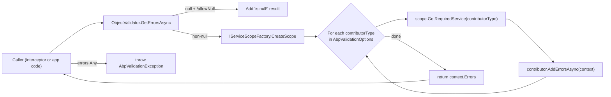

ABP ships a small but pluggable validation pipeline that sits between the dependency
injection container and method-level interception. Two packages cooperate:
`Volo.Abp.Validation.Abstractions` defines the exception type and a marker interface,
while `Volo.Abp.Validation` provides the module, the `IObjectValidator` runtime, the
data-annotation contributor and the interceptor that wires everything into ABP's
dynamic proxy stack. This page maps every file in those two projects to its role,
shows the real signatures of the public surface, and explains how the
`AbpValidationOptions.ObjectValidationContributors` list is populated automatically.
For the interceptor specifics see [method-invocation validation](/validation/method-invocation-validation),
and for the FluentValidation bridge see [FluentValidation integration](/validation/fluent-validation-integration).

## File inventory

The packages live under `framework/src/`. Two projects make the core pipeline; a
third project (`Volo.Abp.FluentValidation`) is documented on its own page.

<Tabs>
  <Tab title="Volo.Abp.Validation">

| File | Role |
| --- | --- |
| `Volo.Abp.Validation/Volo/Abp/Validation/AbpValidationModule.cs` | The module — registers the interceptor hook and auto-collects contributors. |
| `Volo.Abp.Validation/Volo/Abp/Validation/AbpValidationOptions.cs` | Options object: `IgnoredTypes` and `ObjectValidationContributors`. |
| `Volo.Abp.Validation/Volo/Abp/Validation/IObjectValidator.cs` | The entry-point service interface. |
| `Volo.Abp.Validation/Volo/Abp/Validation/ObjectValidator.cs` | Default implementation that loops over contributors. |
| `Volo.Abp.Validation/Volo/Abp/Validation/IObjectValidationContributor.cs` | Plug-in contract — one `AddErrorsAsync(ObjectValidationContext)`. |
| `Volo.Abp.Validation/Volo/Abp/Validation/ObjectValidationContext.cs` | Context passed to contributors: validating object + error list. |
| `Volo.Abp.Validation/Volo/Abp/Validation/DataAnnotationObjectValidationContributor.cs` | Built-in `[Required]`, `[StringLength]`, `IValidatableObject` contributor. |
| `Volo.Abp.Validation/Volo/Abp/Validation/IAttributeValidationResultProvider.cs` + `DefaultAttributeValidationResultProvider.cs` | Strategy for running a single `ValidationAttribute`. |
| `Volo.Abp.Validation/Volo/Abp/Validation/IValidationEnabled.cs` | Marker interface that opts a service in to interception. |
| `Volo.Abp.Validation/Volo/Abp/Validation/DisableValidationAttribute.cs` | Opt-out at class / method / property level. |
| `Volo.Abp.Validation/Volo/Abp/Validation/EnableValidationAttribute.cs` | Re-enable for a single method on a disabled class. |
| `Volo.Abp.Validation/Volo/Abp/Validation/AbpValidationResult.cs` + `IAbpValidationResult.cs` | Mutable container of `ValidationResult` items. |
| `Volo.Abp.Validation/Volo/Abp/Validation/HasValidationErrorsExtensions.cs` | Fluent `WithValidationError(...)` helpers for `IHasValidationErrors`. |
| `Volo.Abp.Validation/Volo/Abp/Validation/ValidationInterceptor.cs` | The `IAbpInterceptor` that runs the validator before each call. |
| `Volo.Abp.Validation/Volo/Abp/Validation/ValidationInterceptorRegistrar.cs` | Registration hook for `IValidationEnabled` services. |
| `Volo.Abp.Validation/Volo/Abp/Validation/MethodInvocationValidator.cs` | Walks method parameters, calls `IObjectValidator` per argument. |
| `Volo.Abp.Validation/Volo/Abp/Validation/MethodInvocationValidationContext.cs` | Per-call context (target, method, arguments). |
| `Volo.Abp.Validation/Volo/Abp/Validation/IMethodInvocationValidator.cs` | The interceptor's collaborator interface. |
| `Volo.Abp.Validation/Volo/Abp/Validation/ValidationHelper.cs` | Static `IsValidEmailAddress` regex helper. |
| `Volo.Abp.Validation/Volo/Abp/Validation/Localization/AbpValidationResource.cs` + `*.json` | Embedded localization resource for built-in messages. |
| `Volo.Abp.Validation/Volo/Abp/Validation/StringValues/*` | A separate family of types for typed setting/feature values (covered in settings/features docs). |

  </Tab>
  <Tab title="Volo.Abp.Validation.Abstractions">

| File | Role |
| --- | --- |
| `Volo.Abp.Validation.Abstractions/Volo/Abp/Validation/AbpValidationAbstractionsModule.cs` | Empty module — keeps abstractions independent from the localization stack. |
| `Volo.Abp.Validation.Abstractions/Volo/Abp/Validation/AbpValidationException.cs` | `AbpException`-derived exception with a `ValidationErrors` list. |
| `Volo.Abp.Validation.Abstractions/Volo/Abp/Validation/IHasValidationErrors.cs` | Marker for exceptions that carry validation results. |

  </Tab>
  <Tab title="Volo.Abp.Core / Validation attributes">

| File | Role |
| --- | --- |
| `Volo.Abp.Core/Volo/Abp/Validation/DynamicMaxLengthAttribute.cs` | `MaxLengthAttribute` whose `Length` is loaded from a static property at construction time. |
| `Volo.Abp.Core/Volo/Abp/Validation/DynamicStringLengthAttribute.cs` | Same pattern for `StringLengthAttribute` (min/max). |
| `Volo.Abp.Core/Volo/Abp/Validation/DynamicRangeAttribute.cs` | Same pattern for `RangeAttribute`. |

These attributes live in the core project — they avoid a hard reference from
business code to `Volo.Abp.Validation` so they can be used on DTOs in modules
that do not depend on the validation module directly.

  </Tab>
</Tabs>

## The module

`AbpValidationModule` depends on the abstractions module and on
`AbpLocalizationModule` (the built-in error messages are localized). It does two
things during `PreConfigureServices`: install a registration callback for the
[validation interceptor](/validation/method-invocation-validation), and **auto-collect**
every `IObjectValidationContributor` registered in the container into
`AbpValidationOptions.ObjectValidationContributors`.

```csharp framework/src/Volo.Abp.Validation/Volo/Abp/Validation/AbpValidationModule.cs
[DependsOn(
    typeof(AbpValidationAbstractionsModule),
    typeof(AbpLocalizationModule)
    )]
public class AbpValidationModule : AbpModule
{
    public override void PreConfigureServices(ServiceConfigurationContext context)
    {
        context.Services.OnRegistered(ValidationInterceptorRegistrar.RegisterIfNeeded);
        AutoAddObjectValidationContributors(context.Services);
    }

    public override void ConfigureServices(ServiceConfigurationContext context)
    {
        Configure<AbpVirtualFileSystemOptions>(options =>
        {
            options.FileSets.AddEmbedded<AbpValidationResource>();
        });

        Configure<AbpLocalizationOptions>(options =>
        {
            options.Resources
                .Add<AbpValidationResource>("en")
                .AddVirtualJson("/Volo/Abp/Validation/Localization");
        });
    }

    private static void AutoAddObjectValidationContributors(IServiceCollection services)
    {
        var contributorTypes = new List<Type>();

        services.OnRegistered(context =>
        {
            if (typeof(IObjectValidationContributor).IsAssignableFrom(context.ImplementationType))
            {
                contributorTypes.Add(context.ImplementationType);
            }
        });

        services.Configure<AbpValidationOptions>(options =>
        {
            options.ObjectValidationContributors.AddIfNotContains(contributorTypes);
        });
    }
}
```

<Note>
Auto-collection runs through `IServiceCollection.OnRegistered`, the same DI extension
covered in [conventional registration](/di/conventional-registration). Any class that
implements `IObjectValidationContributor` and is registered (e.g. by the default
conventional registrar) is appended to the contributor list — no manual wiring.
</Note>

The abstractions module is intentionally empty:

```csharp framework/src/Volo.Abp.Validation.Abstractions/Volo/Abp/Validation/AbpValidationAbstractionsModule.cs
public class AbpValidationAbstractionsModule : AbpModule { }
```

Its sole purpose is to let other packages depend on the exception type without
dragging in the entire validation pipeline.

## AbpValidationOptions

The options object exposes two collections:

```csharp framework/src/Volo.Abp.Validation/Volo/Abp/Validation/AbpValidationOptions.cs
public class AbpValidationOptions
{
    public List<Type> IgnoredTypes { get; }

    public ITypeList<IObjectValidationContributor> ObjectValidationContributors { get; set; }

    public AbpValidationOptions()
    {
        IgnoredTypes = new List<Type>();
        ObjectValidationContributors = new TypeList<IObjectValidationContributor>();
    }
}
```

| Member | Purpose |
| --- | --- |
| `IgnoredTypes` | Types skipped during recursive data-annotation validation (see `DataAnnotationObjectValidationContributor.ValidateObjectRecursively`). |
| `ObjectValidationContributors` | Ordered list of contributor *types* — resolved from the container per validation call. |

You typically don't add types here yourself; auto-collection during module
configuration does it for you. Override the list (e.g. to reorder) in your own
module's `ConfigureServices`:

```csharp
Configure<AbpValidationOptions>(options =>
{
    options.IgnoredTypes.Add(typeof(IQueryable));
});
```

## The object validator pipeline

`IObjectValidator` is the public entry point. Application code rarely calls it
directly — the [method-invocation interceptor](/validation/method-invocation-validation)
does — but tests and custom code can use it to validate ad-hoc graphs.

```csharp framework/src/Volo.Abp.Validation/Volo/Abp/Validation/IObjectValidator.cs
public interface IObjectValidator
{
    Task ValidateAsync(
        object validatingObject,
        string? name = null,
        bool allowNull = false
    );

    Task<List<ValidationResult>> GetErrorsAsync(
        object validatingObject,
        string? name = null,
        bool allowNull = false
    );
}
```

The default implementation `ObjectValidator` (transient) builds an
`ObjectValidationContext`, creates a DI scope, and asks each registered
contributor to add errors:

```csharp framework/src/Volo.Abp.Validation/Volo/Abp/Validation/ObjectValidator.cs
public virtual async Task<List<ValidationResult>> GetErrorsAsync(object validatingObject, string? name = null, bool allowNull = false)
{
    if (validatingObject == null)
    {
        if (allowNull)
        {
            return new List<ValidationResult>(); //TODO: Returning an array would be more performent
        }
        else
        {
            return new List<ValidationResult>
                {
                    name == null
                        ? new ValidationResult("Given object is null!")
                        : new ValidationResult(name + " is null!", new[] {name})
                };
        }
    }

    var context = new ObjectValidationContext(validatingObject);

    using (var scope = ServiceScopeFactory.CreateScope())
    {
        foreach (var contributorType in Options.ObjectValidationContributors)
        {
            var contributor = (IObjectValidationContributor)
                scope.ServiceProvider.GetRequiredService(contributorType);
            await contributor.AddErrorsAsync(context);
        }
    }

    return context.Errors;
}
```

`ValidateAsync` simply throws `AbpValidationException` if `GetErrorsAsync`
returns a non-empty list:

```csharp framework/src/Volo.Abp.Validation/Volo/Abp/Validation/ObjectValidator.cs
public virtual async Task ValidateAsync(object validatingObject, string? name = null, bool allowNull = false)
{
    var errors = await GetErrorsAsync(validatingObject, name, allowNull);

    if (errors.Any())
    {
        throw new AbpValidationException(
            "Object state is not valid! See ValidationErrors for details.",
            errors
        );
    }
}
```

### Flow diagram



## ObjectValidationContext and contributors

Every contributor sees the same context:

```csharp framework/src/Volo.Abp.Validation/Volo/Abp/Validation/ObjectValidationContext.cs
public class ObjectValidationContext
{
    [NotNull]
    public object ValidatingObject { get; }

    public List<ValidationResult> Errors { get; }

    public ObjectValidationContext([NotNull] object validatingObject)
    {
        ValidatingObject = Check.NotNull(validatingObject, nameof(validatingObject));
        Errors = new List<ValidationResult>();
    }
}
```

The contributor interface is one method:

```csharp framework/src/Volo.Abp.Validation/Volo/Abp/Validation/IObjectValidationContributor.cs
public interface IObjectValidationContributor
{
    Task AddErrorsAsync(ObjectValidationContext context);
}
```

### Built-in contributors

<CardGroup cols={2}>
  <Card title="DataAnnotationObjectValidationContributor" icon="tag">
    Reads `ValidationAttribute`s via `TypeDescriptor`, recursively walks
    property graphs and `IEnumerable` items (depth-capped at 8) and invokes
    `IValidatableObject.Validate` if the object implements it.
  </Card>
  <Card title="FluentObjectValidationContributor" icon="droplet">
    Looks up `IValidator<T>` from the container and runs it. Ships in
    [Volo.Abp.FluentValidation](/validation/fluent-validation-integration).
  </Card>
</CardGroup>

The data-annotation contributor includes both attribute scanning and
`IValidatableObject` support in a single pass:

```csharp framework/src/Volo.Abp.Validation/Volo/Abp/Validation/DataAnnotationObjectValidationContributor.cs
public void AddErrors(List<ValidationResult> errors, object validatingObject)
{
    var properties = TypeDescriptor.GetProperties(validatingObject).Cast<PropertyDescriptor>();

    foreach (var property in properties)
    {
        AddPropertyErrors(validatingObject, property, errors);
    }

    if (validatingObject is IValidatableObject validatableObject)
    {
        errors.AddRange(
            validatableObject.Validate(new ValidationContext(validatableObject, ServiceProvider, null))
        );
    }
}
```

Per-property attributes are dispatched through `IAttributeValidationResultProvider`,
which gives modules a hook to override how a `ValidationAttribute` is evaluated:

```csharp framework/src/Volo.Abp.Validation/Volo/Abp/Validation/IAttributeValidationResultProvider.cs
public interface IAttributeValidationResultProvider
{
    ValidationResult? GetOrDefault(ValidationAttribute validationAttribute, object? validatingObject, ValidationContext validationContext);
}
```

```csharp framework/src/Volo.Abp.Validation/Volo/Abp/Validation/DefaultAttributeValidationResultProvider.cs
public class DefaultAttributeValidationResultProvider : IAttributeValidationResultProvider, ITransientDependency
{
    public virtual ValidationResult? GetOrDefault(ValidationAttribute validationAttribute, object? validatingObject, ValidationContext validationContext)
    {
        return validationAttribute.GetValidationResult(validatingObject, validationContext);
    }
}
```

### Recursion and `IgnoredTypes`

`DataAnnotationObjectValidationContributor` walks the object graph up to
`MaxRecursiveParameterValidationDepth = 8`. It skips primitives, `IQueryable`
sources, anything in `AbpValidationOptions.IgnoredTypes` and any property
decorated with `[DisableValidation]`.

```csharp framework/src/Volo.Abp.Validation/Volo/Abp/Validation/DataAnnotationObjectValidationContributor.cs
protected virtual void ValidateObjectRecursively(List<ValidationResult> errors, object? validatingObject, int currentDepth)
{
    if (currentDepth > MaxRecursiveParameterValidationDepth)
    {
        return;
    }
    // ...
    if (Options.IgnoredTypes.Any(t => t.IsInstanceOfType(validatingObject)))
    {
        return;
    }

    var properties = TypeDescriptor.GetProperties(validatingObject).Cast<PropertyDescriptor>();
    foreach (var property in properties)
    {
        if (property.Attributes.OfType<DisableValidationAttribute>().Any())
        {
            continue;
        }

        ValidateObjectRecursively(errors, property.GetValue(validatingObject), currentDepth + 1);
    }
}
```

### Writing your own contributor

```csharp
public class CustomBusinessRuleContributor : IObjectValidationContributor, ITransientDependency
{
    public Task AddErrorsAsync(ObjectValidationContext context)
    {
        if (context.ValidatingObject is CreateOrderDto dto && dto.Total < 0)
        {
            context.Errors.Add(new ValidationResult("Total cannot be negative.", new[] { nameof(dto.Total) }));
        }
        return Task.CompletedTask;
    }
}
```

Because the module's `OnRegistered` callback picks up every
`IObjectValidationContributor`, the type above is auto-added to the contributor
list with no further configuration.

## Validation results

Contributors append to a `List<ValidationResult>` exposed via two thin types:

```csharp framework/src/Volo.Abp.Validation/Volo/Abp/Validation/IAbpValidationResult.cs
public interface IAbpValidationResult
{
    List<ValidationResult> Errors { get; }
}
```

```csharp framework/src/Volo.Abp.Validation/Volo/Abp/Validation/AbpValidationResult.cs
public class AbpValidationResult : IAbpValidationResult
{
    public List<ValidationResult> Errors { get; }

    public AbpValidationResult()
    {
        Errors = new List<ValidationResult>();
    }
}
```

`MethodInvocationValidationContext` extends this base so the interceptor can
share the same `Errors` list across `_objectValidator.GetErrorsAsync` calls per
parameter — see [method-invocation validation](/validation/method-invocation-validation).

## AbpValidationException

Validation failures surface as `AbpValidationException`, a subtype of
`AbpException` that carries the error list and self-logs at `Warning` level by
default.

```csharp framework/src/Volo.Abp.Validation.Abstractions/Volo/Abp/Validation/AbpValidationException.cs
[Serializable]
public class AbpValidationException : AbpException,
    IHasLogLevel,
    IHasValidationErrors,
    IExceptionWithSelfLogging
{
    /// <summary>
    /// Detailed list of validation errors for this exception.
    /// </summary>
    public IList<ValidationResult> ValidationErrors { get; }

    /// <summary>
    /// Exception severity.
    /// Default: Warn.
    /// </summary>
    public LogLevel LogLevel { get; set; }
    // ... constructors ...
}
```

`AbpValidationException.Log(ILogger)` writes one line per validation result so
the same log entry contains the field name and the message — convenient when
the exception is caught by the [web exception filter](/web/exception-handling).

```csharp framework/src/Volo.Abp.Validation.Abstractions/Volo/Abp/Validation/AbpValidationException.cs
public void Log(ILogger logger)
{
    if (ValidationErrors.IsNullOrEmpty())
    {
        return;
    }

    var validationErrors = new StringBuilder();
    validationErrors.AppendLine("There are " + ValidationErrors.Count + " validation errors:");
    foreach (var validationResult in ValidationErrors)
    {
        var memberNames = "";
        if (validationResult.MemberNames != null && validationResult.MemberNames.Any())
        {
            memberNames = " (" + string.Join(", ", validationResult.MemberNames) + ")";
        }

        validationErrors.AppendLine(validationResult.ErrorMessage + memberNames);
    }

    logger.LogWithLevel(LogLevel, validationErrors.ToString());
}
```

### Building exceptions with extension methods

`HasValidationErrorsExtensions` adds a fluent `WithValidationError` to any
`IHasValidationErrors` (so it also works on `AbpBusinessException` subclasses
that opt in to the marker):

```csharp framework/src/Volo.Abp.Validation/Volo/Abp/Validation/HasValidationErrorsExtensions.cs
public static TException WithValidationError<TException>([NotNull] this TException exception, [NotNull] ValidationResult validationError)
    where TException : IHasValidationErrors
{
    Check.NotNull(exception, nameof(exception));
    Check.NotNull(validationError, nameof(validationError));

    exception.ValidationErrors.Add(validationError);

    return exception;
}

public static TException WithValidationError<TException>([NotNull] this TException exception, string errorMessage, params string[] memberNames)
    where TException : IHasValidationErrors
{
    var validationResult = memberNames.IsNullOrEmpty()
        ? new ValidationResult(errorMessage)
        : new ValidationResult(errorMessage, memberNames);

    return exception.WithValidationError(validationResult);
}
```

Typical usage from a domain service:

```csharp
throw new AbpValidationException("Customer is not valid.")
    .WithValidationError("Email is required.", nameof(CreateCustomerDto.Email))
    .WithValidationError("Country must be ISO-3166.", nameof(CreateCustomerDto.CountryCode));
```

## Opt-in vs opt-out

ABP's interception is *opt-in* for the validation pipeline. There are three
controls:

| Control | Effect |
| --- | --- |
| `IValidationEnabled` marker interface | Class becomes a candidate for `ValidationInterceptor` — see [validation interception](/validation/method-invocation-validation). Application services already implement it transitively. |
| `[DisableValidation]` | On a class, a method or a property — skips validation for that target. |
| `[EnableValidation]` | On a method — re-enables when the declaring class has `[DisableValidation]`. |

```csharp framework/src/Volo.Abp.Validation/Volo/Abp/Validation/IValidationEnabled.cs
namespace Volo.Abp.Validation;

public interface IValidationEnabled
{

}
```

```csharp framework/src/Volo.Abp.Validation/Volo/Abp/Validation/DisableValidationAttribute.cs
[AttributeUsage(AttributeTargets.Method | AttributeTargets.Class | AttributeTargets.Property)]
public class DisableValidationAttribute : Attribute
{

}
```

```csharp framework/src/Volo.Abp.Validation/Volo/Abp/Validation/EnableValidationAttribute.cs
[AttributeUsage(AttributeTargets.Method)]
public class EnableValidationAttribute : Attribute
{

}
```

When applied on a property, `[DisableValidation]` is honored by the
data-annotation contributor's recursive walk (the property is skipped). When
applied on a method or class, it short-circuits `MethodInvocationValidator`.

## Dynamic data-annotation attributes

`Volo.Abp.Core` ships three attributes that read a length / range from a static
property at construction time, so DTO classes can reuse a single constants
class as the source of truth:

```csharp framework/src/Volo.Abp.Core/Volo/Abp/Validation/DynamicMaxLengthAttribute.cs
public class DynamicMaxLengthAttribute : MaxLengthAttribute
{
    private static readonly FieldInfo? MaximumLengthField;

    static DynamicMaxLengthAttribute()
    {
        MaximumLengthField = typeof(MaxLengthAttribute).GetField(
            "<Length>k__BackingField",
            BindingFlags.Instance | BindingFlags.NonPublic
        );
        Debug.Assert(MaximumLengthField != null, nameof(MaximumLengthField) + " != null");
    }

    public DynamicMaxLengthAttribute(
        [NotNull] Type sourceType,
        string? maximumLengthPropertyName)
    {
        Check.NotNull(sourceType, nameof(sourceType));

        if (maximumLengthPropertyName != null)
        {
            var maximumLengthProperty = sourceType.GetProperty(
                maximumLengthPropertyName,
                BindingFlags.Static | BindingFlags.Public
            );
            Debug.Assert(maximumLengthProperty != null, nameof(maximumLengthProperty) + " != null");
            MaximumLengthField?.SetValue(this, (int)maximumLengthProperty?.GetValue(null)!);
        }
    }
}
```

```csharp
public static class UserConsts
{
    public static int NameMaxLength { get; set; } = 64;
}

public class UpdateUserDto
{
    [DynamicMaxLength(typeof(UserConsts), nameof(UserConsts.NameMaxLength))]
    public string Name { get; set; }
}
```

`DynamicStringLengthAttribute` and `DynamicRangeAttribute` follow the same
pattern for `StringLengthAttribute` and `RangeAttribute`.

## Localization resource

ABP's built-in validation messages live in an embedded resource so they can be
overridden per culture:

```csharp framework/src/Volo.Abp.Validation/Volo/Abp/Validation/AbpValidationModule.cs
Configure<AbpVirtualFileSystemOptions>(options =>
{
    options.FileSets.AddEmbedded<AbpValidationResource>();
});

Configure<AbpLocalizationOptions>(options =>
{
    options.Resources
        .Add<AbpValidationResource>("en")
        .AddVirtualJson("/Volo/Abp/Validation/Localization");
});
```

JSON files for `en`, `tr`, `de`, `fr`, `es`, `ru`, `zh-Hans` and many more
locales live under `Volo.Abp.Validation/Volo/Abp/Validation/Localization/`.

## ValidationHelper

A tiny helper for e-mail validation, used by the framework where a DataAnnotation
`EmailAddressAttribute` would be too strict.

```csharp framework/src/Volo.Abp.Validation/Volo/Abp/Validation/ValidationHelper.cs
public class ValidationHelper
{
    // Taken from W3C as an alternative to the RFC5322 specification: https://html.spec.whatwg.org/#valid-e-mail-address
    public static string EmailRegEx { get; set; } = @"^[a-zA-Z0-9.!#$%&'*+\/=?^_`{|}~-]+@[a-zA-Z0-9](?:[a-zA-Z0-9-]{0,61}[a-zA-Z0-9])?(?:\.[a-zA-Z0-9](?:[a-zA-Z0-9-]{0,61}[a-zA-Z0-9])?)*$";

    public static bool IsValidEmailAddress(string email)
    {
        if (string.IsNullOrEmpty(email))
        {
            return false;
        }

        return Regex.IsMatch(email, EmailRegEx, RegexOptions.Compiled | RegexOptions.IgnoreCase);
    }
}
```

Because `EmailRegEx` is a static property, modules can replace the pattern
during startup.

## Where to go next

<CardGroup cols={2}>
  <Card title="Method-invocation validation" icon="bolt" href="/validation/method-invocation-validation">
    How `ValidationInterceptor` and `MethodInvocationValidator` cooperate with
    [Castle DynamicProxy](/di/castle-dynamic-proxy) to validate every public
    method on `IValidationEnabled` services.
  </Card>
  <Card title="FluentValidation integration" icon="droplet" href="/validation/fluent-validation-integration">
    The `Volo.Abp.FluentValidation` module — auto-registers `IValidator<T>` and
    plugs it into the contributor pipeline.
  </Card>
  <Card title="Web exception handling" icon="globe" href="/web/exception-handling">
    Where `AbpValidationException` is converted into a
    `RemoteServiceErrorResponse` with HTTP 400.
  </Card>
  <Card title="Conventional registration" icon="screwdriver-wrench" href="/di/conventional-registration">
    The DI mechanism that makes auto-collection of contributors possible.
  </Card>
</CardGroup>
