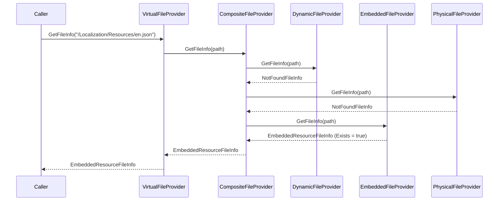

`IVirtualFileProvider` is the single service every consumer talks to, but it is a thin facade. Behind it lives a small zoo of providers and `IFileInfo` implementations: a `CompositeFileProvider` that merges every registered file set, an abstract `DictionaryBasedFileProvider` that backs the embedded and dynamic providers, the runtime-writable `DynamicFileProvider`, and a family of `IFileInfo` types that represent embedded resources, synthetic directories, and in-memory files. This page documents each of them with their real signatures and explains how they compose at request time.

If you have not read it yet, start with [VFS overview](/vfs/overview), then [Embedded files](/vfs/embedded-files) and [Physical files](/vfs/physical-files) for the two primary file-set kinds.

## The composite `VirtualFileProvider`

The runtime root is `VirtualFileProvider`, registered as `ISingletonDependency`:

```csharp Volo/Abp/VirtualFileSystem/VirtualFileProvider.cs
public class VirtualFileProvider : IVirtualFileProvider, ISingletonDependency
{
    private readonly IFileProvider _hybridFileProvider;
    private readonly AbpVirtualFileSystemOptions _options;

    public VirtualFileProvider(
        IOptions<AbpVirtualFileSystemOptions> options,
        IDynamicFileProvider dynamicFileProvider)
    {
        _options = options.Value;
        _hybridFileProvider = CreateHybridProvider(dynamicFileProvider);
    }

    public virtual IFileInfo GetFileInfo(string subpath)
        => _hybridFileProvider.GetFileInfo(subpath);

    public virtual IDirectoryContents GetDirectoryContents(string subpath)
    {
        if (subpath == "")
        {
            subpath = "/";
        }
        return _hybridFileProvider.GetDirectoryContents(subpath);
    }

    public virtual IChangeToken Watch(string filter)
        => _hybridFileProvider.Watch(filter);

    protected virtual IFileProvider CreateHybridProvider(IDynamicFileProvider dynamicFileProvider)
    {
        var fileProviders = new List<IFileProvider>();

        fileProviders.Add(dynamicFileProvider);

        foreach (var fileSet in _options.FileSets.AsEnumerable().Reverse())
        {
            fileProviders.Add(fileSet.FileProvider);
        }

        return new CompositeFileProvider(fileProviders);
    }
}
```

Three observations:

- The composite is built **once**, eagerly in the constructor. Adding to `FileSets` after the singleton is resolved has no effect — that is why all VFS configuration must happen in `ConfigureServices` / `PreConfigureServices` / `PostConfigureServices`, before any service resolves `IVirtualFileProvider`.
- The dynamic provider sits at index 0 of the composite, so an `AddOrUpdate(...)` call always wins.
- `FileSets` is iterated in **reverse** before being added to the composite. The set registered last (typically the host app) takes precedence over framework modules.

For an empty `subpath`, `GetDirectoryContents` is normalised to `"/"` to match the way `AbpEmbeddedFileProvider` keys the root.

## `DictionaryBasedFileProvider`

The embedded provider and the dynamic provider both extend `DictionaryBasedFileProvider`, which implements `IFileProvider` over an in-memory dictionary keyed by virtual path:

```csharp Volo/Abp/VirtualFileSystem/DictionaryBasedFileProvider.cs
public abstract class DictionaryBasedFileProvider : IFileProvider
{
    protected abstract IDictionary<string, IFileInfo> Files { get; }

    public virtual IFileInfo GetFileInfo(string? subpath)
    {
        if (subpath == null)
        {
            return new NotFoundFileInfo(subpath!);
        }

        var file = Files.GetOrDefault(NormalizePath(subpath));
        if (file == null)
        {
            return new NotFoundFileInfo(subpath);
        }

        return file;
    }

    public virtual IDirectoryContents GetDirectoryContents(string subpath)
    {
        var directory = GetFileInfo(subpath);
        if (!directory.IsDirectory)
        {
            return NotFoundDirectoryContents.Singleton;
        }

        var fileList = new List<IFileInfo>();
        var directoryPath = subpath.EnsureEndsWith('/');
        foreach (var fileInfo in Files.Values)
        {
            var fullPath = fileInfo.GetVirtualOrPhysicalPathOrNull();
            if (fullPath == null || !fullPath.StartsWith(directoryPath))
            {
                continue;
            }

            var relativePath = fullPath.Substring(directoryPath.Length);
            if (relativePath.Contains("/"))
            {
                continue;
            }

            fileList.Add(fileInfo);
        }

        return new EnumerableDirectoryContents(fileList);
    }

    public virtual IChangeToken Watch(string filter)
        => NullChangeToken.Singleton;

    protected virtual string NormalizePath(string subpath) => subpath;
}
```

Key points:

- **Lookups** apply `NormalizePath` first. Subclasses override this — `AbpEmbeddedFileProvider` delegates to `VirtualFilePathHelper.NormalizePath` (see [Embedded files](/vfs/embedded-files#path-normalisation)).
- **Directory contents** are computed by linear scan: every entry whose path starts with `directoryPath` and has no further `/` after it is included. This makes large dictionaries O(N) for each `GetDirectoryContents` call, which is acceptable because embedded sets are typically a few hundred entries.
- **Watch returns `NullChangeToken.Singleton`** — dictionary entries do not change unless the subclass overrides this. `DynamicFileProvider` does.
- Entries use `IFileInfo.GetVirtualOrPhysicalPathOrNull()` (the [`AbpFileInfoExtensions`](/vfs/overview#reading-file-content) helper) so the directory scan works for both `EmbeddedResourceFileInfo` (virtual path) and `InMemoryFileInfo` (dynamic path).

`EnumerableDirectoryContents` is a trivial wrapper that exposes an `IEnumerable<IFileInfo>` as an `IDirectoryContents` with `Exists = true`.

## `DynamicFileProvider`

`DynamicFileProvider` extends `DictionaryBasedFileProvider` to allow runtime additions and per-path change-token notifications. It is the **only** writable provider in the chain — everything else is constructed once and immutable.

```csharp Volo/Abp/VirtualFileSystem/DynamicFileProvider.cs
public class DynamicFileProvider : DictionaryBasedFileProvider,
                                   IDynamicFileProvider,
                                   ISingletonDependency
{
    protected override IDictionary<string, IFileInfo> Files => DynamicFiles;

    protected ConcurrentDictionary<string, IFileInfo> DynamicFiles { get; }
    protected ConcurrentDictionary<string, ChangeTokenInfo> FilePathTokenLookup { get; }

    public DynamicFileProvider()
    {
        FilePathTokenLookup = new ConcurrentDictionary<string, ChangeTokenInfo>(
            StringComparer.OrdinalIgnoreCase);
        DynamicFiles = new ConcurrentDictionary<string, IFileInfo>();
    }

    public void AddOrUpdate(IFileInfo fileInfo)
    {
        var filePath = fileInfo.GetVirtualOrPhysicalPathOrNull();
        DynamicFiles.AddOrUpdate(filePath!, fileInfo, (key, value) => fileInfo);
        ReportChange(filePath!);
    }

    public bool Delete(string filePath)
    {
        if (!DynamicFiles.TryRemove(filePath, out _))
        {
            return false;
        }
        ReportChange(filePath);
        return true;
    }

    public override IChangeToken Watch(string filter)
        => GetOrAddChangeToken(filter);
    // ...
}
```

The `IDynamicFileProvider` contract is intentionally tiny:

```csharp Volo/Abp/VirtualFileSystem/IDynamicFileProvider.cs
public interface IDynamicFileProvider : IFileProvider
{
    void AddOrUpdate(IFileInfo fileInfo);
    bool Delete(string filePath);
}
```

### Change-token semantics

Every call to `Watch(filter)` registers (or reuses) a per-path `CancellationChangeToken`. `AddOrUpdate` and `Delete` cancel and remove the registered token, so any consumer that was subscribed sees the change immediately:

```csharp
private IChangeToken GetOrAddChangeToken(string filePath)
{
    if (!FilePathTokenLookup.TryGetValue(filePath, out var tokenInfo))
    {
        var cancellationTokenSource = new CancellationTokenSource();
        var cancellationChangeToken = new CancellationChangeToken(cancellationTokenSource.Token);
        tokenInfo = new ChangeTokenInfo(cancellationTokenSource, cancellationChangeToken);
        tokenInfo = FilePathTokenLookup.GetOrAdd(filePath, tokenInfo);
    }
    return tokenInfo.ChangeToken;
}

private void ReportChange(string filePath)
{
    if (FilePathTokenLookup.TryRemove(filePath, out var tokenInfo))
    {
        tokenInfo.TokenSource.Cancel();
    }
}
```

The source code carries a candid comment about the current limitations:

> ```
> //TODO: Work with directory & wildcard watches!
> //TODO: Work with dictionaries!
> ```
> 
> *Current implementation only supports file watch. Does not support directory or wildcard watches.*

In practice you should call `Watch` with an exact virtual path, not a glob — globs are matched only against the literal key.

### Adding a runtime file

`AddOrUpdate` keys the file by `IFileInfo.GetVirtualOrPhysicalPathOrNull()`, which means the `IFileInfo` you push must report a path through one of the three recognised channels:

```csharp
public static string? GetVirtualOrPhysicalPathOrNull([NotNull] this IFileInfo fileInfo)
{
    if (fileInfo is EmbeddedResourceFileInfo embeddedFileInfo) return embeddedFileInfo.VirtualPath;
    if (fileInfo is InMemoryFileInfo inMemoryFileInfo)       return inMemoryFileInfo.DynamicPath;
    return fileInfo.PhysicalPath;
}
```

For most runtime additions the right choice is `InMemoryFileInfo`, which carries an explicit `DynamicPath`.

## `InMemoryFileInfo`

`InMemoryFileInfo` represents a synthetic file backed by a byte array:

```csharp Volo/Abp/VirtualFileSystem/InMemoryFileInfo.cs
public class InMemoryFileInfo : IFileInfo
{
    public bool Exists => true;
    public long Length => _fileContent.Length;
    public string? PhysicalPath => null;
    public string Name { get; }
    public DateTimeOffset LastModified { get; }
    public bool IsDirectory => false;

    private readonly byte[] _fileContent;
    public string DynamicPath { get; }

    public InMemoryFileInfo(string dynamicPath, byte[] fileContent, string name)
    {
        DynamicPath = dynamicPath;
        Name = name;
        _fileContent = fileContent;
        LastModified = DateTimeOffset.Now;
    }

    public Stream CreateReadStream() => new MemoryStream(_fileContent, false);
}
```

Typical use:

```csharp
public class GeneratedScriptPublisher
{
    private readonly IDynamicFileProvider _dynamicFiles;

    public GeneratedScriptPublisher(IDynamicFileProvider dynamicFiles)
        => _dynamicFiles = dynamicFiles;

    public void Publish(string virtualPath, string content)
    {
        var bytes = Encoding.UTF8.GetBytes(content);
        var name = Path.GetFileName(virtualPath);
        _dynamicFiles.AddOrUpdate(new InMemoryFileInfo(virtualPath, bytes, name));
    }
}
```

This is exactly the pattern the framework uses internally to publish auto-generated client proxies and CSRF tokens into the VFS so they participate in [bundling](/ui-mvc/bundling).

## `VirtualDirectoryFileInfo`

`VirtualDirectoryFileInfo` is the directory companion to `EmbeddedResourceFileInfo`. `AbpEmbeddedFileProvider` synthesises one for every parent folder while it scans the assembly's manifest resource names, so `GetDirectoryContents("/Pages")` returns the expected list rather than an empty result:

```csharp Volo/Abp/VirtualFileSystem/VirtualDirectoryFileInfo.cs
public class VirtualDirectoryFileInfo : IFileInfo
{
    public bool Exists => true;
    public long Length => 0;
    public string PhysicalPath { get; }
    public string Name { get; }
    public DateTimeOffset LastModified { get; }
    public bool IsDirectory => true;

    public VirtualDirectoryFileInfo(string physicalPath, string name, DateTimeOffset lastModified)
    {
        PhysicalPath = physicalPath;
        Name = name;
        LastModified = lastModified;
    }

    public Stream CreateReadStream()
    {
        throw new InvalidOperationException();
    }
}
```

`CreateReadStream` throws because directories cannot be opened. Note that `PhysicalPath` here is misnamed — it actually carries the virtual directory path; that is what `DictionaryBasedFileProvider.GetDirectoryContents` matches against.

## `EnumerableDirectoryContents`

The simple `IDirectoryContents` returned by `DictionaryBasedFileProvider`:

```csharp Volo/Abp/VirtualFileSystem/EnumerableDirectoryContents.cs
internal class EnumerableDirectoryContents : IDirectoryContents
{
    private readonly IEnumerable<IFileInfo> _entries;

    public EnumerableDirectoryContents([NotNull] IEnumerable<IFileInfo> entries)
    {
        Check.NotNull(entries, nameof(entries));
        _entries = entries;
    }

    public bool Exists => true;
    public IEnumerator<IFileInfo> GetEnumerator() => _entries.GetEnumerator();
    IEnumerator IEnumerable.GetEnumerator() => _entries.GetEnumerator();
}
```

It is `internal`, so consumers see it only through the `IDirectoryContents` interface.

## `IFileInfo` type inventory

| Type | `Exists` | `IsDirectory` | `PhysicalPath` | `CreateReadStream` |
|------|----------|---------------|----------------|--------------------|
| `EmbeddedResourceFileInfo` | `true` | `false` | `null` | `assembly.GetManifestResourceStream(...)` |
| `VirtualDirectoryFileInfo` | `true` | `true` | virtual path | throws `InvalidOperationException` |
| `InMemoryFileInfo` | `true` | `false` | `null` | `new MemoryStream(_fileContent, false)` |
| `NotFoundFileInfo` (from `Microsoft.Extensions.FileProviders`) | `false` | `false` | `null` | throws |
| `PhysicalFileInfo` (from `Microsoft.Extensions.FileProviders.Physical`) | `true` | `false` | absolute disk path | opens the on-disk file |
| `ManifestFileInfo` / `ManifestDirectoryInfo` (from `Microsoft.Extensions.FileProviders.Embedded`) | `true` | varies | `null` | reads from manifest |

The first three are ABP-owned (in `Volo.Abp.VirtualFileSystem`); the rest come from Microsoft. The [Virtual File Explorer](/vfs/virtual-file-explorer-module) filters the directory listing by **type name** to a known allow list — only entries whose runtime type name is one of `VirtualDirectoryFileInfo`, `EmbeddedResourceFileInfo`, `ManifestDirectoryInfo`, `ManifestFileInfo` are shown.

## File-set `IFileProvider` inventory

| Set type | Provider returned to composite |
|----------|--------------------------------|
| `EmbeddedVirtualFileSetInfo` (assembly without manifest) | `AbpEmbeddedFileProvider` |
| `EmbeddedVirtualFileSetInfo` (assembly with manifest, no `baseFolder`) | `ManifestEmbeddedFileProvider(assembly)` |
| `EmbeddedVirtualFileSetInfo` (assembly with manifest, with `baseFolder`) | `ManifestEmbeddedFileProvider(assembly, baseFolder)` |
| `PhysicalVirtualFileSetInfo` | `PhysicalFileProvider(root, exclusionFilters)` |

`VirtualFileSetList` and `VirtualFileSetInfo` are described in [VFS overview](/vfs/overview#abpvirtualfilesystemoptions).

## Internal versus public providers

ABP's terminology distinguishes:

- **Public** providers — `VirtualFileProvider`, `DynamicFileProvider`. Reachable from DI and meant to be used or replaced.
- **Internal** providers — `AbpEmbeddedFileProvider`, `PhysicalFileProvider`, `ManifestEmbeddedFileProvider`. They live inside a `VirtualFileSetInfo` and are reached only through the composite. (`EnumerableDirectoryContents` is also `internal`, but it is an `IDirectoryContents` rather than an `IFileProvider`.)

If you need to inject your own provider implementation, the supported extension point is to add a `VirtualFileSetInfo` (or one of its subclasses) directly to `FileSets`:

```csharp
Configure<AbpVirtualFileSystemOptions>(options =>
{
    options.FileSets.Add(new VirtualFileSetInfo(myCustomFileProvider));
});
```

Because `VirtualFileSetList` is just `List<VirtualFileSetInfo>` you can insert at a specific position to control ordering, but most consumers stick with `AddEmbedded`/`AddPhysical`.

## Reading content

`Microsoft.Extensions.FileProviders.AbpFileInfoExtensions` ships the convenience extensions discussed in the overview. They work uniformly across every `IFileInfo` produced by the composite:

```csharp
public static string ReadAsString(this IFileInfo fileInfo);
public static string ReadAsString(this IFileInfo fileInfo, Encoding encoding);
public static Task<string> ReadAsStringAsync(this IFileInfo fileInfo);
public static Task<string> ReadAsStringAsync(this IFileInfo fileInfo, Encoding encoding);
public static byte[] ReadBytes(this IFileInfo fileInfo);
public static Task<byte[]> ReadBytesAsync(this IFileInfo fileInfo);
public static string? GetVirtualOrPhysicalPathOrNull(this IFileInfo fileInfo);
```

Both `ReadAsString` overloads default the encoding detection to UTF-8 (`new StreamReader(stream, encoding, true)`), which matches how ABP modules ship JSON, CSS, and JS — always UTF-8 with optional BOM.

## End-to-end request flow



The composite stops at the first `Exists == true` and returns it. For `GetDirectoryContents`, by contrast, the composite **concatenates** entries from every provider — that is what lets the [Virtual File Explorer](/vfs/virtual-file-explorer-module) show a merged view.

## Related pages

- [VFS overview](/vfs/overview) — how the composite is constructed and the lookup chain.
- [Embedded files](/vfs/embedded-files) — `AbpEmbeddedFileProvider` and the manifest provider.
- [Physical files](/vfs/physical-files) — `PhysicalFileProvider`, watch tokens, `ReplaceEmbeddedByPhysical`.
- [Virtual File Explorer](/vfs/virtual-file-explorer-module) — runtime UI that browses the composite.
- [Localization](/localization/overview) — `AddVirtualJson` consumes the composite for resource JSON.
- [UI MVC bundling](/ui-mvc/bundling) — bundle contributors read CSS/JS through `IVirtualFileProvider` and watch for changes.
