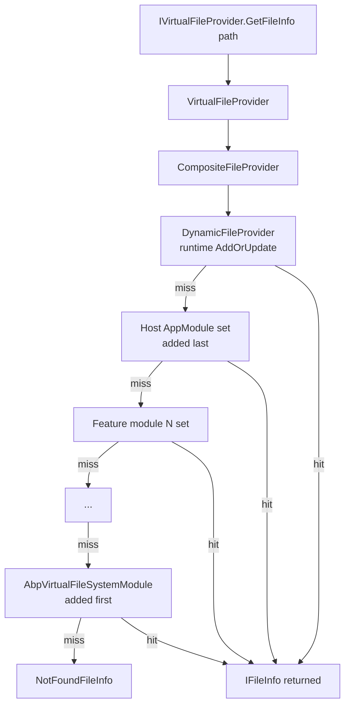

The ABP **Virtual File System** (VFS) lets a module ship CSS, JavaScript, Razor views, localization JSON, JSON schemas, and any other static asset as **embedded resources inside its own assembly**, while still being addressable by a single `/`-rooted path at runtime. Consuming applications can override the same path with a file on disk for development, or supply a dynamic in-memory file at runtime — all without the consumer caring which provider produced the file. This page introduces the module, the `IVirtualFileProvider` abstraction, the `AbpVirtualFileSystemOptions.FileSets` registration list, and the composite lookup chain that resolves a virtual path.

The VFS lives in **`Volo.Abp.VirtualFileSystem`** and is depended on by virtually every UI- or localization-bearing module in the framework. See the [`/localization`](/localization/overview) section for how the VFS supplies translation JSON, and the [`/ui-mvc`](/ui-mvc/overview) section for how it supplies bundled CSS/JS.

## The module

`AbpVirtualFileSystemModule` is the integration point. It is intentionally empty — VFS exposes its functionality entirely through the singleton `VirtualFileProvider` service (registered via `ISingletonDependency`) and the `AbpVirtualFileSystemOptions` options class. Any module that needs to publish virtual files takes a `DependsOn(typeof(AbpVirtualFileSystemModule))` attribute and configures `AbpVirtualFileSystemOptions.FileSets` in `ConfigureServices`.

```csharp Volo/Abp/VirtualFileSystem/AbpVirtualFileSystemModule.cs
using Volo.Abp.Modularity;

namespace Volo.Abp.VirtualFileSystem;

public class AbpVirtualFileSystemModule : AbpModule
{

}
```

<Note>
There are no `ConfigureServices` calls in the module itself because `VirtualFileProvider`, `DynamicFileProvider`, and the options class are wired up through ABP's convention-based registrar (the `ISingletonDependency` marker interface). The module exists so dependents can express the dependency declaratively.
</Note>

## `IVirtualFileProvider`

`IVirtualFileProvider` is an empty marker interface that extends `Microsoft.Extensions.FileProviders.IFileProvider`. Any service that wants to read virtual files takes `IVirtualFileProvider` in its constructor and calls the standard `GetFileInfo`, `GetDirectoryContents`, and `Watch` methods.

```csharp Volo/Abp/VirtualFileSystem/IVirtualFileProvider.cs
using Microsoft.Extensions.FileProviders;

namespace Volo.Abp.VirtualFileSystem;

public interface IVirtualFileProvider : IFileProvider
{

}
```

The marker exists so that ABP can register **its own** composite provider as the resolution root, independent of any `IFileProvider` instances that ASP.NET Core might have in DI for static files, Razor views, or `appsettings.json`. A consumer that wants the merged ABP virtual view asks for `IVirtualFileProvider`; a consumer that wants only the physical web root asks for `IWebHostEnvironment.WebRootFileProvider`.

## `AbpVirtualFileSystemOptions`

The configuration surface is a single options class with one property — an ordered list of registered file sets:

```csharp Volo/Abp/VirtualFileSystem/AbpVirtualFileSystemOptions.cs
namespace Volo.Abp.VirtualFileSystem;

public class AbpVirtualFileSystemOptions
{
    public VirtualFileSetList FileSets { get; }

    public AbpVirtualFileSystemOptions()
    {
        FileSets = new VirtualFileSetList();
    }
}
```

`VirtualFileSetList` is just `List<VirtualFileSetInfo>`. Each `VirtualFileSetInfo` wraps a single underlying `IFileProvider`:

```csharp Volo/Abp/VirtualFileSystem/VirtualFileSetInfo.cs
public class VirtualFileSetInfo
{
    public IFileProvider FileProvider { get; }

    public VirtualFileSetInfo([NotNull] IFileProvider fileProvider)
    {
        FileProvider = Check.NotNull(fileProvider, nameof(fileProvider));
    }
}
```

Two specialised subclasses carry extra metadata used by `ReplaceEmbeddedByPhysical<T>` and the virtual file explorer:

| Type | Extra members | Source |
|------|---------------|--------|
| `VirtualFileSetInfo` | `FileProvider` | `VirtualFileSetInfo.cs` |
| `EmbeddedVirtualFileSetInfo` | `Assembly`, `BaseFolder?` | `Embedded/EmbeddedVirtualFileSetInfo.cs` |
| `PhysicalVirtualFileSetInfo` | `Root` | `Physical/PhysicalVirtualFileSetInfo.cs` |

## Registering file sets

`VirtualFileSetListExtensions` exposes the two registration helpers every module uses:

```csharp Volo/Abp/VirtualFileSystem/VirtualFileSetListExtensions.cs
public static void AddEmbedded<T>(
    [NotNull] this VirtualFileSetList list,
    string? baseNamespace = null,
    string? baseFolder = null)
{
    Check.NotNull(list, nameof(list));

    var assembly = typeof(T).Assembly;
    var fileProvider = CreateFileProvider(
        assembly,
        baseNamespace,
        baseFolder
    );

    list.Add(new EmbeddedVirtualFileSetInfo(fileProvider, assembly, baseFolder));
}

public static void AddPhysical(
    [NotNull] this VirtualFileSetList list,
    [NotNull] string root,
    ExclusionFilters exclusionFilters = ExclusionFilters.Sensitive)
{
    Check.NotNull(list, nameof(list));
    Check.NotNullOrWhiteSpace(root, nameof(root));

    var fileProvider = new PhysicalFileProvider(root, exclusionFilters);
    list.Add(new PhysicalVirtualFileSetInfo(fileProvider, root));
}
```

`AddEmbedded<T>` picks the right embedded provider automatically. If the assembly was built with `<GenerateEmbeddedFilesManifest>true</GenerateEmbeddedFilesManifest>` in its `.csproj` (so it ships a `Microsoft.Extensions.FileProviders.Embedded.Manifest.xml` resource), the standard `ManifestEmbeddedFileProvider` is used; otherwise ABP falls back to its own `AbpEmbeddedFileProvider` which reads `assembly.GetManifestResourceNames()` directly. See [Embedded files](/vfs/embedded-files) for the details.

`AddPhysical` wraps the framework's `PhysicalFileProvider` and honours `ExclusionFilters.Sensitive` by default — so dot-files, hidden files, and OS-system files are skipped. See [Physical files](/vfs/physical-files).

A third helper, `ReplaceEmbeddedByPhysical<T>`, lets a development host swap an already-registered embedded set for a folder on disk — useful for live-editing CSS/JS or localization JSON without rebuilding the source assembly.

```csharp Volo/Abp/VirtualFileSystem/VirtualFileSetListExtensions.cs
public static void ReplaceEmbeddedByPhysical<T>(
    [NotNull] this VirtualFileSetList fileSets,
    [NotNull] string physicalPath)
{
    // ... iterates fileSets, replacing every EmbeddedVirtualFileSetInfo
    // whose Assembly == typeof(T).Assembly with a PhysicalVirtualFileSetInfo
    // rooted at physicalPath (plus the original BaseFolder if any).
}
```

<Tip>
`ReplaceEmbeddedByPhysical<TModule>(Path.Combine(Directory.GetCurrentDirectory(), @"..\..\..\..\..\framework\src\Volo.Abp.AspNetCore.Mvc.UI.Theme.Basic"))` is the canonical hot-reload pattern: it points the runtime at the source folder so a refresh in the browser picks up edits to `.css`/`.js`/`.cshtml` immediately.
</Tip>

## The composite `VirtualFileProvider`

`VirtualFileProvider` is the singleton that implements `IVirtualFileProvider`. It builds a single `CompositeFileProvider` over **all** registered file sets plus the dynamic provider:

```csharp Volo/Abp/VirtualFileSystem/VirtualFileProvider.cs
public class VirtualFileProvider : IVirtualFileProvider, ISingletonDependency
{
    private readonly IFileProvider _hybridFileProvider;
    private readonly AbpVirtualFileSystemOptions _options;

    public VirtualFileProvider(
        IOptions<AbpVirtualFileSystemOptions> options,
        IDynamicFileProvider dynamicFileProvider)
    {
        _options = options.Value;
        _hybridFileProvider = CreateHybridProvider(dynamicFileProvider);
    }

    public virtual IFileInfo GetFileInfo(string subpath)
        => _hybridFileProvider.GetFileInfo(subpath);

    public virtual IDirectoryContents GetDirectoryContents(string subpath)
    {
        if (subpath == "")
        {
            subpath = "/";
        }
        return _hybridFileProvider.GetDirectoryContents(subpath);
    }

    public virtual IChangeToken Watch(string filter)
        => _hybridFileProvider.Watch(filter);

    protected virtual IFileProvider CreateHybridProvider(IDynamicFileProvider dynamicFileProvider)
    {
        var fileProviders = new List<IFileProvider>();

        fileProviders.Add(dynamicFileProvider);

        foreach (var fileSet in _options.FileSets.AsEnumerable().Reverse())
        {
            fileProviders.Add(fileSet.FileProvider);
        }

        return new CompositeFileProvider(fileProviders);
    }
}
```

Two implementation details are worth reading carefully:

1. **`dynamicFileProvider` is added first.** Anything pushed at runtime via `IDynamicFileProvider.AddOrUpdate(...)` therefore wins over **every** static file set.
2. **`FileSets` is iterated in reverse.** The set registered *last* — typically the application host's own set — is consulted *first*. That makes "downstream wins" the natural ordering: a host can shadow a file in a depended-on module simply by registering its own set after the framework's modules have registered theirs.

## The lookup chain



The `CompositeFileProvider` short-circuits on the first provider that returns a file with `Exists == true`. For `GetDirectoryContents`, the composite **merges** the entries from every provider so the caller sees the union of all file sets at that path — that is why the [Virtual File Explorer](/vfs/virtual-file-explorer-module) can list "everything available under `/Localization/Resources`" by walking a single virtual root.

## A complete module example

A typical UI module wires its embedded `wwwroot`, `Pages`, and `Localization` folders into the VFS in a single `Configure<AbpVirtualFileSystemOptions>` call:

```csharp
[DependsOn(typeof(AbpVirtualFileSystemModule))]
public class MyFeatureModule : AbpModule
{
    public override void ConfigureServices(ServiceConfigurationContext context)
    {
        Configure<AbpVirtualFileSystemOptions>(options =>
        {
            options.FileSets.AddEmbedded<MyFeatureModule>("MyCompany.MyFeature");
        });
    }
}
```

The `baseNamespace` argument (`"MyCompany.MyFeature"`) maps the assembly's manifest-resource names back to logical paths — see the [Embedded files](/vfs/embedded-files) page for the conversion rules.

## Reading file content

The `Microsoft.Extensions.FileProviders.AbpFileInfoExtensions` static class adds convenience extensions to `IFileInfo` so callers do not have to deal with streams manually:

```csharp Microsoft/Extensions/FileProviders/AbpFileInfoExtensions.cs
public static string ReadAsString([NotNull] this IFileInfo fileInfo);
public static string ReadAsString([NotNull] this IFileInfo fileInfo, Encoding encoding);
public static Task<string> ReadAsStringAsync([NotNull] this IFileInfo fileInfo);
public static Task<string> ReadAsStringAsync([NotNull] this IFileInfo fileInfo, Encoding encoding);

public static byte[] ReadBytes([NotNull] this IFileInfo fileInfo);
public static Task<byte[]> ReadBytesAsync([NotNull] this IFileInfo fileInfo);

public static string? GetVirtualOrPhysicalPathOrNull([NotNull] this IFileInfo fileInfo);
```

`GetVirtualOrPhysicalPathOrNull` is the safe way to ask "what is the path of this file?" — it returns `embeddedFileInfo.VirtualPath` for embedded resources, `inMemoryFileInfo.DynamicPath` for dynamic in-memory files, and `fileInfo.PhysicalPath` otherwise. The [composite provider](/vfs/file-providers) uses the same helper when building dynamic dictionaries.

```csharp
public static string? GetVirtualOrPhysicalPathOrNull([NotNull] this IFileInfo fileInfo)
{
    Check.NotNull(fileInfo, nameof(fileInfo));

    if (fileInfo is EmbeddedResourceFileInfo embeddedFileInfo)
    {
        return embeddedFileInfo.VirtualPath;
    }

    if (fileInfo is InMemoryFileInfo inMemoryFileInfo)
    {
        return inMemoryFileInfo.DynamicPath;
    }

    return fileInfo.PhysicalPath;
}
```

## When to use the VFS

<CardGroup cols={2}>
  <Card title="Module-shipped assets" icon="file-zipper">
    CSS, JS, Razor views, JSON, images that travel with the module's NuGet package — use `AddEmbedded<TModule>(...)`.
  </Card>
  <Card title="Host customisations" icon="folder-tree">
    Files the host adds at the application level — register an additional `AddEmbedded<HostModule>(...)` set or a folder via `AddPhysical(root)`.
  </Card>
  <Card title="Dev-time live editing" icon="rotate">
    Wrap your VFS config in an `IsDevelopment()` branch and call `ReplaceEmbeddedByPhysical<TModule>(srcPath)` to map back onto the source tree.
  </Card>
  <Card title="Runtime-generated files" icon="bolt">
    Push synthetic files into the dynamic provider with `IDynamicFileProvider.AddOrUpdate(...)` — see [File providers](/vfs/file-providers).
  </Card>
</CardGroup>

## Source-file inventory

The VFS package is small. Every file lives under `framework/src/Volo.Abp.VirtualFileSystem/`:

| File | Purpose |
|------|---------|
| `Volo/Abp/VirtualFileSystem/AbpVirtualFileSystemModule.cs` | Empty module — pure dependency anchor. |
| `Volo/Abp/VirtualFileSystem/AbpVirtualFileSystemOptions.cs` | Holds `FileSets` (`VirtualFileSetList`). |
| `Volo/Abp/VirtualFileSystem/IVirtualFileProvider.cs` | Marker interface extending `IFileProvider`. |
| `Volo/Abp/VirtualFileSystem/VirtualFileProvider.cs` | Composite provider — singleton root. |
| `Volo/Abp/VirtualFileSystem/VirtualFileSetInfo.cs` | Base file-set descriptor. |
| `Volo/Abp/VirtualFileSystem/VirtualFileSetList.cs` | `List<VirtualFileSetInfo>` ordered registry. |
| `Volo/Abp/VirtualFileSystem/VirtualFileSetListExtensions.cs` | `AddEmbedded`, `AddPhysical`, `ReplaceEmbeddedByPhysical`. |
| `Volo/Abp/VirtualFileSystem/DictionaryBasedFileProvider.cs` | Abstract base for in-memory providers. |
| `Volo/Abp/VirtualFileSystem/DynamicFileProvider.cs` | Runtime-writable provider with per-path change tokens. |
| `Volo/Abp/VirtualFileSystem/IDynamicFileProvider.cs` | `AddOrUpdate` / `Delete` contract. |
| `Volo/Abp/VirtualFileSystem/InMemoryFileInfo.cs` | `IFileInfo` over a `byte[]` payload. |
| `Volo/Abp/VirtualFileSystem/VirtualDirectoryFileInfo.cs` | Synthetic directory `IFileInfo`. |
| `Volo/Abp/VirtualFileSystem/VirtualFilePathHelper.cs` | Internal path normaliser. |
| `Volo/Abp/VirtualFileSystem/EnumerableDirectoryContents.cs` | Internal `IDirectoryContents` wrapper. |
| `Volo/Abp/VirtualFileSystem/Embedded/AbpEmbeddedFileProvider.cs` | Fallback embedded provider. |
| `Volo/Abp/VirtualFileSystem/Embedded/EmbeddedResourceFileInfo.cs` | `IFileInfo` over `Assembly.GetManifestResourceStream`. |
| `Volo/Abp/VirtualFileSystem/Embedded/EmbeddedVirtualFileSetInfo.cs` | Embedded-specific `VirtualFileSetInfo`. |
| `Volo/Abp/VirtualFileSystem/Physical/PhysicalVirtualFileSetInfo.cs` | Physical-specific `VirtualFileSetInfo`. |
| `Microsoft/Extensions/FileProviders/AbpFileInfoExtensions.cs` | `ReadAsString*`, `ReadBytes*`, `GetVirtualOrPhysicalPathOrNull`. |

## Related pages

- [Embedded files](/vfs/embedded-files) — `AbpEmbeddedFileProvider`, `EmbeddedResourceFileInfo`, `ManifestEmbeddedFileProvider`.
- [Physical files](/vfs/physical-files) — `PhysicalVirtualFileSetInfo`, watch behaviour, hot-reload.
- [File providers](/vfs/file-providers) — `DictionaryBasedFileProvider`, `DynamicFileProvider`, `InMemoryFileInfo`.
- [Virtual File Explorer module](/vfs/virtual-file-explorer-module) — the UI for browsing virtual files at runtime.
- [Localization](/localization/overview) — consumes `IVirtualFileProvider` to load resource JSON.
- [UI MVC bundling](/ui-mvc/bundling) — bundling reads CSS/JS through the VFS.
