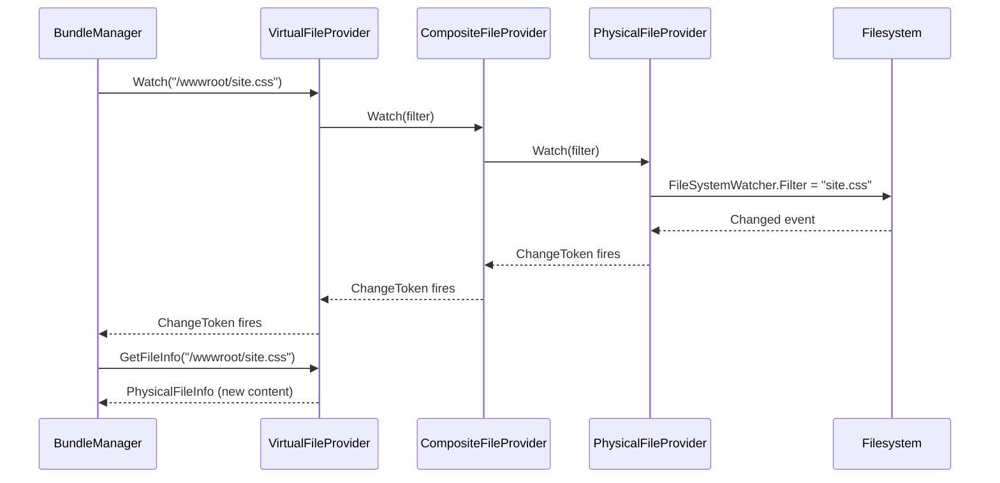

Sometimes a file set must live on disk — a content folder shipped alongside the host, a designer's editable theme, or a module's source tree mapped in for hot-reload during development. ABP supports this through `AddPhysical(root)`, which wraps Microsoft's `Microsoft.Extensions.FileProviders.Physical.PhysicalFileProvider` in a `PhysicalVirtualFileSetInfo`. Because the underlying provider already implements full filesystem watching, virtual paths resolved through a physical set automatically participate in change-token notifications — meaning everything that calls `IVirtualFileProvider.Watch(...)` (bundle invalidation, Razor view recompilation, localization cache, dynamic JS proxies) reacts to disk edits without further work.

This page covers the registration helpers, the watch semantics, and the canonical `ReplaceEmbeddedByPhysical<T>` development pattern. Prerequisites: [VFS overview](/vfs/overview) and [Embedded files](/vfs/embedded-files).

## Registration

The single entry point is the extension method on `VirtualFileSetList`:

```csharp Volo/Abp/VirtualFileSystem/VirtualFileSetListExtensions.cs
public static void AddPhysical(
    [NotNull] this VirtualFileSetList list,
    [NotNull] string root,
    ExclusionFilters exclusionFilters = ExclusionFilters.Sensitive)
{
    Check.NotNull(list, nameof(list));
    Check.NotNullOrWhiteSpace(root, nameof(root));

    var fileProvider = new PhysicalFileProvider(root, exclusionFilters);
    list.Add(new PhysicalVirtualFileSetInfo(fileProvider, root));
}
```

The parameters:

| Parameter | Type | Default | Meaning |
|-----------|------|---------|---------|
| `root` | `string` | (required) | Absolute on-disk path that becomes virtual `/`. Validated as non-null and non-whitespace. |
| `exclusionFilters` | `ExclusionFilters` | `ExclusionFilters.Sensitive` | Forwarded to `PhysicalFileProvider`. `Sensitive` skips dot-files, hidden, and OS-system entries. Use `ExclusionFilters.None` to expose every file. |

<Note>
`AddPhysical` does not accept a relative path. If you have a path relative to the host's content root, resolve it yourself with `Path.Combine(env.ContentRootPath, "Content")` before passing it in — the underlying `PhysicalFileProvider` will throw on a non-rooted argument.
</Note>

## `PhysicalVirtualFileSetInfo`

The wrapper type stores the root for later inspection:

```csharp Volo/Abp/VirtualFileSystem/Physical/PhysicalVirtualFileSetInfo.cs
public class PhysicalVirtualFileSetInfo : VirtualFileSetInfo
{
    public string Root { get; }

    public PhysicalVirtualFileSetInfo(
        [NotNull] IFileProvider fileProvider,
        [NotNull] string root)
        : base(fileProvider)
    {
        Root = Check.NotNullOrWhiteSpace(root, nameof(root));
    }
}
```

Comparison with the embedded variant:

| Type | `FileProvider` | Extra metadata | Created by |
|------|----------------|----------------|------------|
| `EmbeddedVirtualFileSetInfo` | `AbpEmbeddedFileProvider` or `ManifestEmbeddedFileProvider` | `Assembly`, `BaseFolder?` | `AddEmbedded<T>()` |
| `PhysicalVirtualFileSetInfo` | `PhysicalFileProvider` | `Root` | `AddPhysical(root)` |

`ReplaceEmbeddedByPhysical<T>` produces a `PhysicalVirtualFileSetInfo` in-place; see [the swap pattern](#replaceembeddedbyphysical-t).

## Watch behaviour

The `IFileProvider.Watch(filter)` method on `PhysicalFileProvider` returns a change token that fires when files matching the filter glob change on disk. This is propagated up through ABP's composite provider untouched:

```csharp Volo/Abp/VirtualFileSystem/VirtualFileProvider.cs
public virtual IChangeToken Watch(string filter)
{
    return _hybridFileProvider.Watch(filter);
}
```

Because `VirtualFileProvider` is a `CompositeFileProvider` over every registered set plus the dynamic provider, the composite's `Watch` returns a token that fires when **any** of its inner providers signals a change. So an `IVirtualFileProvider.Watch("**/*.css")` subscription fires whether:

1. The host edits a CSS file in a folder registered via `AddPhysical`.
2. A module re-registers an embedded resource via `IDynamicFileProvider.AddOrUpdate(...)`.

`AbpEmbeddedFileProvider` and `ManifestEmbeddedFileProvider`, by contrast, return `NullChangeToken.Singleton` — embedded files do not change once the assembly is loaded.

| Provider | `Watch(filter)` behaviour |
|----------|---------------------------|
| `PhysicalFileProvider` | Real filesystem watch; fires on create/modify/delete that matches `filter`. |
| `AbpEmbeddedFileProvider` (via `DictionaryBasedFileProvider`) | `NullChangeToken.Singleton` — never fires. |
| `ManifestEmbeddedFileProvider` | `NullChangeToken.Singleton` — never fires. |
| `DynamicFileProvider` | Per-path `CancellationChangeToken`; fires on `AddOrUpdate` / `Delete` for that exact path. |

<Tip>
If you depend on bundling invalidation, use a physical set during development so the watch token actually fires. After publishing, embedded sets are fine because the assets are immutable.
</Tip>

## `ReplaceEmbeddedByPhysical<T>`

This is the development-only swap that takes a module's already-registered embedded set and replaces its `IFileProvider` with a `PhysicalFileProvider` pointing at the module's source folder on disk:

```csharp Volo/Abp/VirtualFileSystem/VirtualFileSetListExtensions.cs
public static void ReplaceEmbeddedByPhysical<T>(
    [NotNull] this VirtualFileSetList fileSets,
    [NotNull] string physicalPath)
{
    Check.NotNull(fileSets, nameof(fileSets));
    Check.NotNullOrWhiteSpace(physicalPath, nameof(physicalPath));

    var assembly = typeof(T).Assembly;

    for (var i = 0; i < fileSets.Count; i++)
    {
        if (fileSets[i] is EmbeddedVirtualFileSetInfo embeddedVirtualFileSet &&
            embeddedVirtualFileSet.Assembly == assembly)
        {
            var thisPath = physicalPath;

            if (!embeddedVirtualFileSet.BaseFolder.IsNullOrEmpty())
            {
                thisPath = Path.Combine(thisPath, embeddedVirtualFileSet.BaseFolder!);
            }

            fileSets[i] = new PhysicalVirtualFileSetInfo(
                new PhysicalFileProvider(thisPath),
                thisPath
            );
        }
    }
}
```

What it does, step by step:

1. Iterates every entry in `FileSets`.
2. Picks only those whose declared `Assembly` matches the type parameter `T`'s assembly.
3. If the embedded set had a `BaseFolder`, combines it with the supplied `physicalPath` so that the same logical paths map onto the same logical sub-tree on disk.
4. Replaces the entry with a fresh `PhysicalVirtualFileSetInfo` rooted at the resulting path.
5. Note that **all** matching entries are replaced — if a single assembly registered multiple embedded sets (rare), all of them swap to the same physical root with their respective `BaseFolder`s appended.

### The canonical dev-time wiring

```csharp
public override void PostConfigureServices(ServiceConfigurationContext context)
{
    var hostingEnvironment = context.Services.GetSingletonInstance<IWebHostEnvironment>();

    if (hostingEnvironment.IsDevelopment())
    {
        Configure<AbpVirtualFileSystemOptions>(options =>
        {
            options.FileSets.ReplaceEmbeddedByPhysical<MyFeatureModule>(
                Path.Combine(
                    hostingEnvironment.ContentRootPath,
                    "..", "..", "modules", "my-feature",
                    "src", "MyCompany.MyFeature.Web"));
        });
    }
}
```

After this runs, every request for `/Pages/Index.cshtml` (or any other file the embedded set used to serve) goes to the file on disk under `modules/my-feature/src/MyCompany.MyFeature.Web/Pages/Index.cshtml` instead. Edit the file, refresh the browser, see the change — no rebuild required.

<Warning>
`ReplaceEmbeddedByPhysical<T>` only inspects the **current** `FileSets`. If a downstream module registers its own embedded set for the same `T` after the swap runs, that registration is *not* affected. Run the swap in `PostConfigureServices` (after all modules' `ConfigureServices` have executed) to make sure every set is visible.
</Warning>

## A composite of embedded and physical sets

A real host typically ends up with a layered configuration: the framework modules ship embedded sets, the app shells embedded sets too, and the app also registers a few physical folders for editable content:

```csharp
[DependsOn(typeof(AbpVirtualFileSystemModule))]
public class MyAppModule : AbpModule
{
    public override void ConfigureServices(ServiceConfigurationContext context)
    {
        var env = context.Services.GetSingletonInstance<IWebHostEnvironment>();

        Configure<AbpVirtualFileSystemOptions>(options =>
        {
            // The app's own embedded assets:
            options.FileSets.AddEmbedded<MyAppModule>();

            // An editable content folder under the published app:
            options.FileSets.AddPhysical(
                Path.Combine(env.ContentRootPath, "Content"));

            // A read-only mirror that also surfaces hidden/system files:
            options.FileSets.AddPhysical(
                Path.Combine(env.ContentRootPath, "Archive"),
                ExclusionFilters.None);
        });
    }
}
```

Because `VirtualFileProvider` iterates `FileSets` in reverse, the **last** call wins on conflicts — the `Archive` set is consulted first, then `Content`, then the app's own embedded set, then every depended-on module's embedded set. See [VFS overview](/vfs/overview) for the full lookup chain.

## What about `IFileInfo.PhysicalPath`?

Files returned from a physical set always populate `IFileInfo.PhysicalPath`, while files from an embedded set leave it `null`:

```csharp Volo/Abp/VirtualFileSystem/Embedded/EmbeddedResourceFileInfo.cs
public string? PhysicalPath => null;
```

The framework's `GetVirtualOrPhysicalPathOrNull` extension uses this to identify the file type:

```csharp Microsoft/Extensions/FileProviders/AbpFileInfoExtensions.cs
public static string? GetVirtualOrPhysicalPathOrNull([NotNull] this IFileInfo fileInfo)
{
    Check.NotNull(fileInfo, nameof(fileInfo));

    if (fileInfo is EmbeddedResourceFileInfo embeddedFileInfo)
    {
        return embeddedFileInfo.VirtualPath;
    }

    if (fileInfo is InMemoryFileInfo inMemoryFileInfo)
    {
        return inMemoryFileInfo.DynamicPath;
    }

    return fileInfo.PhysicalPath;
}
```

Consumers that need to open a stream — image processors, Razor view compilers, the [bundling](/ui-mvc/bundling) cache — can fall back to `File.OpenRead(fileInfo.PhysicalPath)` if it is non-null, or call `fileInfo.CreateReadStream()` otherwise. The VFS abstracts the choice.

## Exclusion filters

`PhysicalFileProvider`'s `ExclusionFilters` enum lets you control which on-disk entries are visible. ABP defaults to `ExclusionFilters.Sensitive`, which is the union of:

- `ExclusionFilters.DotPrefixed` — files and folders starting with `.`.
- `ExclusionFilters.Hidden` — those with the OS hidden attribute set.
- `ExclusionFilters.System` — those with the OS system attribute set.

| Value | Effect |
|-------|--------|
| `ExclusionFilters.None` | Expose everything, including `.git`, `.vs`, `Thumbs.db`. |
| `ExclusionFilters.Sensitive` (default) | Hide dot-prefixed, hidden, and system entries. |
| `ExclusionFilters.DotPrefixed` | Hide only dot-prefixed entries. |
| `ExclusionFilters.Hidden` | Hide only OS-hidden entries. |
| `ExclusionFilters.System` | Hide only OS-system entries. |

For static-asset folders the default is almost always correct. Override only when you need to surface a dot-prefixed file deliberately (such as `.well-known/openid-configuration.json` if you choose to serve it from disk).

## Common gotchas

<AccordionGroup>
  <Accordion title="Watch never fires on network shares">
    `PhysicalFileProvider`'s watch uses `FileSystemWatcher`, which is unreliable over SMB/NFS shares. Local folders work reliably; network mounts may need a polling watcher.
  </Accordion>
  <Accordion title="Case-sensitivity differs between OSes">
    Lookups against a physical set go through the OS case-sensitivity rules (case-insensitive on Windows/macOS, case-sensitive on Linux). Embedded sets are always case-insensitive because they go through `DictionaryBasedFileProvider`'s `StringComparer.OrdinalIgnoreCase` dictionary. If you publish to Linux, match the case in source.
  </Accordion>
  <Accordion title="PhysicalFileProvider holds a file handle">
    The underlying watcher keeps file handles open. If you replace a physical set at runtime (rare), dispose the previous `PhysicalFileProvider` to release the handles.
  </Accordion>
</AccordionGroup>

## End-to-end watch flow

When a downstream subscriber needs to know that a file has changed on disk, it asks `IVirtualFileProvider.Watch(filter)` for a `IChangeToken`, registers a callback on it, and re-requests the file the moment the token fires. The flow for a CSS file is:



The composite token returned by `CompositeFileProvider.Watch` aggregates the inner tokens. As soon as any one of them signals a change, the composite token flips to `HasChanged = true` and the subscriber's callback runs. Embedded providers contribute `NullChangeToken.Singleton`, which never fires, so the effective firing source is whichever physical or dynamic provider matches the filter.

## When to choose physical over embedded

<CardGroup cols={2}>
  <Card title="Editable content" icon="pen-to-square">
    Templates, themes, or documents the operator must change without redeploying — use `AddPhysical`.
  </Card>
  <Card title="Live-reload during dev" icon="rotate">
    `ReplaceEmbeddedByPhysical<TModule>(srcPath)` so the running app reads from the module's source tree.
  </Card>
  <Card title="Per-tenant overrides" icon="users">
    A tenant-specific folder rooted at `Path.Combine(env.ContentRootPath, "tenants", tenantId)` registered as physical lets you customise CSS/Razor per tenant.
  </Card>
  <Card title="Published immutable assets" icon="box-archive">
    Stick with `AddEmbedded` — embedded files travel with the assembly, and `NullChangeToken` is the cheaper signalling default.
  </Card>
</CardGroup>

## Related pages

- [VFS overview](/vfs/overview) — composite lookup and registration semantics.
- [Embedded files](/vfs/embedded-files) — what `ReplaceEmbeddedByPhysical<T>` replaces.
- [File providers](/vfs/file-providers) — the composite `VirtualFileProvider` and the `DynamicFileProvider` that sits in front of every set.
- [Virtual File Explorer](/vfs/virtual-file-explorer-module) — UI that lists `PhysicalFileProvider` entries by type name.
- [UI MVC bundling](/ui-mvc/bundling) — uses `Watch` tokens to invalidate bundles.
- [Localization](/localization/overview) — physical localization JSON folders use the same `AddPhysical` pattern.
