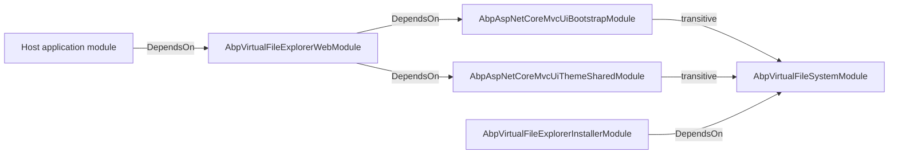

The Virtual File Explorer is a development and diagnostics module that mounts a Razor Pages UI at `~/VirtualFileExplorer` to browse the composite `IVirtualFileProvider` tree at runtime. It shows every visible directory and file across every registered file set — embedded modules, physical folders, and the dynamic provider — and lets the operator open any file to inspect its content. This page walks the module's layout under `modules/virtual-file-explorer/src`: the `Installer` package that brings the VFS dependency along, the `Web` module that adds the menu, options, page model, and Prism.js bundling, and the conventions you need to know to integrate it into a host.

Prerequisites: read [VFS overview](/vfs/overview), [Embedded files](/vfs/embedded-files), and [File providers](/vfs/file-providers) — the explorer is a straight consumer of those APIs.

## Module layout

The repository folder `modules/virtual-file-explorer/` contains two source projects and a demo app:

```
modules/virtual-file-explorer/
├── Volo.Abp.VirtualFileExplorer.abpmdl
├── Volo.Abp.VirtualFileExplorer.abpsln
├── Volo.Abp.VirtualFileExplorer.sln
├── NuGet.md
├── app/
│   └── Volo.Abp.VirtualFileExplorer.DemoApp/
└── src/
    ├── Volo.Abp.VirtualFileExplorer.Installer/
    └── Volo.Abp.VirtualFileExplorer.Web/
```

There is **no** separate `Application`, `Domain`, `EntityFrameworkCore`, `HttpApi`, or `HttpApi.Client` project — the explorer is purely a Web/UI feature with no persistence layer and no remote service contract. Its only data source is `IVirtualFileProvider`.

| Project | Role |
|---------|------|
| `Volo.Abp.VirtualFileExplorer.Installer` | Tiny module that depends on `AbpVirtualFileSystemModule` and embeds its own files. Acts as the package entry point that an `abp install` would pull into a target project. |
| `Volo.Abp.VirtualFileExplorer.Web` | The Razor Pages module containing the explorer UI, navigation menu, page models, and bundle extensions. |

## `AbpVirtualFileExplorerInstallerModule`

The installer module is intentionally minimal. Its only job is to declare a dependency on the VFS module and register its own assembly as an embedded file set:

```csharp src/Volo.Abp.VirtualFileExplorer.Installer/Volo/Abp/VirtualFileExplorer/AbpVirtualFileExplorerInstallerModule.cs
using Volo.Abp.Modularity;
using Volo.Abp.VirtualFileSystem;

namespace Volo.Abp.VirtualFileExplorer;

[DependsOn(
    typeof(AbpVirtualFileSystemModule)
    )]
public class AbpVirtualFileExplorerInstallerModule : AbpModule
{
    public override void ConfigureServices(ServiceConfigurationContext context)
    {
        Configure<AbpVirtualFileSystemOptions>(options =>
        {
            options.FileSets.AddEmbedded<AbpVirtualFileExplorerInstallerModule>();
        });
    }
}
```

The `.csproj` opts in to the manifest format, so the `AddEmbedded<T>()` call (with no `baseFolder`) ends up creating a `ManifestEmbeddedFileProvider`:

```xml src/Volo.Abp.VirtualFileExplorer.Installer/Volo.Abp.VirtualFileExplorer.Installer.csproj
<PropertyGroup>
  <TargetFramework>net8.0</TargetFramework>
  <GenerateEmbeddedFilesManifest>true</GenerateEmbeddedFilesManifest>
  <RootNamespace />
</PropertyGroup>

<ItemGroup>
  <ProjectReference Include="..\..\..\..\framework\src\Volo.Abp.VirtualFileSystem\Volo.Abp.VirtualFileSystem.csproj" />
</ItemGroup>

<ItemGroup>
  <None Remove="..\..\Volo.Abp.VirtualFileExplorer.abpmdl" />
  <Content Include="..\..\Volo.Abp.VirtualFileExplorer.abpmdl">
    <Pack>true</Pack>
    <PackagePath>content\</PackagePath>
  </Content>
  <None Remove="..\..\**\*.abppkg*" />
  <Content Include="..\..\**\*.abppkg*">
    <Pack>true</Pack>
    <PackagePath>content\</PackagePath>
  </Content>
</ItemGroup>
```

The installer also packages the `.abpmdl` (module metadata) and any `.abppkg` descriptors so the ABP CLI can resolve dependencies when a user installs the module into a project.

## `AbpVirtualFileExplorerWebModule`

The Web module is the real entry point. It pulls in two UI infrastructure modules and configures the explorer's services conditionally on `AbpVirtualFileExplorerOptions.IsEnabled`:

```csharp src/Volo.Abp.VirtualFileExplorer.Web/AbpVirtualFileExplorerWebModule.cs
[DependsOn(typeof(AbpAspNetCoreMvcUiBootstrapModule))]
[DependsOn(typeof(AbpAspNetCoreMvcUiThemeSharedModule))]
public class AbpVirtualFileExplorerWebModule : AbpModule
{
    public override void PreConfigureServices(ServiceConfigurationContext context)
    {
        PreConfigure<IMvcBuilder>(mvcBuilder =>
        {
            mvcBuilder.AddApplicationPartIfNotExists(typeof(AbpVirtualFileExplorerWebModule).Assembly);
        });
    }

    public override void ConfigureServices(ServiceConfigurationContext context)
    {
        var virtualFileExplorerOptions =
            context.Services.ExecutePreConfiguredActions<AbpVirtualFileExplorerOptions>();

        if (virtualFileExplorerOptions.IsEnabled)
        {
            Configure<AbpNavigationOptions>(options =>
            {
                options.MenuContributors.Add(new VirtualFileExplorerMenuContributor());
            });

            Configure<AbpVirtualFileSystemOptions>(options =>
            {
                options.FileSets.AddEmbedded<AbpVirtualFileExplorerWebModule>(
                    "Volo.Abp.VirtualFileExplorer.Web");
            });

            Configure<AbpLocalizationOptions>(options =>
            {
                options.Resources
                    .Add<VirtualFileExplorerResource>("en")
                    .AddBaseTypes(typeof(AbpValidationResource))
                    .AddVirtualJson("/Localization/Resources");
            });

            Configure<AbpBundleContributorOptions>(options =>
            {
                options
                    .Extensions<PrismjsStyleBundleContributor>()
                    .Add<PrismjsStyleBundleContributorDocsExtension>();

                options
                    .Extensions<PrismjsScriptBundleContributor>()
                    .Add<PrismjsScriptBundleContributorDocsExtension>();
            });
        }
    }
}
```

Breakdown of each `Configure` call:

| Call | Purpose |
|------|---------|
| `PreConfigure<IMvcBuilder>.AddApplicationPartIfNotExists` | Makes ASP.NET Core MVC discover the explorer's Razor Pages, which live in a referenced assembly. |
| `Configure<AbpNavigationOptions>` | Adds the menu entry described in [Navigation](#navigation). |
| `Configure<AbpVirtualFileSystemOptions>` | Registers the Web project's own embedded resources (CSS, JS, Razor views, JSON) into the VFS. Note the `baseNamespace` argument is `"Volo.Abp.VirtualFileExplorer.Web"`. |
| `Configure<AbpLocalizationOptions>` | Registers the explorer's `VirtualFileExplorerResource` with English as the default culture and inherits from `AbpValidationResource`. JSON lives under `/Localization/Resources` — see [Localization](/localization/overview). |
| `Configure<AbpBundleContributorOptions>` | Extends the Prism.js style and script bundles with the toolbar and copy-to-clipboard plugins used by the file-content modal. |

### `AbpVirtualFileExplorerOptions`

A single boolean toggles the entire feature on or off:

```csharp src/Volo.Abp.VirtualFileExplorer.Web/AbpVirtualFileExplorerOptions.cs
namespace Volo.Abp.VirtualFileExplorer.Web;

public class AbpVirtualFileExplorerOptions
{
    /// <summary>
    /// Default: true.
    /// </summary>
    public bool IsEnabled { get; set; } = true;
}
```

Hosts that depend on the module but want to disable the UI in production can `PreConfigure<AbpVirtualFileExplorerOptions>(o => o.IsEnabled = false)`. Because the module reads the option via `ExecutePreConfiguredActions`, the toggle must be set in `PreConfigureServices`.

<Warning>
The explorer surfaces every embedded and physical file in the VFS, including Razor sources, localization JSON, and assets pulled in by every depended-on module. Treat it as a development/diagnostics tool, not a production endpoint — at minimum gate it behind authentication or set `IsEnabled = false` in non-development environments.
</Warning>

## Navigation

A menu contributor adds the explorer to the main menu:

```csharp src/Volo.Abp.VirtualFileExplorer.Web/Navigation/VirtualFileExplorerMenuContributor.cs
public class VirtualFileExplorerMenuContributor : IMenuContributor
{
    public virtual Task ConfigureMenuAsync(MenuConfigurationContext context)
    {
        if (context.Menu.Name != StandardMenus.Main)
        {
            return Task.CompletedTask;
        }

        var l = context.GetLocalizer<VirtualFileExplorerResource>();

        context.Menu.Items.Add(new ApplicationMenuItem(
            VirtualFileExplorerMenuNames.Index,
            l["Menu:VirtualFileExplorer"],
            icon: "fa fa-file",
            url: "~/VirtualFileExplorer"));

        return Task.CompletedTask;
    }
}
```

```csharp src/Volo.Abp.VirtualFileExplorer.Web/Navigation/VirtualFileExplorerMenuNames.cs
public class VirtualFileExplorerMenuNames
{
    public const string GroupName = "AbpVirualFileExplorer";
    public const string Index = GroupName + ".Index";
}
```

The menu entry only appears on `StandardMenus.Main`; the contributor returns early for every other menu name. The localization key is `Menu:VirtualFileExplorer`, resolved via the `VirtualFileExplorerResource`.

## Razor Pages

The Web project ships two Razor pages under `Pages/VirtualFileExplorer/`:

| Page | Model | Route | Purpose |
|------|-------|-------|---------|
| `Index.cshtml` | `IndexModel` | `~/VirtualFileExplorer` | Lists files and directories at the current `Path` with paging. |
| `FileContentModal.cshtml` | `FileContentModal` | `~/VirtualFileExplorer/FileContentModal` | Loads a single file by `FilePath` and returns its UTF-8 content for display. |

Both extend `VirtualFileExplorerPageModel`, an `AbpPageModel` configured with the localization resource and mapper context:

```csharp src/Volo.Abp.VirtualFileExplorer.Web/Pages/VirtualFileExplorer/VirtualFileExplorerPageModel.cs
public abstract class VirtualFileExplorerPageModel : AbpPageModel
{
    protected VirtualFileExplorerPageModel()
    {
        LocalizationResourceType = typeof(VirtualFileExplorerResource);
        ObjectMapperContext = typeof(AbpVirtualFileExplorerWebModule);
    }
}
```

### `IndexModel`

`IndexModel` is the meat of the explorer. It takes the merged `IVirtualFileProvider`, lists the children of the current `Path`, filters them by type name, paginates, and builds breadcrumbs:

```csharp src/Volo.Abp.VirtualFileExplorer.Web/Pages/VirtualFileExplorer/Index.cshtml.cs
public class IndexModel : VirtualFileExplorerPageModel
{
    [BindProperty(SupportsGet = true)] public string Path { get; set; } = "/";
    [BindProperty(SupportsGet = true)] public int CurrentPage { get; set; } = 1;
    [BindProperty(SupportsGet = true)] public int PageSize { get; set; } = 10;

    public List<FileInfoViewModel> FileInfoList { get; set; }
    public PagerModel PagerModel { get; set; }
    public string PathNavigation { get; set; }

    protected IVirtualFileProvider VirtualFileProvider { get; }

    public IndexModel(IVirtualFileProvider virtualFileProvider)
    {
        VirtualFileProvider = virtualFileProvider;
    }

    public virtual IActionResult OnGet()
    {
        var query = VirtualFileProvider.GetDirectoryContents(Path)
            .Where(d => VirtualFileExplorerConsts.AllowFileInfoTypes
                                                 .Contains(d.GetType().Name))
            .OrderByDescending(f => f.IsDirectory).ToList();

        PagerModel = new PagerModel(
            query.Count, PageSize, CurrentPage, PageSize,
            $"{Url.Content("~/")}VirtualFileExplorer?Path={Path}&PageSize={PageSize}");

        SetViewModel(query.Skip((CurrentPage - 1) * PageSize).Take(PageSize));
        SetPathNavigation();

        return Page();
    }
    // ...
}
```

#### The allow-list

The most important line is the filter:

```csharp src/Volo.Abp.VirtualFileExplorer.Web/VirtualFileExplorerConsts.cs
public static class VirtualFileExplorerConsts
{
    public static readonly string[] AllowFileInfoTypes = {
        "VirtualDirectoryFileInfo",
        "EmbeddedResourceFileInfo",
        "ManifestDirectoryInfo",
        "ManifestFileInfo"
    };
}
```

Only those four `IFileInfo` runtime type names are rendered. This filters out:

| Filtered type | Reason |
|---------------|--------|
| `PhysicalFileInfo` / `PhysicalDirectoryInfo` | Disk entries do not appear — the explorer is intended as a **virtual** browser, so physical folders registered through `AddPhysical` are hidden. |
| `InMemoryFileInfo` | Dynamic in-memory files are excluded too. |
| `NotFoundFileInfo` / `NotFoundDirectoryContents` | Naturally — they fail the `.Exists` check anyway. |

If you need physical files visible (for example to debug `ReplaceEmbeddedByPhysical<T>` during development), you currently have to subclass `IndexModel` and override `OnGet`.

#### View-model mapping

Each surviving `IFileInfo` becomes a `FileInfoViewModel`:

```csharp src/Volo.Abp.VirtualFileExplorer.Web/Models/FileInfoViewModel.cs
public class FileInfoViewModel
{
    public string FilePath { get; set; }
    public string Icon { get; set; }
    public string FileType { get; set; }
    public string Length { get; set; }
    public string FileName { get; set; }
    public DateTime LastUpdateTime { get; set; }
    public bool IsDirectory { get; set; }
}
```

The mapping logic:

- Directories get `fas fa-folder`, a path-linked `FileName` (HTML anchor), and `Length = "/"`.
- `EmbeddedResourceFileInfo` files have `FilePath` set to their `VirtualPath` so the modal can re-fetch them.
- Other files default to `<currentPath>/<name>` as the file path.
- `LastUpdateTime` is `LocalDateTime`-converted.
- `Length` is formatted as `"<bytes> bytes"`.

#### Breadcrumb generation

`SetPathNavigation` builds a Bootstrap breadcrumb by walking `Path.Split('/')`:

```csharp
private void SetPathNavigation()
{
    var navigationBuild = new StringBuilder();
    var pathArray = Path.Split('/').Where(p => !p.IsNullOrWhiteSpace());
    var href = $"{Url.Content("~/")}VirtualFileExplorer?path=";

    navigationBuild.Append(
        $"<nav aria-label='breadcrumb'>" +
        $" <ol class='breadcrumb'>" +
        $"<li class='breadcrumb-item'><a href='{href}/'>{L["BackToRoot"]}</a></li>");

    foreach (var item in pathArray)
    {
        href += "/" + item;
        navigationBuild.Append($"<li class='breadcrumb-item'><a href='{href}'>{item}</a></li>");
    }

    navigationBuild.Append("</ol></nav>");
    PathNavigation = navigationBuild.ToString();
}
```

The breadcrumb is emitted as raw HTML into the view through `@Html.Raw(Model.PathNavigation)`.

### `FileContentModal`

`FileContentModal` loads a single file and converts it to a string via `ReadAsStringAsync()`:

```csharp src/Volo.Abp.VirtualFileExplorer.Web/Pages/VirtualFileExplorer/FileContentModal.cshtml.cs
public class FileContentModal : PageModel
{
    [Required]
    [BindProperty(SupportsGet = true)]
    public string FilePath { get; set; }

    public string Content { get; set; }

    protected IVirtualFileProvider VirtualFileProvider { get; }

    public FileContentModal(IVirtualFileProvider virtualFileProvider)
    {
        VirtualFileProvider = virtualFileProvider;
    }

    public virtual async Task<IActionResult> OnGetAsync()
    {
        var fileInfo = VirtualFileProvider.GetFileInfo(FilePath);
        if (fileInfo == null || fileInfo.IsDirectory)
        {
            return NotFound();
        }

        Content = await fileInfo.ReadAsStringAsync();
        return Page();
    }
}
```

Note that `FileContentModal` extends `PageModel` directly — not `VirtualFileExplorerPageModel` — so it does not bind to the explorer's localization resource. The modal is a thin endpoint that returns text into a Bootstrap modal opened by the index page's `showContent('<filePath>')` JS handler.

### `Index.cshtml`

The view is a Bootstrap card containing the breadcrumb, an `<abp-table>` of view-model rows, and an `<abp-paginator>`:

```cshtml src/Volo.Abp.VirtualFileExplorer.Web/Pages/VirtualFileExplorer/Index.cshtml
@page
@model IndexModel
@inject IPageLayout PageLayout
@inject IHtmlLocalizer<VirtualFileExplorerResource> L
@inject IHtmlLocalizer<AbpUiResource> UiLocalizer
@{
    PageLayout.Content.Title = L["VirtualFileExplorer"].Value;
    PageLayout.Content.BreadCrumb.Add(L["Menu:VirtualFileExplorer"].Value);
    PageLayout.Content.MenuItemName = VirtualFileExplorerMenuNames.Index;
}

@section styles {
    <abp-style-bundle name="@typeof(IndexModel).FullName">
        <abp-style src="/Pages/VirtualFileExplorer/index.css"/>
    </abp-style-bundle>
}

@section scripts {
    <abp-script-bundle name="@typeof(IndexModel).FullName">
        <abp-script src="/Pages/VirtualFileExplorer/index.js"/>
    </abp-script-bundle>
}

<abp-card id="VirtualFileExplorerWrapper">
  <abp-card-body>
    @Html.Raw(Model.PathNavigation)
    <abp-table striped-rows="true" class="nowrap dataTable no-footer">
      <thead>
        <tr>
          <th>@UiLocalizer["Actions"]</th>
          <th>@L["VirtualFileName"]</th>
          <th>@L["VirtualFileType"]</th>
          <th>@L["LastUpdateTime"]</th>
          <th>@L["Size"]</th>
        </tr>
      </thead>
      <tbody> ... </tbody>
    </abp-table>
    <abp-paginator model="Model.PagerModel" show-info="true"/>
  </abp-card-body>
</abp-card>
```

The page uses `<abp-style-bundle>` / `<abp-script-bundle>` to register its dedicated CSS and JS into the [bundling](/ui-mvc/bundling) system. The bundle name uses `typeof(IndexModel).FullName` so it is unique per page model.

## Prism.js bundle extensions

The file-content modal renders source code with Prism.js syntax highlighting. The Web module extends both the Prism.js style and script bundles to add the toolbar and copy-to-clipboard plugins:

```csharp src/Volo.Abp.VirtualFileExplorer.Web/Bundling/PrismjsScriptBundleContributorDocsExtension.cs
public class PrismjsScriptBundleContributorDocsExtension : BundleContributor
{
    public override void ConfigureBundle(BundleConfigurationContext context)
    {
        context.Files.AddIfNotContains("/libs/prismjs/plugins/toolbar/prism-toolbar.js");
        context.Files.AddIfNotContains("/libs/prismjs/plugins/copy-to-clipboard/prism-copy-to-clipboard.js");
    }
}
```

```csharp src/Volo.Abp.VirtualFileExplorer.Web/Bundling/PrismjsStyleBundleContributorDocsExtension.cs
public class PrismjsStyleBundleContributorDocsExtension : BundleContributor
{
    public override void ConfigureBundle(BundleConfigurationContext context)
    {
        context.Files.AddIfNotContains("/libs/prismjs/plugins/toolbar/prism-toolbar.css");
    }
}
```

These are wired in `AbpVirtualFileExplorerWebModule.ConfigureServices` via the `AbpBundleContributorOptions.Extensions<TContributor>()` API — see [UI MVC bundling](/ui-mvc/bundling) for the contributor model.

## Localization resource

```csharp src/Volo.Abp.VirtualFileExplorer.Web/Localization/VirtualFileExplorerResource.cs
[LocalizationResourceName("AbpVirtualFileExplorer")]
public class VirtualFileExplorerResource
{
}
```

The resource name `AbpVirtualFileExplorer` keys the JSON files under `Localization/Resources/`. They are embedded resources (declared in the `.csproj` `<EmbeddedResource Include="Localization\**\*.json" />`) and loaded through `AddVirtualJson("/Localization/Resources")`. See [Localization](/localization/overview) for the full pipeline.

## Module dependency chain



The `Installer` module is a separate dependency from the `Web` module — a host can depend on the installer to participate in module-discovery without taking the Web UI assembly. Most hosts that want the UI just `DependsOn(typeof(AbpVirtualFileExplorerWebModule))`.

## Wiring the module into a host

```csharp
[DependsOn(
    typeof(AbpVirtualFileExplorerWebModule),
    // ...
)]
public class MyAppModule : AbpModule
{
    public override void PreConfigureServices(ServiceConfigurationContext context)
    {
        // Disable in production
        var env = context.Services.GetSingletonInstance<IWebHostEnvironment>();
        if (!env.IsDevelopment())
        {
            PreConfigure<AbpVirtualFileExplorerOptions>(options =>
            {
                options.IsEnabled = false;
            });
        }
    }
}
```

When `IsEnabled = false`, `AbpVirtualFileExplorerWebModule.ConfigureServices` skips every configuration call — no menu entry, no embedded set, no localization, no Prism.js extensions are added. The Razor Pages assembly is still part of the application (added in `PreConfigureServices`), so a direct navigation to `~/VirtualFileExplorer` would still hit the page; pair the toggle with authorization on the route if you need a hard block.

## What you can build on top

Because the explorer is a thin consumer of `IVirtualFileProvider`, you can subclass it freely:

- Override `IndexModel.OnGet` to widen `AllowFileInfoTypes` and include `PhysicalFileInfo`/`InMemoryFileInfo`.
- Replace `FileContentModal` with a richer viewer (binary preview, image rendering, hex view).
- Add a second menu entry that points to a custom filter, e.g. "Localization JSON only".

In every case the underlying provider is the composite described in [File providers](/vfs/file-providers).

## Related pages

- [VFS overview](/vfs/overview) — composite provider and `AbpVirtualFileSystemOptions`.
- [Embedded files](/vfs/embedded-files) — how `AddEmbedded<AbpVirtualFileExplorerWebModule>` chooses `ManifestEmbeddedFileProvider`.
- [Physical files](/vfs/physical-files) — why `PhysicalFileInfo` is filtered out of the explorer.
- [File providers](/vfs/file-providers) — `IFileInfo` type inventory referenced by `AllowFileInfoTypes`.
- [Localization](/localization/overview) — `VirtualFileExplorerResource` and `AddVirtualJson` mechanics.
- [UI MVC bundling](/ui-mvc/bundling) — Prism.js style/script bundle extensions and `<abp-script-bundle>` usage.
