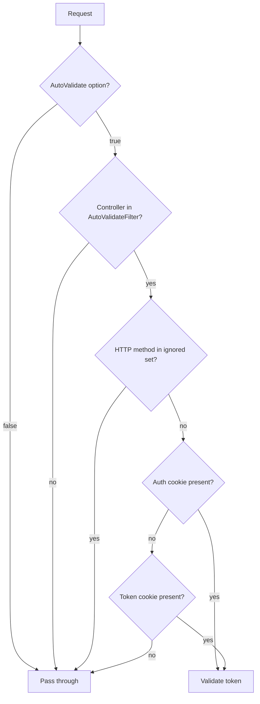

ABP layers a few defaults on top of ASP.NET Core's anti-forgery
infrastructure so single-page apps, server-rendered MVC views and Razor
Pages get CSRF protection out of the box without ad-hoc attribute
sprinkling. Everything lives in
`framework/src/Volo.Abp.AspNetCore.Mvc/Volo/Abp/AspNetCore/Mvc/AntiForgery/`
and integrates with the standard `IAntiforgery` services.

## File inventory

| File | Role |
| --- | --- |
| `AbpAntiForgeryOptions.cs` | The options bag: token cookie, auth scheme name, auto-validate switches |
| `AbpAntiForgeryCookieNameProvider.cs` | Resolves the auth cookie + token cookie names at runtime |
| `AbpAutoValidateAntiforgeryTokenAttribute.cs` | Global filter factory added to MVC by `AbpAspNetCoreMvcModule` |
| `AbpAutoValidateAntiforgeryTokenAuthorizationFilter.cs` | The runtime filter that decides whether to call `IAntiforgery.ValidateRequestAsync` |
| `AbpValidateAntiForgeryTokenAttribute.cs` | Opt-in filter factory for individual actions |
| `AbpValidateAntiforgeryTokenAuthorizationFilter.cs` | Shared validation logic (parent of the auto variant) |
| `IAbpAntiForgeryManager.cs` + `AspNetCoreAbpAntiForgeryManager.cs` | Helpers that generate and set the token cookie |

## How global validation gets wired in

`AbpAspNetCoreMvcModule` registers the auto-validate filter as a global
MVC filter, so every MVC action is in scope by default:

```csharp title="framework/src/Volo.Abp.AspNetCore.Mvc/Volo/Abp/AspNetCore/Mvc/AbpAspNetCoreMvcModule.cs"
var mvcCoreBuilder = context.Services.AddMvcCore(options =>
{
    options.Filters.Add(new AbpAutoValidateAntiforgeryTokenAttribute());
});
```

That attribute is a filter factory, not the filter itself:

```csharp title="framework/src/Volo.Abp.AspNetCore.Mvc/Volo/Abp/AspNetCore/Mvc/AntiForgery/AbpAutoValidateAntiforgeryTokenAttribute.cs"
[AttributeUsage(AttributeTargets.Class | AttributeTargets.Method, AllowMultiple = false, Inherited = true)]
public class AbpAutoValidateAntiforgeryTokenAttribute : Attribute, IFilterFactory, IOrderedFilter
{
    // The default Order for this attribute is 1000 because it must run after any filter which does authentication
    // or login in order to allow them to behave as expected (ie Unauthenticated or Redirect instead of 400).
    public int Order { get; set; } = 1000;

    public bool IsReusable => true;

    public IFilterMetadata CreateInstance(IServiceProvider serviceProvider)
    {
        return serviceProvider.GetRequiredService<AbpAutoValidateAntiforgeryTokenAuthorizationFilter>();
    }
}
```

The high `Order = 1000` is intentional: authentication filters run first
so a missing/expired cookie produces a 401/Redirect, not a 400.

## AbpAntiForgeryOptions

The options bag is what controls the global behaviour:

```csharp title="framework/src/Volo.Abp.AspNetCore.Mvc/Volo/Abp/AspNetCore/Mvc/AntiForgery/AbpAntiForgeryOptions.cs"
public class AbpAntiForgeryOptions
{
    /// <summary>
    /// Use to set the cookie options to transfer Anti Forgery token between server and client.
    /// Default name of the cookie: "XSRF-TOKEN".
    /// </summary>
    public CookieBuilder TokenCookie { get; }

    /// <summary>
    /// Used to find auth cookie when validating Anti Forgery token.
    /// Default value: "Identity.Application".
    /// </summary>
    public string? AuthCookieSchemaName { get; set; }

    /// <summary>
    /// Default value: true.
    /// </summary>
    public bool AutoValidate { get; set; } = true;

    public Predicate<Type> AutoValidateFilter { get; set; }       // default: type => true

    public HashSet<string> AutoValidateIgnoredHttpMethods { get; set; }
    // default: { "GET", "HEAD", "TRACE", "OPTIONS" }

    public AbpAntiForgeryOptions()
    {
        AutoValidateFilter = type => true;

        TokenCookie = new CookieBuilder
        {
            Name = "XSRF-TOKEN",
            HttpOnly = false,
            IsEssential = true,
            SameSite = SameSiteMode.None,
            Expiration = TimeSpan.FromDays(3650) //10 years!
        };

        AuthCookieSchemaName = "Identity.Application";

        AutoValidateIgnoredHttpMethods = new HashSet<string> { "GET", "HEAD", "TRACE", "OPTIONS" };
    }
}
```

| Option | Default | Notes |
| --- | --- | --- |
| `TokenCookie.Name` | `"XSRF-TOKEN"` | The cookie that the JavaScript client reads to set the `RequestVerificationToken` header / form field |
| `TokenCookie.HttpOnly` | `false` | Has to be readable from JS so SPAs can echo it back |
| `TokenCookie.IsEssential` | `true` | Bypasses GDPR consent middleware |
| `TokenCookie.SameSite` | `None` | Required for cross-origin SPA scenarios |
| `TokenCookie.Expiration` | 10 years | Effectively persistent |
| `AuthCookieSchemaName` | `"Identity.Application"` | Drives `AbpAntiForgeryCookieNameProvider.GetAuthCookieNameOrNull()` |
| `AutoValidate` | `true` | Master switch for the global filter |
| `AutoValidateFilter` | `type => true` | Predicate on the controller type |
| `AutoValidateIgnoredHttpMethods` | GET/HEAD/TRACE/OPTIONS | Methods that should never require a token |

## Cookie name provider

`AbpAntiForgeryCookieNameProvider` resolves both cookies at runtime so the
validation filter can short-circuit when there is no auth cookie *and* no
token cookie (i.e. the call is from a non-browser client):

```csharp title="framework/src/Volo.Abp.AspNetCore.Mvc/Volo/Abp/AspNetCore/Mvc/AntiForgery/AbpAntiForgeryCookieNameProvider.cs"
public virtual string? GetAuthCookieNameOrNull()
{
    if (_abpAntiForgeryOptions.AuthCookieSchemaName == null) return null;
    return _namedOptionsAccessor.Get(_abpAntiForgeryOptions.AuthCookieSchemaName)?.Cookie?.Name;
}

public virtual string? GetAntiForgeryCookieNameOrNull()
{
    return _abpAntiForgeryOptions.TokenCookie.Name;
}
```

## The validation filter

The base filter implements `IAsyncAuthorizationFilter` and
`IAntiforgeryPolicy`, which makes the framework's
`IsEffectivePolicy` machinery skip duplicate filters:

```csharp title="framework/src/Volo.Abp.AspNetCore.Mvc/Volo/Abp/AspNetCore/Mvc/AntiForgery/AbpValidateAntiforgeryTokenAuthorizationFilter.cs"
public async Task OnAuthorizationAsync(AuthorizationFilterContext context)
{
    if (!context.IsEffectivePolicy<IAntiforgeryPolicy>(this))
    {
        _logger.LogInformation("Skipping the execution of current filter as its not the most effective filter implementing the policy " + typeof(IAntiforgeryPolicy));
        return;
    }

    if (ShouldValidate(context))
    {
        try
        {
            await _antiforgery.ValidateRequestAsync(context.HttpContext);
        }
        catch (AntiforgeryValidationException exception)
        {
            _logger.LogWarning(exception.Message, exception);
            context.Result = new AntiforgeryValidationFailedResult();
        }
    }
}
```

The decision boils down to two rules:

1. If the request carries the auth cookie, always validate &mdash; logged-in
   sessions are the prime CSRF target.
2. Otherwise, only validate when the token cookie is present. This lets
   non-browser clients (mobile, server-to-server) skip the check entirely
   without explicit `[IgnoreAntiforgeryToken]` attributes:

```csharp title="AbpValidateAntiforgeryTokenAuthorizationFilter.ShouldValidate"
protected virtual bool ShouldValidate(AuthorizationFilterContext context)
{
    var authCookieName = _antiForgeryCookieNameProvider.GetAuthCookieNameOrNull();

    //Always perform antiforgery validation when request contains authentication cookie
    if (authCookieName != null &&
        context.HttpContext.Request.Cookies.ContainsKey(authCookieName))
    {
        return true;
    }

    var antiForgeryCookieName = _antiForgeryCookieNameProvider.GetAntiForgeryCookieNameOrNull();

    //No need to validate if antiforgery cookie is not sent.
    //That means the request is sent from a non-browser client.
    if (antiForgeryCookieName != null &&
        !context.HttpContext.Request.Cookies.ContainsKey(antiForgeryCookieName))
    {
        return false;
    }

    // Anything else requires a token.
    return true;
}
```

## The auto variant

`AbpAutoValidateAntiforgeryTokenAuthorizationFilter` derives from the base
class and adds the options-driven gates:

```csharp title="framework/src/Volo.Abp.AspNetCore.Mvc/Volo/Abp/AspNetCore/Mvc/AntiForgery/AbpAutoValidateAntiforgeryTokenAuthorizationFilter.cs"
protected override bool ShouldValidate(AuthorizationFilterContext context)
{
    if (!_options.AutoValidate) return false;

    if (context.ActionDescriptor.IsControllerAction())
    {
        var controllerType = context.ActionDescriptor
            .AsControllerActionDescriptor()
            .ControllerTypeInfo
            .AsType();

        if (!_options.AutoValidateFilter(controllerType)) return false;
    }

    if (IsIgnoredHttpMethod(context)) return false;

    return base.ShouldValidate(context);
}

protected virtual bool IsIgnoredHttpMethod(AuthorizationFilterContext context)
{
    return context.HttpContext.Request.Method
        .ToUpperInvariant()
        .IsIn(_options.AutoValidateIgnoredHttpMethods);
}
```

Walk-through:



## Per-action opt-in

`AbpValidateAntiForgeryTokenAttribute` works the other way around: place it
on a single method (or a controller) to force validation even when
`AutoValidate` is off:

```csharp title="framework/src/Volo.Abp.AspNetCore.Mvc/Volo/Abp/AspNetCore/Mvc/AntiForgery/AbpValidateAntiForgeryTokenAttribute.cs"
[AttributeUsage(AttributeTargets.Class | AttributeTargets.Method, AllowMultiple = false, Inherited = true)]
public class AbpValidateAntiForgeryTokenAttribute : Attribute, IFilterFactory, IOrderedFilter
{
    public int Order { get; set; } = 1000;
    public bool IsReusable => true;

    public IFilterMetadata CreateInstance(IServiceProvider serviceProvider)
    {
        return serviceProvider.GetRequiredService<AbpValidateAntiforgeryTokenAuthorizationFilter>();
    }
}
```

Use ASP.NET Core's `[IgnoreAntiforgeryToken]` to bypass validation on a
specific action when the auto filter would otherwise apply.

## Emitting the cookie

`AspNetCoreAbpAntiForgeryManager` is the friendly API that views or API
endpoints call to make sure the token cookie is present on the response:

```csharp title="framework/src/Volo.Abp.AspNetCore.Mvc/Volo/Abp/AspNetCore/Mvc/AntiForgery/AspNetCoreAbpAntiForgeryManager.cs"
public class AspNetCoreAbpAntiForgeryManager : IAbpAntiForgeryManager, ITransientDependency
{
    protected AbpAntiForgeryOptions Options { get; }
    protected HttpContext HttpContext => _httpContextAccessor.HttpContext!;

    public virtual void SetCookie()
    {
        HttpContext.Response.Cookies.Append(
            Options.TokenCookie.Name!,
            GenerateToken(),
            Options.TokenCookie.Build(HttpContext)
        );
    }

    public virtual string GenerateToken()
    {
        return _antiforgery.GetAndStoreTokens(_httpContextAccessor.HttpContext!).RequestToken!;
    }
}
```

A typical usage pattern is a controller (or middleware) that calls
`SetCookie()` whenever the user logs in or visits the application root,
so JavaScript clients can read the value and echo it back as a header.

## Configuring per host

A web host typically configures the options in its
`PreConfigureServices`/`ConfigureServices`:

```csharp
PreConfigure<AbpAntiForgeryOptions>(options =>
{
    options.AuthCookieSchemaName = "MyAuth";              // matches the AddCookie name
    options.TokenCookie.Name     = "X-XSRF-TOKEN";
    options.TokenCookie.SameSite = SameSiteMode.Lax;
    options.AutoValidateFilter   = type =>
        !typeof(WebhookControllerBase).IsAssignableFrom(type);
});
```

`AuthCookieSchemaName` must match the scheme used by
`Microsoft.AspNetCore.Authentication.Cookies`. The default `"Identity.Application"`
is the value the ABP Identity Pro module ships with.

## Related cross-cutting

<CardGroup cols={2}>
  <Card title="Authentication" href="/auth" icon="key">
    Source of the auth cookie that triggers mandatory validation.
  </Card>
  <Card title="Authorization" href="/authz" icon="shield-check">
    Anti-forgery and authorization filters share the `IOrderedFilter` pipeline.
  </Card>
  <Card title="Multi-tenancy" href="/multitenancy" icon="building">
    Tenant cookies travel beside the anti-forgery cookie and share `IsEssential` semantics.
  </Card>
  <Card title="Auditing" href="/auditing" icon="clipboard-list">
    Failed validations show up as `AntiforgeryValidationFailedResult` in audit logs.
  </Card>
</CardGroup>
