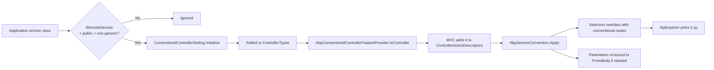
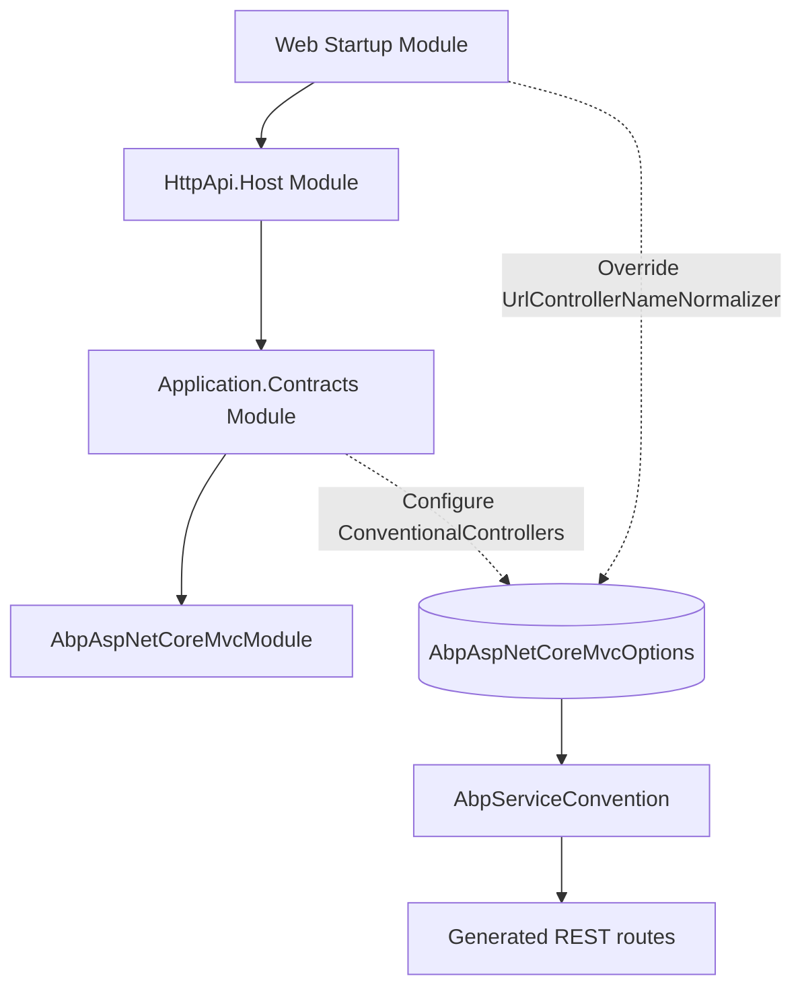

ABP turns `IApplicationService` / `IRemoteService` classes into REST
controllers without you writing `[Route]` attributes. The mechanism is an
`IApplicationModelConvention` named `AbpServiceConvention` plus a
companion `IConventionalRouteBuilder`. Together they live in
`framework/src/Volo.Abp.AspNetCore.Mvc/Volo/Abp/AspNetCore/Mvc/Conventions/`
and they are what makes the **auto-API** experience deterministic.

## File inventory

| File | Role |
| --- | --- |
| `IAbpServiceConvention.cs` | Marker interface (extends `IApplicationModelConvention`) |
| `AbpServiceConvention.cs` | The actual convention applied to `ApplicationModel` |
| `AbpServiceConventionWrapper.cs` | Lazy wrapper registered into `MvcOptions.Conventions` |
| `IConventionalRouteBuilder.cs` / `ConventionalRouteBuilder.cs` | Builds REST URLs from controller/action metadata |
| `AbpConventionalControllerOptions.cs` | Options bag (`UseV3UrlStyle`, ignored suffixes, form-body ignore list) |
| `AbpConventionalApiControllerSpecification.cs` | Tells MVC which conventional controllers are API controllers |
| `AbpConventionalControllerFeatureProvider.cs` | Adds conventional types to MVC's controller feature |
| `ConventionalControllerSetting.cs` | Per-assembly configuration (root path, predicate, normalizers, versions) |
| `ConventionalControllerSettingList.cs` | Strongly typed list of settings |
| `UrlControllerNameNormalizerContext.cs` / `UrlActionNameNormalizerContext.cs` | Context objects for URL normalizers |

## How a class becomes a controller



The selection predicate is defined in `ConventionalControllerSetting`:

```csharp title="framework/src/Volo.Abp.AspNetCore.Mvc/Volo/Abp/AspNetCore/Mvc/Conventions/ConventionalControllerSetting.cs"
private static bool IsRemoteService(Type type)
{
    if (!type.IsPublic || type.IsAbstract || type.IsGenericType)
    {
        return false;
    }

    var remoteServiceAttr = ReflectionHelper.GetSingleAttributeOrDefault<RemoteServiceAttribute>(type);
    if (remoteServiceAttr != null && !remoteServiceAttr.IsEnabledFor(type))
    {
        return false;
    }

    if (typeof(IRemoteService).IsAssignableFrom(type))
    {
        return true;
    }

    return false;
}
```

Add `[RemoteService(IsEnabled = false)]` to a class and it disappears from
the auto-API; the same attribute can disable individual controllers
without touching the option list.

## ApplicationServiceTypes

`ConventionalControllerSetting.ApplicationServiceTypes` is a `[Flags]` enum
that scopes which application services in the assembly are exposed.

```csharp title="framework/src/Volo.Abp.Core/Volo/Abp/ApplicationServiceTypes.cs"
[Flags]
public enum ApplicationServiceTypes : byte
{
    ApplicationServices = 1,
    IntegrationServices = 2,
    All = ApplicationServices | IntegrationServices
}
```

The filter is applied during `Initialize()`:

```csharp title="ConventionalControllerSetting.cs"
private bool IsPreferredApplicationServiceType(Type type)
{
    if (ApplicationServiceTypes == ApplicationServiceTypes.ApplicationServices)
    {
        return !IntegrationServiceAttribute.IsDefinedOrInherited(type);
    }

    if (ApplicationServiceTypes == ApplicationServiceTypes.IntegrationServices)
    {
        return IntegrationServiceAttribute.IsDefinedOrInherited(type);
    }

    return true;
}
```

Integration services are kept off the regular `/api/` prefix by
`AbpAspNetCoreMvcOptions.ExposeIntegrationServices` (default `false`),
which makes `AbpServiceConvention.RemoveIntegrationControllersIfNotExposed`
drop them from the application model entirely.

## Registering controllers for an assembly

A module's `ConfigureServices` opts an assembly into auto-API:

```csharp title="MyApplicationContractsModule.cs"
Configure<AbpAspNetCoreMvcOptions>(options =>
{
    options.ConventionalControllers
        .Create(typeof(MyApplicationModule).Assembly, opts =>
        {
            opts.RootPath = "shop";
            opts.RemoteServiceName = "Shop";
            opts.UrlControllerNameNormalizer = ctx => ctx.ControllerName.ToKebabCase();
        });
});
```

`Create` constructs a `ConventionalControllerSetting`, allows you to mutate
it, and then runs `Initialize()` so the type set is locked in:

```csharp title="AbpConventionalControllerOptions.cs"
public AbpConventionalControllerOptions Create(
    Assembly assembly,
    Action<ConventionalControllerSetting>? optionsAction = null)
{
    var setting = new ConventionalControllerSetting(
        assembly,
        ModuleApiDescriptionModel.DefaultRootPath,
        ModuleApiDescriptionModel.DefaultRemoteServiceName
    );

    optionsAction?.Invoke(setting);
    setting.Initialize();
    ConventionalControllerSettings.Add(setting);
    return this;
}
```

Default root path is `"app"` and the default remote-service name is
`"Default"` &mdash; both come from
`ModuleApiDescriptionModel` constants.

## ConventionalControllerSetting reference

| Property | Default | Effect |
| --- | --- | --- |
| `Assembly` | required | Assembly to scan for `IRemoteService` types |
| `RootPath` | `"app"` | Inserted between `/api/` and the controller name |
| `RemoteServiceName` | `"Default"` | Used in `ApplicationApiDescriptionModel.Modules` keys |
| `UseV3UrlStyle` | `false` | Falls back to legacy ABP v3 URL casing |
| `TypePredicate` | `null` | Extra filter on candidate types |
| `ApplicationServiceTypes` | `All` | Limit to application or integration services |
| `ControllerModelConfigurer` | `null` | Mutator invoked per `ControllerModel` |
| `UrlControllerNameNormalizer` | `null` | Rewrites the controller segment |
| `UrlActionNameNormalizer` | `null` | Rewrites the action segment |
| `ApiVersions` / `ApiVersionConfigurer` | empty | Apply [API versioning](/web/api-versioning) per assembly |

## The AbpServiceConvention pipeline

`AbpServiceConvention.Apply` runs in three phases per controller:

```csharp title="framework/src/Volo.Abp.AspNetCore.Mvc/Volo/Abp/AspNetCore/Mvc/Conventions/AbpServiceConvention.cs"
public void Apply(ApplicationModel application)
{
    ApplyForControllers(application);
}

protected virtual void ApplyForControllers(ApplicationModel application)
{
    RemoveDuplicateControllers(application);
    RemoveIntegrationControllersIfNotExposed(application);

    foreach (var controller in GetControllers(application))
    {
        var controllerType = controller.ControllerType.AsType();
        var configuration = GetControllerSettingOrNull(controllerType);

        if (ImplementsRemoteServiceInterface(controllerType))
        {
            controller.ControllerName = controller.ControllerName.RemovePostFix(ApplicationService.CommonPostfixes);
            configuration?.ControllerModelConfigurer?.Invoke(controller);
            ConfigureRemoteService(controller, configuration);
        }
        else
        {
            var remoteServiceAttr = ReflectionHelper.GetSingleAttributeOrDefault<RemoteServiceAttribute>(controllerType.GetTypeInfo());
            if (remoteServiceAttr != null && remoteServiceAttr.IsEnabledFor(controllerType))
            {
                ConfigureRemoteService(controller, configuration);
            }
        }
    }
}
```

### 1. RemoveDuplicateControllers

Three rules collapse duplicates:

- `AbpAspNetCoreMvcOptions.ControllersToRemove` deletes the listed types.
- `[ReplaceControllers(typeof(OldController))]` lets a new controller
  declare which existing ones it supersedes.
- `[ExposeServices(IncludeSelf = false)]` on a derived controller removes
  the base controller from MVC since the derived class replaces it.

### 2. RemoveIntegrationControllersIfNotExposed

```csharp title="AbpServiceConvention.cs"
protected virtual void RemoveIntegrationControllersIfNotExposed(ApplicationModel application)
{
    if (Options.ExposeIntegrationServices)
    {
        return;
    }

    var integrationControllers = GetControllers(application)
        .Where(c => IntegrationServiceAttribute.IsDefinedOrInherited(c.ControllerType))
        .ToArray();

    application.Controllers.RemoveAll(integrationControllers);
}
```

### 3. ConfigureRemoteService

Calls `ConfigureApiExplorer`, `ConfigureSelector`, and
`ConfigureParameters`. The parameter rebinding logic is small but
important:

```csharp title="AbpServiceConvention.cs"
foreach (var prm in action.Parameters)
{
    if (prm.BindingInfo != null) { continue; }

    if (!TypeHelper.IsPrimitiveExtended(prm.ParameterInfo.ParameterType, includeEnums: true))
    {
        if (CanUseFormBodyBinding(action, prm))
        {
            prm.BindingInfo = BindingInfo.GetBindingInfo(new[] { new FromBodyAttribute() });
        }
    }
}
```

Complex objects are bound from the body, except for `IFormFile` and
`IRemoteStreamContent` (configured via
`AbpConventionalControllerOptions.FormBodyBindingIgnoredTypes`), and except
for `GET`/`DELETE`/`TRACE`/`HEAD` methods, which never use the body.

## Route templates

`ConventionalRouteBuilder.Build` is the URL formatter. The shape is:

```
{apiRoutePrefix}/{rootPath}/{controller}[/{id}][/{action}[/{secondaryId}]]
```

Live code from
`framework/src/Volo.Abp.AspNetCore.Mvc/Volo/Abp/AspNetCore/Mvc/Conventions/ConventionalRouteBuilder.cs`:

```csharp title="ConventionalRouteBuilder.Build"
var apiRoutePrefix = GetApiRoutePrefix(action, configuration);
var controllerNameInUrl =
    NormalizeUrlControllerName(rootPath, controllerName, action, httpMethod, configuration);

var url = $"{apiRoutePrefix}/{rootPath}/{NormalizeControllerNameCase(controllerNameInUrl, configuration)}";

//Add {id} path if needed
var idParameterModel = action.Parameters.FirstOrDefault(p => p.ParameterName == "id");
if (idParameterModel != null)
{
    if (TypeHelper.IsPrimitiveExtended(idParameterModel.ParameterType, includeEnums: true))
    {
        url += "/{id}";
    }
    else
    {
        // composite key: append {Prop} segments for each public property
    }
}

//Add action name if needed
var actionNameInUrl = NormalizeUrlActionName(rootPath, controllerName, action, httpMethod, configuration);
if (!actionNameInUrl.IsNullOrEmpty())
{
    url += $"/{NormalizeActionNameCase(actionNameInUrl, configuration)}";

    //Add secondary Id
    var secondaryIds = action.Parameters
        .Where(p => p.ParameterName.EndsWith("Id", StringComparison.Ordinal)).ToList();
    if (secondaryIds.Count == 1)
    {
        url += $"/{{{NormalizeSecondaryIdNameCase(secondaryIds[0], configuration)}}}";
    }
}
```

`GetApiRoutePrefix` returns `"api"` by default, but switches to
`"integration-api"` when the controller carries
`[IntegrationService]`. Both constants come from `AbpAspNetCoreConsts`.

### Examples

| Service method | Inferred route |
| --- | --- |
| `BookAppService.GetAsync(Guid id)` (`HttpGet`) | `GET /api/app/book/{id}` |
| `BookAppService.GetListAsync(BookListInput input)` (`HttpGet`) | `GET /api/app/book` |
| `BookAppService.CreateAsync(BookCreateDto input)` (`HttpPost`) | `POST /api/app/book` |
| `BookAppService.UpdateAsync(Guid id, BookUpdateDto input)` (`HttpPut`) | `PUT /api/app/book/{id}` |
| `BookAppService.DeleteAsync(Guid id)` (`HttpDelete`) | `DELETE /api/app/book/{id}` |
| `OrderAppService.MoveAsync(Guid id, Guid warehouseId)` (`HttpPost`) | `POST /api/app/order/{id}/move/{warehouseId}` |
| Integration service variant | `POST /integration-api/...` |

## How `[DependsOn]` exposes application services

Because `AbpAspNetCoreMvcModule` is added to your startup module's
`[DependsOn]` graph, every other module in the graph can call
`Configure<AbpAspNetCoreMvcOptions>` at any depth. Those configurations
are merged before `AbpServiceConvention.Apply` runs, so an
**Application.Contracts** module can register its own assembly as
conventional controllers and a **Web** module higher up the chain can
override the URL normalizer without coordination between them.



## Related reading

- [Auto API controllers](/web/auto-api-controllers) &mdash; the user-facing
  view of conventional controllers.
- [API explorer and models](/web/api-explorer-and-models) &mdash; how the
  resulting endpoints are surfaced for proxy generation.
- [API versioning](/web/api-versioning) &mdash; how `ApiVersions` /
  `ApiVersionConfigurer` on a setting plug into versioned routes.
