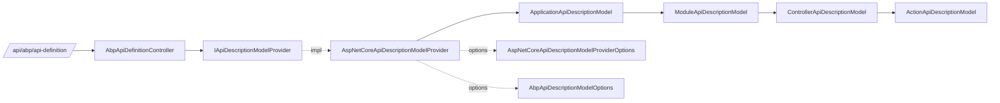

ABP needs a stable, machine-readable description of every controller and
action it exposes so dynamic HTTP clients, JavaScript proxies, Swagger
extensions and code generators can stay in sync. That description is
materialized by `AspNetCoreApiDescriptionModelProvider` and served by
`AbpApiDefinitionController` at `/api/abp/api-definition`. The model
classes themselves live in `Volo.Abp.Http.Modeling` and are shared with
the dynamic HTTP client subsystem.

## File inventory



Files involved in this flow:

| File | Role |
| --- | --- |
| `Volo.Abp.AspNetCore.Mvc/Volo/Abp/AspNetCore/Mvc/ApiExploring/AbpApiDefinitionController.cs` | HTTP entry point at `api/abp/api-definition` |
| `Volo.Abp.AspNetCore.Mvc/Volo/Abp/AspNetCore/Mvc/ApiExploring/AbpRemoteServiceApiDescriptionProvider.cs` | Adds default error-response types to remote-service actions |
| `Volo.Abp.AspNetCore.Mvc/Volo/Abp/AspNetCore/Mvc/ApiExploring/AbpRemoteServiceApiDescriptionProviderOptions.cs` | `SupportedResponseTypes` for the provider above |
| `Volo.Abp.AspNetCore.Mvc/Volo/Abp/AspNetCore/Mvc/AspNetCoreApiDescriptionModelProvider.cs` | Top-level builder that walks `IApiDescriptionGroupCollectionProvider` |
| `Volo.Abp.AspNetCore.Mvc/Volo/Abp/AspNetCore/Mvc/AspNetCoreApiDescriptionModelProviderOptions.cs` | Controller-/action-/parameter-name generators |
| `Volo.Abp.Http/Volo/Abp/Http/Modeling/IApiDescriptionModelProvider.cs` | Provider abstraction |
| `Volo.Abp.Http/Volo/Abp/Http/Modeling/ApplicationApiDescriptionModel.cs` | Root model: `Modules` + `Types` |
| `Volo.Abp.Http/Volo/Abp/Http/Modeling/ModuleApiDescriptionModel.cs` | Module entry: `RootPath`, `RemoteServiceName`, `Controllers` |
| `Volo.Abp.Http.Abstractions/Volo/Abp/Http/Modeling/AbpApiDescriptionModelOptions.cs` | Interfaces excluded from generated proxies |

## The endpoint

`AbpApiDefinitionController` is exposed by every ABP web host that
includes `AbpAspNetCoreMvcModule`:

```csharp title="framework/src/Volo.Abp.AspNetCore.Mvc/Volo/Abp/AspNetCore/Mvc/ApiExploring/AbpApiDefinitionController.cs"
[Area("abp")]
[RemoteService(Name = "abp")]
[Route("api/abp/api-definition")]
public class AbpApiDefinitionController : AbpController, IRemoteService
{
    protected readonly IApiDescriptionModelProvider ModelProvider;

    public AbpApiDefinitionController(IApiDescriptionModelProvider modelProvider)
    {
        ModelProvider = modelProvider;
    }

    [HttpGet]
    public virtual ApplicationApiDescriptionModel Get(ApplicationApiDescriptionModelRequestDto model)
    {
        return ModelProvider.CreateApiModel(model);
    }
}
```

`ApplicationApiDescriptionModelRequestDto` supports `IncludeTypes` so
clients can request the full DTO type catalog or a slimmer module/controller
list.

## ApplicationApiDescriptionModel

```csharp title="framework/src/Volo.Abp.Http/Volo/Abp/Http/Modeling/ApplicationApiDescriptionModel.cs"
[Serializable]
public class ApplicationApiDescriptionModel
{
    public IDictionary<string, ModuleApiDescriptionModel> Modules { get; set; } = default!;
    public IDictionary<string, TypeApiDescriptionModel> Types { get; set; } = default!;

    public static ApplicationApiDescriptionModel Create()
    {
        return new ApplicationApiDescriptionModel
        {
            Modules = new ConcurrentDictionary<string, ModuleApiDescriptionModel>(),
            Types = new Dictionary<string, TypeApiDescriptionModel>()
        };
    }

    public ModuleApiDescriptionModel GetOrAddModule(string rootPath, string remoteServiceName)
    {
        return Modules.GetOrAdd(rootPath, () => ModuleApiDescriptionModel.Create(rootPath, remoteServiceName));
    }

    public ApplicationApiDescriptionModel CreateSubModel(string[]? modules = null, string[]? controllers = null, string[]? actions = null);
}
```

Each `RootPath` (e.g. `"app"`, `"identity"`, `"administration"`) becomes a
key in `Modules`. The `Types` dictionary is the flattened DTO catalog used
when generating client classes.

## ModuleApiDescriptionModel

```csharp title="framework/src/Volo.Abp.Http/Volo/Abp/Http/Modeling/ModuleApiDescriptionModel.cs"
public class ModuleApiDescriptionModel
{
    public const string DefaultRootPath = "app";
    public const string DefaultRemoteServiceName = "Default";

    public string RootPath { get; set; } = default!;
    public string RemoteServiceName { get; set; } = default!;
    public IDictionary<string, ControllerApiDescriptionModel> Controllers { get; set; } = default!;

    public ControllerApiDescriptionModel GetOrAddController(
        string name,
        string? groupName,
        bool isRemoteService,
        bool isIntegrationService,
        string? apiVersion,
        Type type,
        HashSet<Type>? ignoredInterfaces = null);
}
```

`DefaultRootPath` and `DefaultRemoteServiceName` are also the defaults used
by `AbpConventionalControllerOptions.Create` — see
[API conventions](/web/api-conventions).

## AspNetCoreApiDescriptionModelProvider

This is the heavy lifter. It walks every `ApiDescription` produced by
ASP.NET Core and assembles the `ApplicationApiDescriptionModel`:

```csharp title="framework/src/Volo.Abp.AspNetCore.Mvc/Volo/Abp/AspNetCore/Mvc/AspNetCoreApiDescriptionModelProvider.cs"
public ApplicationApiDescriptionModel CreateApiModel(ApplicationApiDescriptionModelRequestDto input)
{
    var model = ApplicationApiDescriptionModel.Create();

    foreach (var descriptionGroupItem in _descriptionProvider.ApiDescriptionGroups.Items)
    {
        foreach (var apiDescription in descriptionGroupItem.Items)
        {
            if (!apiDescription.ActionDescriptor.IsControllerAction())
            {
                continue;
            }

            AddApiDescriptionToModel(apiDescription, model, input);
        }
    }

    // ... post-process: remove duplicate non-remote-service entries ...

    return model;
}
```

For every action it derives:

- the **module** (`GetRootPath` + `GetRemoteServiceName` honour the
  matching `ConventionalControllerSetting`)
- a unique **controller key** from
  `AspNetCoreApiDescriptionModelProviderOptions.ControllerNameGenerator`
- a unique **action key** from `ActionNameGenerator`
- `AllowAnonymous` based on endpoint metadata
- `ImplementFrom` &mdash; the interface that declares the method, used by
  dynamic clients to find the matching contract.

```csharp title="AspNetCoreApiDescriptionModelProvider.cs"
bool? allowAnonymous = null;
if (apiDescription.ActionDescriptor.EndpointMetadata.Any(x => x is IAllowAnonymous))
{
    allowAnonymous = true;
}
else if (apiDescription.ActionDescriptor.EndpointMetadata.Any(x => x is IAuthorizeData))
{
    allowAnonymous = false;
}

var implementFrom = controllerType.FullName;
var interfaceType = controllerType.GetInterfaces()
    .FirstOrDefault(i => i.GetMethods().Any(x => x.ToString() == method.ToString()));
if (interfaceType != null)
{
    implementFrom = TypeHelper.GetFullNameHandlingNullableAndGenerics(interfaceType);
}
```

When `IncludeTypes` is `true` the provider also walks every method
parameter and return type, recursively flattening generics, dictionaries
and enumerables into `applicationModel.Types`. This is what powers
ABP's TypeScript / Angular service-proxy generation.

## AspNetCoreApiDescriptionModelProviderOptions

The options class tells the provider how to name things:

```csharp title="framework/src/Volo.Abp.AspNetCore.Mvc/Volo/Abp/AspNetCore/Mvc/AspNetCoreApiDescriptionModelProviderOptions.cs"
public class AspNetCoreApiDescriptionModelProviderOptions
{
    public Func<Type, ConventionalControllerSetting?, string> ControllerNameGenerator { get; set; }
    public Func<MethodInfo, string> ActionNameGenerator { get; set; }
    public Func<ApiParameterDescription, string?> ApiParameterNameGenerator { get; set; }

    public AspNetCoreApiDescriptionModelProviderOptions()
    {
        ControllerNameGenerator = (controllerType, setting) =>
        {
            var controllerName = controllerType.Name
                .RemovePostFix("Controller")
                .RemovePostFix(ApplicationService.CommonPostfixes);

            if (setting?.UrlControllerNameNormalizer != null)
            {
                controllerName = setting.UrlControllerNameNormalizer(
                    new UrlControllerNameNormalizerContext(setting.RootPath, controllerName));
            }

            return controllerName;
        };

        ActionNameGenerator = (method) =>
        {
            var methodNameBuilder = new StringBuilder(method.Name);

            var parameters = method.GetParameters();
            if (parameters.Any())
            {
                methodNameBuilder.Append("By");
                for (var i = 0; i < parameters.Length; i++)
                {
                    if (i > 0) methodNameBuilder.Append("And");
                    methodNameBuilder.Append(parameters[i].Name!.ToPascalCase());
                }
            }

            return methodNameBuilder.ToString();
        };

        ApiParameterNameGenerator = (apiParameterDescription) =>
        {
            // honour [JsonPropertyName(...)] on the DTO property
            if (apiParameterDescription.ModelMetadata is DefaultModelMetadata defaultModelMetadata)
            {
                var attr = (JsonPropertyNameAttribute?) defaultModelMetadata?.Attributes?.PropertyAttributes?
                    .FirstOrDefault(x => x is JsonPropertyNameAttribute);
                if (attr != null) return attr.Name;
            }

            return null;
        };
    }
}
```

Overloads with the same name receive `By{ParameterName}And…` suffixes so
the generated client keys remain unique.

## AbpRemoteServiceApiDescriptionProvider

`AbpAspNetCoreMvcModule` also registers an
`IApiDescriptionProvider` that runs at `Order = -999` (right after the
default provider). It guarantees every remote-service action lists the
common ABP error response types so OpenAPI and proxy generators always
know about 400/401/403/404/500/501 responses returning
`RemoteServiceErrorResponse`:

```csharp title="AbpAspNetCoreMvcModule.cs (excerpt)"
Configure<AbpRemoteServiceApiDescriptionProviderOptions>(options =>
{
    var statusCodes = new List<int>
    {
        (int) HttpStatusCode.Forbidden,
        (int) HttpStatusCode.Unauthorized,
        (int) HttpStatusCode.BadRequest,
        (int) HttpStatusCode.NotFound,
        (int) HttpStatusCode.NotImplemented,
        (int) HttpStatusCode.InternalServerError
    };

    options.SupportedResponseTypes.AddIfNotContains(statusCodes.Select(statusCode => new ApiResponseType
    {
        Type = typeof(RemoteServiceErrorResponse),
        StatusCode = statusCode
    }));
});
```

The matching provider then attaches those types to every API description:

```csharp title="framework/src/Volo.Abp.AspNetCore.Mvc/Volo/Abp/AspNetCore/Mvc/ApiExploring/AbpRemoteServiceApiDescriptionProvider.cs"
public void OnProvidersExecuting(ApiDescriptionProviderContext context)
{
    foreach (var apiResponseType in GetApiResponseTypes())
    {
        foreach (var result in context.Results.Where(x => x.IsRemoteService()))
        {
            // skip if the action already declares this status with [ProducesResponseType]
            // ... add to result.SupportedResponseTypes ...
        }
    }
}

public int Order => -999;
```

## AbpApiDescriptionModelOptions

Cross-cutting interfaces should not bleed into client proxies. The default
list filters them out:

```csharp title="framework/src/Volo.Abp.Http.Abstractions/Volo/Abp/Http/Modeling/AbpApiDescriptionModelOptions.cs"
public class AbpApiDescriptionModelOptions
{
    public HashSet<Type> IgnoredInterfaces { get; }

    public AbpApiDescriptionModelOptions()
    {
        IgnoredInterfaces = new HashSet<Type>
        {
            typeof(ITransientDependency),
            typeof(ISingletonDependency),
            typeof(IDisposable),
            typeof(IAvoidDuplicateCrossCuttingConcerns)
        };
    }
}
```

`AbpAspNetCoreMvcModule.ConfigureServices` adds a few more MVC-specific
interfaces:

```csharp title="AbpAspNetCoreMvcModule.cs"
Configure<AbpApiDescriptionModelOptions>(options =>
{
    options.IgnoredInterfaces.AddIfNotContains(typeof(IAsyncActionFilter));
    options.IgnoredInterfaces.AddIfNotContains(typeof(IFilterMetadata));
    options.IgnoredInterfaces.AddIfNotContains(typeof(IActionFilter));
});
```

## Consumers

The model fuels several downstream features:

- **Dynamic HTTP clients** (`Volo.Abp.Http.Client`) pull the model at
  startup or per-request to map C# proxy methods to URLs.
- **JavaScript/TypeScript proxy generation** (`abp-cli generate-proxy`)
  reads the JSON response of `/api/abp/api-definition`.
- **Swagger integration** uses the same `ApiDescription` pipeline, with
  extra error responses contributed by `AbpRemoteServiceApiDescriptionProvider`.
- Cross-cutting concerns ([Authorization](/authz),
  [Authentication](/auth) and [Multi-tenancy](/multitenancy)) read
  `AllowAnonymous` / interface metadata from the model when generating
  scope-aware clients.

## Customizing the model at runtime

Override the helpers from your module:

```csharp
Configure<AspNetCoreApiDescriptionModelProviderOptions>(options =>
{
    options.ControllerNameGenerator = (type, setting) =>
        type.Name.RemovePostFix("Controller").ToKebabCase();
});

Configure<AbpApiDescriptionModelOptions>(options =>
{
    options.IgnoredInterfaces.Add(typeof(IMyMarkerInterface));
});
```

`AbpApiDefinitionController` will then return the customized model on the
next call.
