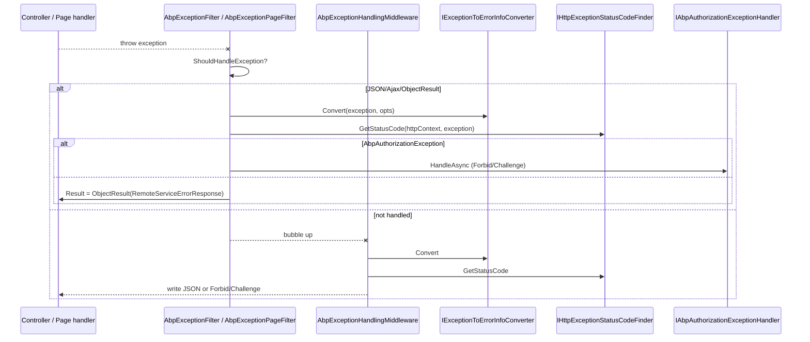

ABP's web layer turns CLR exceptions into structured
`RemoteServiceErrorResponse` JSON payloads with consistent HTTP status
codes. The mechanism spans **two filters**, **one middleware**, and a pair
of services that decide *what* the response looks like and *which* status
code to return. This page traces each piece using the actual code under
`framework/src/Volo.Abp.AspNetCore*`.

## File inventory

| File | Role |
| --- | --- |
| `Volo.Abp.AspNetCore.Mvc/Volo/Abp/AspNetCore/Mvc/ExceptionHandling/AbpExceptionFilter.cs` | MVC `IAsyncExceptionFilter` for controllers |
| `Volo.Abp.AspNetCore.Mvc/Volo/Abp/AspNetCore/Mvc/ExceptionHandling/AbpExceptionPageFilter.cs` | Razor Pages `IAsyncPageFilter` |
| `Volo.Abp.AspNetCore/Volo/Abp/AspNetCore/ExceptionHandling/AbpExceptionHandlingMiddleware.cs` | Final safety net before the response leaves the host |
| `Volo.Abp.AspNetCore/Volo/Abp/AspNetCore/ExceptionHandling/IHttpExceptionStatusCodeFinder.cs` + `DefaultHttpExceptionStatusCodeFinder.cs` | Map an `Exception` to an `HttpStatusCode` |
| `Volo.Abp.AspNetCore/Volo/Abp/AspNetCore/ExceptionHandling/AbpExceptionHttpStatusCodeOptions.cs` | Per-error-code overrides |
| `Volo.Abp.AspNetCore/Volo/Abp/AspNetCore/ExceptionHandling/IAbpAuthorizationExceptionHandler.cs` + `DefaultAbpAuthorizationExceptionHandler.cs` | Forbid/challenge for `AbpAuthorizationException` |
| `Volo.Abp.ExceptionHandling/Volo/Abp/AspNetCore/ExceptionHandling/IExceptionToErrorInfoConverter.cs` + `DefaultExceptionToErrorInfoConverter.cs` | Build the `RemoteServiceErrorInfo` payload |
| `Volo.Abp.ExceptionHandling/Volo/Abp/AspNetCore/ExceptionHandling/AbpExceptionHandlingOptions.cs` | `SendExceptionsDetailsToClients`, `SendStackTraceToClients` |
| `Volo.Abp.Http/Volo/Abp/Http/RemoteServiceErrorInfo.cs`, `RemoteServiceErrorResponse.cs` | DTOs returned to the client |

## End-to-end flow



`AbpExceptionFilter` runs first for controllers; `AbpExceptionPageFilter`
covers Razor Pages. Anything they decide not to handle (or that throws
before MVC sees the request) falls through to
`AbpExceptionHandlingMiddleware`.

## AbpExceptionFilter

`AbpExceptionFilter` is auto-registered as a transient dependency. It only
handles exceptions when the action returns an object result, the client
asks for JSON, or the request is AJAX:

```csharp title="framework/src/Volo.Abp.AspNetCore.Mvc/Volo/Abp/AspNetCore/Mvc/ExceptionHandling/AbpExceptionFilter.cs"
public virtual async Task OnExceptionAsync(ExceptionContext context)
{
    if (!ShouldHandleException(context))
    {
        LogException(context, out _);
        return;
    }

    await HandleAndWrapException(context);
}

protected virtual bool ShouldHandleException(ExceptionContext context)
{
    if (context.ActionDescriptor.IsControllerAction() &&
        context.ActionDescriptor.HasObjectResult())
    {
        return true;
    }

    if (context.HttpContext.Request.CanAccept(MimeTypes.Application.Json))
    {
        return true;
    }

    if (context.HttpContext.Request.IsAjax())
    {
        return true;
    }

    return false;
}
```

When it decides to handle, it logs through `IExceptionNotifier`, sets the
`X-Abp-Error-Format` header, and emits an `ObjectResult` carrying the
`RemoteServiceErrorResponse`:

```csharp title="AbpExceptionFilter.HandleAndWrapException"
LogException(context, out var remoteServiceErrorInfo);
await context.GetRequiredService<IExceptionNotifier>()
    .NotifyAsync(new ExceptionNotificationContext(context.Exception));

if (context.Exception is AbpAuthorizationException)
{
    await context.HttpContext.RequestServices
        .GetRequiredService<IAbpAuthorizationExceptionHandler>()
        .HandleAsync(context.Exception.As<AbpAuthorizationException>(), context.HttpContext);
}
else
{
    context.HttpContext.Response.Headers.Add(AbpHttpConsts.AbpErrorFormat, "true");
    context.HttpContext.Response.StatusCode = (int)context
        .GetRequiredService<IHttpExceptionStatusCodeFinder>()
        .GetStatusCode(context.HttpContext, context.Exception);

    context.Result = new ObjectResult(new RemoteServiceErrorResponse(remoteServiceErrorInfo));
}

context.Exception = null!; //Handled!
```

`IExceptionNotifier` is the same channel used by background workers, so a
single subscriber receives events from any layer of the stack.

## AbpExceptionPageFilter

The Razor Pages equivalent has the same `ShouldHandleException` logic but
runs as an `IAsyncPageFilter`:

```csharp title="framework/src/Volo.Abp.AspNetCore.Mvc/Volo/Abp/AspNetCore/Mvc/ExceptionHandling/AbpExceptionPageFilter.cs"
public virtual async Task OnPageHandlerExecutionAsync(
    PageHandlerExecutingContext context,
    PageHandlerExecutionDelegate next)
{
    if (context.HandlerMethod == null || !ShouldHandleException(context))
    {
        await next();
        return;
    }

    var pageHandlerExecutedContext = await next();
    if (pageHandlerExecutedContext.Exception == null)
    {
        return;
    }

    await HandleAndWrapException(pageHandlerExecutedContext);
}
```

The implementation of `HandleAndWrapException` is essentially identical to
the MVC variant; only the context type changes.

## AbpExceptionHandlingMiddleware

The middleware catches anything that escapes the filters. It only takes
ownership when the in-flight action wanted an object result (recorded in
`HttpContext.Items["_AbpActionInfo"]` as `AbpActionInfoInHttpContext`):

```csharp title="framework/src/Volo.Abp.AspNetCore/Volo/Abp/AspNetCore/ExceptionHandling/AbpExceptionHandlingMiddleware.cs"
public async Task InvokeAsync(HttpContext context, RequestDelegate next)
{
    try
    {
        await next(context);
    }
    catch (Exception ex)
    {
        if (context.Response.HasStarted)
        {
            _logger.LogWarning("An exception occurred, but response has already started!");
            throw;
        }

        if (context.Items["_AbpActionInfo"] is AbpActionInfoInHttpContext actionInfo)
        {
            if (actionInfo.IsObjectResult)
            {
                await HandleAndWrapException(context, ex);
                return;
            }
        }

        throw;
    }
}
```

Inside `HandleAndWrapException` it sets the status code, writes the JSON
body manually and adds the `AbpHttpConsts.AbpErrorFormat` header:

```csharp title="AbpExceptionHandlingMiddleware.HandleAndWrapException"
httpContext.Response.Clear();
httpContext.Response.StatusCode = (int)statusCodeFinder.GetStatusCode(httpContext, exception);
httpContext.Response.OnStarting(_clearCacheHeadersDelegate, httpContext.Response);
httpContext.Response.Headers.Add(AbpHttpConsts.AbpErrorFormat, "true");
httpContext.Response.Headers.Add("Content-Type", "application/json");

await httpContext.Response.WriteAsync(
    jsonSerializer.Serialize(
        new RemoteServiceErrorResponse(
            errorInfoConverter.Convert(exception, options =>
            {
                options.SendExceptionsDetailsToClients = exceptionHandlingOptions.SendExceptionsDetailsToClients;
                options.SendStackTraceToClients = exceptionHandlingOptions.SendStackTraceToClients;
            })
        )
    )
);
```

The middleware is added by `UseAbpExceptionHandling` (idempotent thanks to
the `_AbpExceptionHandlingMiddleware_Added` marker).

## IExceptionToErrorInfoConverter

This is the abstraction that builds a `RemoteServiceErrorInfo`. It uses a
chain-of-responsibility pattern, with a default implementation in
`Volo.Abp.ExceptionHandling`:

```csharp title="framework/src/Volo.Abp.ExceptionHandling/Volo/Abp/AspNetCore/ExceptionHandling/IExceptionToErrorInfoConverter.cs"
public interface IExceptionToErrorInfoConverter
{
    [Obsolete("Use other Convert method.")]
    RemoteServiceErrorInfo Convert(Exception exception, bool includeSensitiveDetails);

    RemoteServiceErrorInfo Convert(Exception exception, Action<AbpExceptionHandlingOptions>? options = null);
}
```

`DefaultExceptionToErrorInfoConverter` honours these well-known interfaces:

| Interface / type | Effect |
| --- | --- |
| `IHasErrorCode` | Populates `Code` on the error info |
| `IHasErrorDetails` | Sets `Details` |
| `IHasValidationErrors` (`AbpValidationException`) | Emits per-field `ValidationErrors` |
| `IHasLogLevel` | Drives logging level |
| `IUserFriendlyException` | Forces the message to surface to the client |
| `IBusinessException` | Reveals `Code`/`Message` to clients even when sensitive details are off |
| Anything else | Replaced with a generic localized message unless `SendExceptionsDetailsToClients = true` |

The `AbpExceptionHandlingOptions` toggles act as the kill-switch:

```csharp
Configure<AbpExceptionHandlingOptions>(options =>
{
    options.SendExceptionsDetailsToClients = false; // production default
    options.SendStackTraceToClients = false;
});
```

## ExceptionToHttpStatusCodeMapper

The status-code mapper is `IHttpExceptionStatusCodeFinder` with one default
implementation. It is the canonical answer to "what HTTP status do I send
for this exception?":

```csharp title="framework/src/Volo.Abp.AspNetCore/Volo/Abp/AspNetCore/ExceptionHandling/DefaultHttpExceptionStatusCodeFinder.cs"
public virtual HttpStatusCode GetStatusCode(HttpContext httpContext, Exception exception)
{
    if (exception is IHasHttpStatusCode exceptionWithHttpStatusCode &&
        exceptionWithHttpStatusCode.HttpStatusCode > 0)
    {
        return (HttpStatusCode)exceptionWithHttpStatusCode.HttpStatusCode;
    }

    if (exception is IHasErrorCode exceptionWithErrorCode &&
        !exceptionWithErrorCode.Code.IsNullOrWhiteSpace())
    {
        if (Options.ErrorCodeToHttpStatusCodeMappings.TryGetValue(exceptionWithErrorCode.Code!, out var status))
        {
            return status;
        }
    }

    if (exception is AbpAuthorizationException)
    {
        return httpContext.User.Identity!.IsAuthenticated
            ? HttpStatusCode.Forbidden
            : HttpStatusCode.Unauthorized;
    }

    if (exception is AbpValidationException)      return HttpStatusCode.BadRequest;
    if (exception is EntityNotFoundException)     return HttpStatusCode.NotFound;
    if (exception is AbpDbConcurrencyException)   return HttpStatusCode.Conflict;
    if (exception is NotImplementedException)     return HttpStatusCode.NotImplemented;
    if (exception is IBusinessException)          return HttpStatusCode.Forbidden;

    return HttpStatusCode.InternalServerError;
}
```

The lookup table is configurable through `AbpExceptionHttpStatusCodeOptions`:

```csharp title="framework/src/Volo.Abp.AspNetCore/Volo/Abp/AspNetCore/ExceptionHandling/AbpExceptionHttpStatusCodeOptions.cs"
public class AbpExceptionHttpStatusCodeOptions
{
    public IDictionary<string, HttpStatusCode> ErrorCodeToHttpStatusCodeMappings { get; }

    public AbpExceptionHttpStatusCodeOptions() =>
        ErrorCodeToHttpStatusCodeMappings = new Dictionary<string, HttpStatusCode>();

    public void Map(string errorCode, HttpStatusCode httpStatusCode)
    {
        ErrorCodeToHttpStatusCodeMappings[errorCode] = httpStatusCode;
    }
}
```

Example:

```csharp
Configure<AbpExceptionHttpStatusCodeOptions>(options =>
{
    options.Map("BookStore:Books:DuplicateName", HttpStatusCode.Conflict);
});
```

## AbpAuthorizationException handler

Authorization failures get special treatment. The default handler chooses
between `Forbid` and `Challenge` based on whether the principal is
authenticated, and lets you override the scheme via
`AbpAuthorizationExceptionHandlerOptions.AuthenticationScheme`:

```csharp title="framework/src/Volo.Abp.AspNetCore/Volo/Abp/AspNetCore/ExceptionHandling/DefaultAbpAuthorizationExceptionHandler.cs"
public virtual async Task HandleAsync(AbpAuthorizationException exception, HttpContext httpContext)
{
    var isAuthenticated = httpContext.User.Identity?.IsAuthenticated ?? false;
    // resolve scheme (configured or default Forbid/Challenge scheme)
    var handler = await handlers.GetHandlerAsync(httpContext, scheme.Name);

    if (isAuthenticated)
    {
        await handler.ForbidAsync(null);
    }
    else
    {
        await handler.ChallengeAsync(null);
    }
}
```

This means cookie-based UIs get an interactive login redirect while API
callers get a 401/403 from the chosen scheme. See [Authorization](/authz)
and [Authentication](/auth) for upstream details.

## A note on `AbpHandledExceptionEventData`

ABP itself relies on `IExceptionNotifier.NotifyAsync(ExceptionNotificationContext)`
rather than a public `AbpHandledExceptionEventData` type. To observe
handled exceptions, implement `IExceptionSubscriber` (in
`Volo.Abp.ExceptionHandling`); the subscribers receive the same
`ExceptionNotificationContext` used by both the filter and the middleware.

## Wiring inside `AbpAspNetCoreMvcModule`

`AbpExceptionFilter`, `AbpExceptionPageFilter`,
`DefaultExceptionToErrorInfoConverter`, `DefaultHttpExceptionStatusCodeFinder`
and `DefaultAbpAuthorizationExceptionHandler` are all `ITransientDependency`
implementations &mdash; ABP's conventional registrar wires them
automatically. The host enables the middleware with one line:

```csharp
app.UseAbpExceptionHandling();
// or (the recommended composition that also adds UoW)
app.UseUnitOfWork();
```

Refer back to [ASP.NET Core module](/web/aspnet-core-module#application-builder-helpers)
for the full builder helper list.

## Related cross-cutting

<CardGroup cols={2}>
  <Card title="Authorization" href="/authz" icon="shield-check">
    Origin of `AbpAuthorizationException` and the permissions that produce it.
  </Card>
  <Card title="Authentication" href="/auth" icon="key">
    Schemes consulted by `DefaultAbpAuthorizationExceptionHandler`.
  </Card>
  <Card title="Auditing" href="/auditing" icon="clipboard-list">
    Audit logs capture the same exception via `AspNetCoreAuditLogContributor`.
  </Card>
  <Card title="Multi-tenancy" href="/multitenancy" icon="building">
    Tenant context survives the exception scope so logs/audits include `TenantId`.
  </Card>
</CardGroup>
