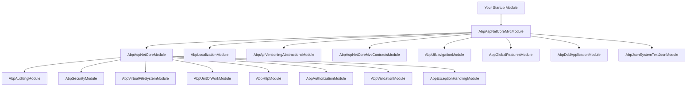
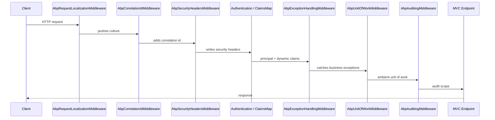

The ABP Framework ships an opinionated ASP.NET Core integration layer that
plugs the modular runtime, dependency injection, auditing, authorization,
unit of work, exception handling, virtual file system, and localization
infrastructure into the standard ASP.NET Core request pipeline. Everything
in this section lives under `framework/src/Volo.Abp.AspNetCore*` in the
[abpframework/abp](https://github.com/abpframework/abp) repository and is
designed so that an application module can opt into the pieces it actually
needs &mdash; APIs, MVC views, Razor Pages, SignalR hubs, Serilog enrichers,
or integration test hosts &mdash; without rewriting plumbing.

## Web packages at a glance

The web layer is split across several ABP modules. Each module declares its
own `[DependsOn]` graph that pulls in the framework primitives it needs, and
applications compose them through their own startup module.

| Package | Module class | Purpose |
| --- | --- | --- |
| `Volo.Abp.AspNetCore` | `AbpAspNetCoreModule` | Base middlewares (auditing, UoW, exception handling, claims map, security headers), request localization, virtual file system, web client info |
| `Volo.Abp.AspNetCore.Mvc` | `AbpAspNetCoreMvcModule` | MVC/Razor Pages integration, conventional controllers, API exploring, filters, content formatters |
| `Volo.Abp.AspNetCore.Mvc.NewtonsoftJson` | `AbpAspNetCoreMvcNewtonsoftModule` | Optional Newtonsoft.Json formatter that respects ABP camelCase + date-time conventions |
| `Volo.Abp.AspNetCore.SignalR` | `AbpAspNetCoreSignalRModule` | `AbpHub` base, auto hub mapping, authentication/audit hub filters |
| `Volo.Abp.AspNetCore.Serilog` | `AbpAspNetCoreSerilogModule` | Serilog `LogContext` enrichers for tenant, user, client and correlation id |
| `Volo.Abp.AspNetCore.TestBase` | `AbpAspNetCoreTestBaseModule` | `TestServer` wiring for integration tests |

Pages in this section dig into each package. A good starting order is
[ASP.NET Core module](/web/aspnet-core-module) →
[MVC controllers](/web/mvc-controllers) →
[Auto API controllers](/web/auto-api-controllers) →
[API conventions](/web/api-conventions).

## Module dependency graph

`AbpAspNetCoreMvcModule` builds on top of `AbpAspNetCoreModule`, which in
turn brings in the framework primitives. The chain is exactly the one
declared on each module class.



The `[DependsOn]` attributes that produce this graph are in
[`AbpAspNetCoreModule.cs`](https://github.com/abpframework/abp/blob/dev/framework/src/Volo.Abp.AspNetCore/Volo/Abp/AspNetCore/AbpAspNetCoreModule.cs)
and
[`AbpAspNetCoreMvcModule.cs`](https://github.com/abpframework/abp/blob/dev/framework/src/Volo.Abp.AspNetCore.Mvc/Volo/Abp/AspNetCore/Mvc/AbpAspNetCoreMvcModule.cs).

```csharp title="framework/src/Volo.Abp.AspNetCore/Volo/Abp/AspNetCore/AbpAspNetCoreModule.cs"
[DependsOn(
    typeof(AbpAuditingModule),
    typeof(AbpSecurityModule),
    typeof(AbpVirtualFileSystemModule),
    typeof(AbpUnitOfWorkModule),
    typeof(AbpHttpModule),
    typeof(AbpAuthorizationModule),
    typeof(AbpValidationModule),
    typeof(AbpExceptionHandlingModule)
    )]
public class AbpAspNetCoreModule : AbpModule
```

## The ABP-augmented request pipeline

ABP plugs additional middlewares into the standard pipeline through
extension methods declared in
`Microsoft.AspNetCore.Builder.AbpApplicationBuilderExtensions`. A typical
ABP application calls them in this order:

```csharp title="Program.cs (typical order)"
app.UseAbpRequestLocalization();
app.UseCorrelationId();
app.UseAbpSecurityHeaders();
app.UseAuthentication();
app.UseAbpClaimsMap();
app.UseDynamicClaims();
app.UseAuthorization();
app.UseUnitOfWork();        // wraps UseAbpExceptionHandling
app.UseAuditing();
app.UseConfiguredEndpoints();
```



`UseUnitOfWork` automatically chains `UseAbpExceptionHandling` if it has not
been added yet &mdash; the helper records that with the
`_AbpExceptionHandlingMiddleware_Added` property on `IApplicationBuilder`.

## Conventional controllers and auto API

`AbpAspNetCoreMvcModule` registers an `AbpConventionalControllerFeatureProvider`
that turns plain `IRemoteService` / `IApplicationService` classes into
controllers without writing routes by hand. The behavior is configured via
`AbpAspNetCoreMvcOptions.ConventionalControllers`.

```csharp title="Module ConfigureServices"
Configure<AbpAspNetCoreMvcOptions>(options =>
{
    options.ConventionalControllers
        .Create(typeof(MyApplicationModule).Assembly);
});
```

The same `IApiDescriptionModelProvider` infrastructure exposes the resulting
endpoint catalog at `/api/abp/api-definition`, which is consumed by ABP
dynamic HTTP clients and code generators. See
[Auto API controllers](/web/auto-api-controllers),
[API conventions](/web/api-conventions), and
[API explorer and models](/web/api-explorer-and-models).

## Where cross-cutting concerns live

The ASP.NET Core integration is the **hosting surface** for the framework's
cross-cutting features. Each one has its own dedicated documentation:

<CardGroup cols={2}>
  <Card title="Authentication" href="/auth" icon="key">
    Cookies, JWT bearer, dynamic claims map middleware that loads claims on each request.
  </Card>
  <Card title="Authorization" href="/authz" icon="shield-check">
    Permission/policy bridge used by `AbpAuthorizationException` and `IAbpAuthorizationExceptionHandler`.
  </Card>
  <Card title="Multi-tenancy" href="/multitenancy" icon="building">
    Tenant resolution that runs inside the middleware chain before audit, UoW, and MVC dispatch.
  </Card>
  <Card title="Auditing" href="/auditing" icon="clipboard-list">
    `AbpAuditingMiddleware` + `AspNetCoreAuditLogContributor` populate the audit log scope around each request.
  </Card>
</CardGroup>

## Key entry points

The table below points at the file you should open first when investigating
a behavior.

| Concern | File |
| --- | --- |
| Module + base services | `Volo.Abp.AspNetCore/Volo/Abp/AspNetCore/AbpAspNetCoreModule.cs` |
| MVC module + filter wiring | `Volo.Abp.AspNetCore.Mvc/Volo/Abp/AspNetCore/Mvc/AbpAspNetCoreMvcModule.cs` |
| Application builder helpers | `Volo.Abp.AspNetCore/Microsoft/AspNetCore/Builder/AbpApplicationBuilderExtensions.cs` |
| Endpoint mapping helper | `Volo.Abp.AspNetCore/Microsoft/AspNetCore/Builder/AbpAspNetCoreApplicationBuilderExtensions.cs` |
| Conventional controllers | `Volo.Abp.AspNetCore.Mvc/Volo/Abp/AspNetCore/Mvc/Conventions/` |
| API explorer | `Volo.Abp.AspNetCore.Mvc/Volo/Abp/AspNetCore/Mvc/ApiExploring/` |
| Exception filter | `Volo.Abp.AspNetCore.Mvc/Volo/Abp/AspNetCore/Mvc/ExceptionHandling/AbpExceptionFilter.cs` |
| Anti-forgery | `Volo.Abp.AspNetCore.Mvc/Volo/Abp/AspNetCore/Mvc/AntiForgery/` |
| Versioning | `Volo.Abp.AspNetCore.Mvc/Volo/Abp/AspNetCore/Mvc/Versioning/` |
| SignalR | `Volo.Abp.AspNetCore.SignalR/Volo/Abp/AspNetCore/SignalR/` |
| Serilog enrichers | `Volo.Abp.AspNetCore.Serilog/Volo/Abp/AspNetCore/Serilog/` |
| Integration tests | `Volo.Abp.AspNetCore.TestBase/Volo/Abp/AspNetCore/TestBase/` |

## Conventions used throughout this section

- File paths are repo-relative to `framework/src/` unless an absolute path
  is given.
- Code excerpts are copied verbatim from the source tree and are annotated
  with the file they came from.
- Options classes are accessed via `Configure<TOptions>(...)` inside a
  module's `ConfigureServices`; the names are stable across releases.
- When a class implements `ITransientDependency` or `ISingletonDependency`,
  ABP's conventional registrar auto-registers it &mdash; you do not need to
  add it to `IServiceCollection` manually.

Continue with [ASP.NET Core module](/web/aspnet-core-module) to see what
`AbpAspNetCoreModule` actually wires into the container.
