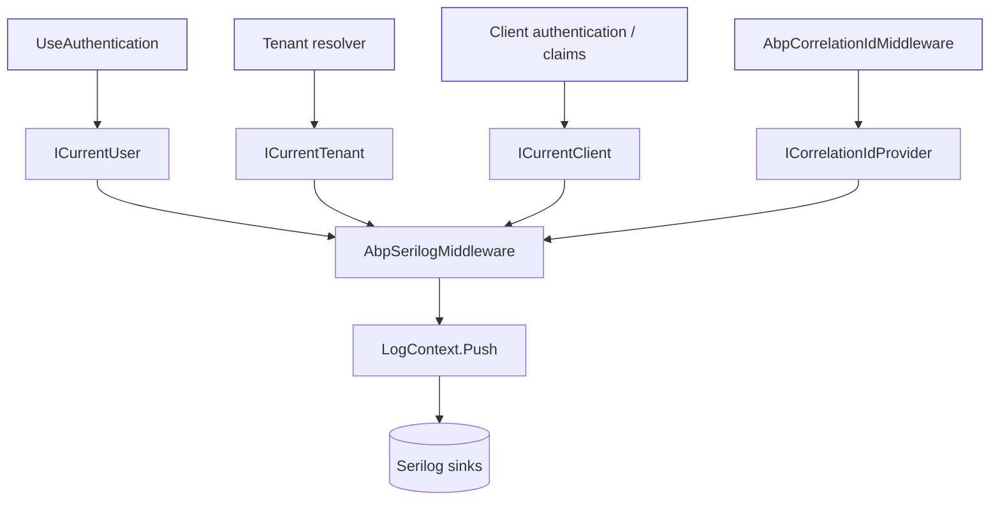

`Volo.Abp.AspNetCore.Serilog` is the smallest module in the web layer.
It exists to push four well-known ABP request properties &mdash;
`TenantId`, `UserId`, `ClientId`, and `CorrelationId` &mdash; into
Serilog's `LogContext` so structured logs carry the same identifiers used
elsewhere in the framework. The package lives in
`framework/src/Volo.Abp.AspNetCore.Serilog/`.

## File inventory

| File | Role |
| --- | --- |
| `Volo/Abp/AspNetCore/Serilog/AbpAspNetCoreSerilogModule.cs` | Module declaration |
| `Volo/Abp/AspNetCore/Serilog/AbpAspNetCoreSerilogOptions.cs` | Configurable enricher property names |
| `Volo/Abp/AspNetCore/Serilog/AbpSerilogMiddleware.cs` | Middleware that pushes ABP context onto `Serilog.Context.LogContext` |
| `Microsoft/AspNetCore/Builder/AbpAspNetCoreSerilogApplicationBuilderExtensions.cs` | `UseAbpSerilogEnrichers()` extension method |

## Module

`AbpAspNetCoreSerilogModule` adds nothing to the DI container beyond what
`AbpAspNetCoreModule` and `AbpMultiTenancyModule` already provide; the
middleware itself is a transient dependency picked up by ABP's
conventional registrar.

```csharp title="framework/src/Volo.Abp.AspNetCore.Serilog/Volo/Abp/AspNetCore/Serilog/AbpAspNetCoreSerilogModule.cs"
[DependsOn(
    typeof(AbpMultiTenancyModule),
    typeof(AbpAspNetCoreModule)
)]
public class AbpAspNetCoreSerilogModule : AbpModule
{
}
```

The dependency on `AbpMultiTenancyModule` is intentional &mdash; the
middleware reads `ICurrentTenant.Id` so it has to be in the graph.

## Options

`AbpAspNetCoreSerilogOptions` exposes the property names used by the
enrichers. The defaults match what every ABP sample uses, but any of them
can be overridden &mdash; useful when an existing logging schema expects
slightly different keys:

```csharp title="framework/src/Volo.Abp.AspNetCore.Serilog/Volo/Abp/AspNetCore/Serilog/AbpAspNetCoreSerilogOptions.cs"
public class AbpAspNetCoreSerilogOptions
{
    public AllEnricherPropertyNames EnricherPropertyNames { get; } = new AllEnricherPropertyNames();

    public class AllEnricherPropertyNames
    {
        /// <summary>
        /// Default value: "TenantId".
        /// </summary>
        public string TenantId { get; set; } = "TenantId";

        /// <summary>
        /// Default value: "UserId".
        /// </summary>
        public string UserId { get; set; } = "UserId";

        /// <summary>
        /// Default value: "ClientId".
        /// </summary>
        public string ClientId { get; set; } = "ClientId";

        /// <summary>
        /// Default value: "CorrelationId".
        /// </summary>
        public string CorrelationId { get; set; } = "CorrelationId";
    }
}
```

Override example:

```csharp
Configure<AbpAspNetCoreSerilogOptions>(options =>
{
    options.EnricherPropertyNames.TenantId      = "tenant_id";
    options.EnricherPropertyNames.UserId        = "user_id";
    options.EnricherPropertyNames.ClientId      = "client_id";
    options.EnricherPropertyNames.CorrelationId = "correlation_id";
});
```

`AbpAspNetCoreSerilogOptions` is the actual source of truth that this
documentation set refers to when it mentions an "enrichers consts"
contract &mdash; the framework uses string properties on the options class
rather than a separate static `AbpSerilogEnrichersConsts` type.

## Middleware

`AbpSerilogMiddleware` is the only runtime component. On each request it
gathers the relevant identifiers from the ABP services and pushes them
onto `Serilog.Context.LogContext`. The Serilog `LogContext` is per
`AsyncLocal`, which means every log event produced while the next
middleware/endpoint executes inherits the properties.

```csharp title="framework/src/Volo.Abp.AspNetCore.Serilog/Volo/Abp/AspNetCore/Serilog/AbpSerilogMiddleware.cs"
public class AbpSerilogMiddleware : IMiddleware, ITransientDependency
{
    private readonly ICurrentClient _currentClient;
    private readonly ICurrentTenant _currentTenant;
    private readonly ICurrentUser _currentUser;
    private readonly ICorrelationIdProvider _correlationIdProvider;
    private readonly AbpAspNetCoreSerilogOptions _options;

    public AbpSerilogMiddleware(
        ICurrentTenant currentTenant,
        ICurrentUser currentUser,
        ICurrentClient currentClient,
        ICorrelationIdProvider correlationIdProvider,
        IOptions<AbpAspNetCoreSerilogOptions> options)
    {
        _currentTenant = currentTenant;
        _currentUser = currentUser;
        _currentClient = currentClient;
        _correlationIdProvider = correlationIdProvider;
        _options = options.Value;
    }

    public async Task InvokeAsync(HttpContext context, RequestDelegate next)
    {
        var enrichers = new List<ILogEventEnricher>();

        if (_currentTenant?.Id != null)
        {
            enrichers.Add(new PropertyEnricher(_options.EnricherPropertyNames.TenantId, _currentTenant.Id));
        }

        if (_currentUser?.Id != null)
        {
            enrichers.Add(new PropertyEnricher(_options.EnricherPropertyNames.UserId, _currentUser.Id));
        }

        if (_currentClient?.Id != null)
        {
            enrichers.Add(new PropertyEnricher(_options.EnricherPropertyNames.ClientId, _currentClient.Id));
        }

        var correlationId = _correlationIdProvider.Get();
        if (!string.IsNullOrEmpty(correlationId))
        {
            enrichers.Add(new PropertyEnricher(_options.EnricherPropertyNames.CorrelationId, correlationId));
        }

        using (LogContext.Push(enrichers.ToArray()))
        {
            await next(context);
        }
    }
}
```

Two subtleties:

- Only non-null identifiers are pushed. Anonymous requests do not get a
  `UserId` property, which keeps logs honest about what is unknown.
- The `using` ensures `LogContext.Push` is reversed when the rest of the
  pipeline finishes &mdash; properties never leak across requests.

## Wiring

The package exposes a tiny extension method that adds the middleware:

```csharp title="framework/src/Volo.Abp.AspNetCore.Serilog/Microsoft/AspNetCore/Builder/AbpAspNetCoreSerilogApplicationBuilderExtensions.cs"
public static class AbpAspNetCoreSerilogApplicationBuilderExtensions
{
    public static IApplicationBuilder UseAbpSerilogEnrichers(this IApplicationBuilder app)
    {
        return app.UseMiddleware<AbpSerilogMiddleware>();
    }
}
```

Place it **after** the middlewares that produce the values it needs
(`UseAuthentication`, the multi-tenancy resolver, and `UseCorrelationId`)
and **before** anything you want enriched (MVC dispatch, custom
middlewares, etc.):

```csharp title="Program.cs (typical order)"
app.UseAbpRequestLocalization();
app.UseCorrelationId();
app.UseAuthentication();
app.UseAbpClaimsMap();
app.UseDynamicClaims();
app.UseMultiTenancy();        // sets ICurrentTenant
app.UseAuthorization();
app.UseAbpSerilogEnrichers(); // <-- here
app.UseUnitOfWork();
app.UseAuditing();
app.UseConfiguredEndpoints();
```

## What it looks like in logs

With the recommended Serilog sink configuration the enrichers surface as
structured properties:

```json
{
  "@t": "2024-04-12T08:14:21.5301030Z",
  "@l": "Information",
  "@mt": "Handled request GET /api/app/book",
  "TenantId": "8ddf1cb4-a2e3-4a25-9f1c-...",
  "UserId":   "0c8d4b22-08d3-44f4-ac9e-...",
  "ClientId": "BookStore_Web",
  "CorrelationId": "fb9d9af6-7d9e-487a-92ed-...",
  "RequestPath": "/api/app/book"
}
```

The values flow from:

| Property | Source |
| --- | --- |
| `TenantId` | `ICurrentTenant.Id` set by the multi-tenancy resolver |
| `UserId` | `ICurrentUser.Id` derived from claims after authentication |
| `ClientId` | `ICurrentClient.Id` (used in machine-to-machine flows) |
| `CorrelationId` | `ICorrelationIdProvider.Get()` populated by `AbpCorrelationIdMiddleware` |

## Where the values are produced



## Common customizations

- **Renaming properties** &mdash; override `EnricherPropertyNames` to fit an
  existing log schema.
- **Adding extra properties** &mdash; write your own
  `ITransientDependency` middleware that pushes additional enrichers
  before calling `next`, or contribute to `LogContext.Push` from an MVC
  filter.
- **Filtering out anonymous logs** &mdash; the middleware only pushes the
  properties that have non-null sources; configure Serilog filters
  separately if you want to drop entire events.

## Related cross-cutting

<CardGroup cols={2}>
  <Card title="Authentication" href="/auth" icon="key">
    `ICurrentUser` and `ICurrentClient` are products of the authentication pipeline.
  </Card>
  <Card title="Multi-tenancy" href="/multitenancy" icon="building">
    `ICurrentTenant` is set by the tenant resolution middleware that runs upstream.
  </Card>
  <Card title="Authorization" href="/authz" icon="shield-check">
    Authorization rules read the same `ICurrentUser` so logs and decisions stay aligned.
  </Card>
  <Card title="Auditing" href="/auditing" icon="clipboard-list">
    Audit logs share the same correlation id so Serilog + audit entries can be cross-referenced.
  </Card>
</CardGroup>
