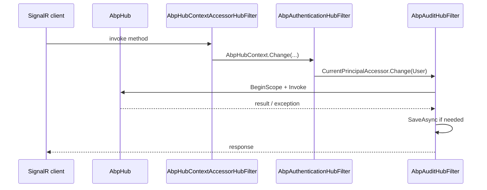

`Volo.Abp.AspNetCore.SignalR` extends ASP.NET Core SignalR with three main
ideas: a base `AbpHub` class that mirrors the controller bases, an
auto-discovery + auto-mapping mechanism so every hub gets a sensible
route, and `IHubFilter` implementations that propagate the principal,
audit scope and unit of work into hub invocations. The package lives at
`framework/src/Volo.Abp.AspNetCore.SignalR/` and depends on
`AbpAspNetCoreModule`.

## File inventory

| File | Role |
| --- | --- |
| `AbpAspNetCoreSignalRModule.cs` | Registers SignalR + hub filters, auto-maps hub endpoints |
| `AbpHub.cs` | Base class for hubs (typed and untyped) with lazy services |
| `AbpHubContext.cs` + `IAbpHubContextAccessor.cs` + `DefaultAbpHubContextAccessor.cs` | Ambient `Hub` / `MethodInfo` / arguments inside the invocation |
| `AbpHubContextAccessorHubFilter.cs` | Filter that fills the accessor for every invocation |
| `AbpSignalRConventionalRegistrar.cs` | Registers hub classes with ABP DI |
| `AbpSignalROptions.cs` + `HubConfig.cs` + `HubConfigList.cs` | The options surface: `Hubs` list, per-hub `RoutePattern` |
| `HubRouteAttribute.cs` | Class-level attribute overriding the auto-generated route |
| `DisableAutoHubMapAttribute.cs` | Opt a hub out of auto-mapping |
| `AbpSignalRUserIdProvider.cs` | Maps SignalR's `IUserIdProvider` onto `ICurrentUser.Id` |
| `Authentication/AbpAuthenticationHubFilter.cs` | Pushes `connection.User` into `ICurrentPrincipalAccessor` |
| `Auditing/AbpAuditHubFilter.cs` | Starts an audit scope per hub invocation |
| `Auditing/AspNetCoreSignalRAuditLogContributor.cs` | Adds SignalR metadata to the audit log |

## Module wiring

The module registers SignalR with three filters &mdash; for hub context,
authentication, and auditing &mdash; and merges discovered hubs into
`AbpSignalROptions.Hubs`:

```csharp title="framework/src/Volo.Abp.AspNetCore.SignalR/Volo/Abp/AspNetCore/SignalR/AbpAspNetCoreSignalRModule.cs"
[DependsOn(typeof(AbpAspNetCoreModule))]
public class AbpAspNetCoreSignalRModule : AbpModule
{
    public override void PreConfigureServices(ServiceConfigurationContext context)
    {
        context.Services.AddConventionalRegistrar(new AbpSignalRConventionalRegistrar());
        AutoAddHubTypes(context.Services);
    }

    public override void ConfigureServices(ServiceConfigurationContext context)
    {
        var routePatterns = new List<string> { "/signalr-hubs" };
        var signalRServerBuilder = context.Services.AddSignalR(options =>
        {
            options.DisableImplicitFromServicesParameters = true;
            options.AddFilter<AbpHubContextAccessorHubFilter>();
            options.AddFilter<AbpAuthenticationHubFilter>();
            options.AddFilter<AbpAuditHubFilter>();
        });

        context.Services.ExecutePreConfiguredActions(signalRServerBuilder);

        Configure<AbpEndpointRouterOptions>(options =>
        {
            options.EndpointConfigureActions.Add(endpointContext =>
            {
                var signalROptions = endpointContext
                    .ScopeServiceProvider
                    .GetRequiredService<IOptions<AbpSignalROptions>>()
                    .Value;

                foreach (var hubConfig in signalROptions.Hubs)
                {
                    routePatterns.AddIfNotContains(hubConfig.RoutePattern);

                    MapHubType(hubConfig.HubType, endpointContext.Endpoints, hubConfig.RoutePattern,
                        opts =>
                        {
                            foreach (var configureAction in hubConfig.ConfigureActions)
                            {
                                configureAction(opts);
                            }
                        });
                }
            });
        });

        Configure<AbpAspNetCoreAuditingOptions>(options =>
        {
            foreach (var routePattern in routePatterns)
            {
                options.IgnoredUrls.AddIfNotContains(x => routePattern.StartsWith(x, StringComparison.OrdinalIgnoreCase), () => routePattern);
            }
        });

        Configure<AbpAuditingOptions>(options =>
        {
            options.Contributors.Add(new AspNetCoreSignalRAuditLogContributor());
        });
    }
}
```

A few important details:

- `options.DisableImplicitFromServicesParameters = true` prevents SignalR
  from trying to model-bind hub method parameters from DI &mdash; ABP wants
  explicit injection.
- The three `AddFilter<...>` calls register hub filters globally.
- Hubs are picked up by walking the ABP `IOnServiceRegistredContext`
  pipeline:

```csharp title="AbpAspNetCoreSignalRModule.AutoAddHubTypes"
services.OnRegistered(context =>
{
    if (IsHubClass(context) && !IsDisabledForAutoMap(context))
    {
        hubTypes.Add(context.ImplementationType);
    }
});

services.Configure<AbpSignalROptions>(options =>
{
    foreach (var hubType in hubTypes)
    {
        options.Hubs.Add(HubConfig.Create(hubType));
    }
});
```

`AbpSignalRConventionalRegistrar` registers every concrete `Hub`
descendant with ABP's DI so the lazy property injection on `AbpHub` works.
`DisableAutoHubMapAttribute` lets you exclude a class from this scan
without removing it from DI.

## Auto-routing

`HubConfig.Create` resolves the route pattern through
`HubRouteAttribute.GetRoutePattern`. When no attribute is present, the
default convention is `/signalr-hubs/{kebab-case-hub-name-without-Hub}`:

```csharp title="framework/src/Volo.Abp.AspNetCore.SignalR/Volo/Abp/AspNetCore/SignalR/HubRouteAttribute.cs"
public static string GetRoutePattern(Type hubType)
{
    var routeAttribute = hubType.GetSingleAttributeOrNull<HubRouteAttribute>();
    if (routeAttribute != null)
    {
        return routeAttribute.GetRoutePatternForType(hubType);
    }

    return "/signalr-hubs/" + hubType.Name.RemovePostFix("Hub").ToKebabCase();
}
```

Examples:

| Hub class | Auto route |
| --- | --- |
| `NotificationHub` | `/signalr-hubs/notification` |
| `OrderProgressHub` | `/signalr-hubs/order-progress` |
| `[HubRoute("/chat")] ChatHub` | `/chat` |

Every collected route is also added to
`AbpAspNetCoreAuditingOptions.IgnoredUrls` so the regular HTTP audit
middleware does not duplicate audit entries for the SignalR negotiation
calls &mdash; auditing is performed by `AbpAuditHubFilter` instead.

## AbpHub: lazy services for hubs

`AbpHub` exposes the same lazy helpers you have on `AbpController` /
`AbpControllerBase`, scoped down to what hubs actually need:

```csharp title="framework/src/Volo.Abp.AspNetCore.SignalR/Volo/Abp/AspNetCore/SignalR/AbpHub.cs"
public abstract class AbpHub : Hub
{
    public IAbpLazyServiceProvider LazyServiceProvider { get; set; } = default!;

    [Obsolete("Use LazyServiceProvider instead.")]
    public IServiceProvider ServiceProvider { get; set; } = default!;

    protected ILoggerFactory? LoggerFactory => LazyServiceProvider.LazyGetService<ILoggerFactory>();
    protected ILogger Logger => LazyServiceProvider.LazyGetService<ILogger>(provider =>
        LoggerFactory?.CreateLogger(GetType().FullName!) ?? NullLogger.Instance);

    protected ICurrentUser CurrentUser => LazyServiceProvider.LazyGetService<ICurrentUser>()!;
    protected ICurrentTenant CurrentTenant => LazyServiceProvider.LazyGetService<ICurrentTenant>()!;
    protected IAuthorizationService AuthorizationService => LazyServiceProvider.LazyGetService<IAuthorizationService>()!;
    protected IClock Clock => LazyServiceProvider.LazyGetService<IClock>()!;
    protected IStringLocalizerFactory StringLocalizerFactory => LazyServiceProvider.LazyGetService<IStringLocalizerFactory>()!;

    // L localizer with LocalizationResource (same shape as AbpController)
}
```

A typed variant (`AbpHub<T>`) mirrors `Hub<T>` for strongly-typed
clients. Both inherit `ISingletonDependency`-free behaviour because hubs
are registered as transient services per connection.

A typical hub:

```csharp
[Authorize]
public class NotificationHub : AbpHub
{
    public Task NotifyAsync(string message)
    {
        Logger.LogInformation("{User} broadcast: {Message}", CurrentUser.Id, message);

        return Clients.All.SendAsync("notify",
            new { TenantId = CurrentTenant.Id, Message = message, At = Clock.Now });
    }
}
```

The auto route would be `/signalr-hubs/notification`, and the
authentication filter ensures `CurrentUser`/`CurrentTenant` reflect the
caller for the duration of the invocation.

## Hub filters

### AbpHubContextAccessorHubFilter

Sets the ambient `AbpHubContext` so downstream services can inspect the
in-flight hub invocation:

```csharp title="AbpHubContextAccessorHubFilter.cs"
public virtual async ValueTask<object?> InvokeMethodAsync(HubInvocationContext invocationContext, Func<HubInvocationContext, ValueTask<object?>> next)
{
    var hubContextAccessor = invocationContext.ServiceProvider.GetRequiredService<IAbpHubContextAccessor>();
    using (hubContextAccessor.Change(new AbpHubContext(
               invocationContext.ServiceProvider,
               invocationContext.Hub,
               invocationContext.HubMethod,
               invocationContext.HubMethodArguments)))
    {
        return await next(invocationContext);
    }
}
```

`AbpHubContext` carries the `Hub` instance, `MethodInfo`, and the
arguments array, which is what audit logging and tenant resolution can
introspect.

### AbpAuthenticationHubFilter

Lifts `connection.User` into `ICurrentPrincipalAccessor` for every
invocation, connect and disconnect callback:

```csharp title="Authentication/AbpAuthenticationHubFilter.cs"
public virtual async ValueTask<object?> InvokeMethodAsync(HubInvocationContext invocationContext, Func<HubInvocationContext, ValueTask<object?>> next)
{
    var currentPrincipalAccessor = invocationContext.ServiceProvider.GetRequiredService<ICurrentPrincipalAccessor>();
    using (currentPrincipalAccessor.Change(invocationContext.Context.User!))
    {
        return await next(invocationContext);
    }
}
```

This is what makes `CurrentUser.Id` work inside a hub method &mdash; the
ABP runtime reads from the principal accessor, not from
`HttpContext.User`. Connect/disconnect get the same treatment so audit
contributors can log the right principal.

### AbpAuditHubFilter

Opens an audit scope around each invocation, flushes the ambient unit of
work, and writes the audit log when appropriate:

```csharp title="Auditing/AbpAuditHubFilter.cs (excerpt)"
using (var saveHandle = auditingManager.BeginScope())
{
    object? result;
    try
    {
        result = await next(invocationContext);
        if (auditingManager.Current.Log.Exceptions.Any()) { hasError = true; }
    }
    catch (Exception ex)
    {
        hasError = true;
        if (!auditingManager.Current.Log.Exceptions.Contains(ex))
        {
            auditingManager.Current.Log.Exceptions.Add(ex);
        }
        throw;
    }
    finally
    {
        if (await ShouldWriteAuditLogAsync(auditingManager.Current.Log, invocationContext.ServiceProvider, hasError))
        {
            var unitOfWorkManager = invocationContext.ServiceProvider.GetRequiredService<IUnitOfWorkManager>();
            if (unitOfWorkManager.Current != null)
            {
                try { await unitOfWorkManager.Current.SaveChangesAsync(); }
                catch (Exception ex) { /* recorded */ }
            }

            await saveHandle.SaveAsync();
        }
    }
}
```

The result is that a successful hub method behaves like an MVC action with
audit and UoW filters &mdash; without you having to wire anything per hub.

## IUserIdProvider

`AbpSignalRUserIdProvider` maps SignalR's group-targeting concept onto the
ABP current user. It rewrites the principal accessor with the connection
user so `ICurrentUser.Id` returns the correct id:

```csharp title="AbpSignalRUserIdProvider.cs"
public virtual string? GetUserId(HubConnectionContext connection)
{
    using (_currentPrincipalAccessor.Change(connection.User))
    {
        return _currentUser.Id?.ToString();
    }
}
```

This makes `IHubContext<TodoHub>.Clients.User(userId)` honour the ABP
identity claim chain.

## AbpSignalROptions

The options class is intentionally small &mdash; ABP does not need a hub
options surface; SignalR already has one. What `AbpSignalROptions`
exposes is the list of hubs ABP will map at startup, plus the route
pattern and connection-dispatcher configuration for each:

```csharp title="framework/src/Volo.Abp.AspNetCore.SignalR/Volo/Abp/AspNetCore/SignalR/AbpSignalROptions.cs"
public class AbpSignalROptions
{
    public HubConfigList Hubs { get; }

    public AbpSignalROptions()
    {
        Hubs = new HubConfigList();
    }
}
```

Each `HubConfig`:

```csharp title="framework/src/Volo.Abp.AspNetCore.SignalR/Volo/Abp/AspNetCore/SignalR/HubConfig.cs"
public class HubConfig
{
    public Type HubType { get; }
    public string RoutePattern { get; set; }
    public List<Action<HttpConnectionDispatcherOptions>> ConfigureActions { get; set; }

    public static HubConfig Create<THub>() where THub : Hub => Create(typeof(THub));

    public static HubConfig Create(Type hubType)
    {
        return new HubConfig(hubType, HubRouteAttribute.GetRoutePattern(hubType));
    }
}
```

A module can override the route or push connection-dispatcher options:

```csharp
Configure<AbpSignalROptions>(options =>
{
    var chat = options.Hubs.FirstOrDefault(h => h.HubType == typeof(ChatHub));
    if (chat != null)
    {
        chat.RoutePattern = "/realtime/chat";
        chat.ConfigureActions.Add(opts =>
        {
            opts.ApplicationMaxBufferSize = 1024 * 64;
        });
    }
});
```

## End-to-end picture



## Related cross-cutting

<CardGroup cols={2}>
  <Card title="Authentication" href="/auth" icon="key">
    `AbpAuthenticationHubFilter` reads the principal that ASP.NET Core's authentication produced.
  </Card>
  <Card title="Authorization" href="/authz" icon="shield-check">
    `[Authorize]` and `AuthorizationService` on hubs work because the principal is propagated.
  </Card>
  <Card title="Multi-tenancy" href="/multitenancy" icon="building">
    `CurrentTenant` inside hub methods resolves from the same principal claims.
  </Card>
  <Card title="Auditing" href="/auditing" icon="clipboard-list">
    `AbpAuditHubFilter` + `AspNetCoreSignalRAuditLogContributor` are the SignalR side of audit logging.
  </Card>
</CardGroup>
