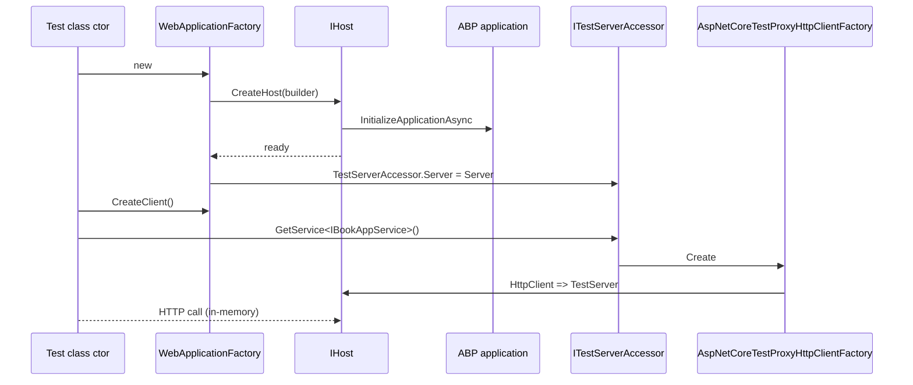

`Volo.Abp.AspNetCore.TestBase` provides the plumbing that lets an ABP
integration test spin up a real ASP.NET Core host backed by
`Microsoft.AspNetCore.TestHost.TestServer`, run the full module lifecycle,
and route ABP's own dynamic HTTP clients through that in-memory server. It
lives at `framework/src/Volo.Abp.AspNetCore.TestBase/` and depends on
`AbpAspNetCoreModule`, `AbpHttpClientModule`, `AbpAutofacModule`, and
`AbpTestBaseModule`.

## File inventory

| File | Role |
| --- | --- |
| `AbpAspNetCoreTestBaseModule.cs` | Module declaration pulling in HTTP client + Autofac + test base |
| `AbpAspNetCoreIntegratedTestBase.cs` | Generic `[Obsolete]` base that boots a host with an `IAbpModule` or Startup class |
| `AbpAspNetCoreAsyncIntegratedTestBase.cs` | Async equivalent built on `WebApplication`/`WebApplication.CreateBuilder()` |
| `AbpWebApplicationFactoryIntegratedTest.cs` | Recommended base built on `WebApplicationFactory<TProgram>` |
| `TestStartup.cs` | Internal startup class that bridges legacy startup tests to `AbpModule` |
| `WebHostBuilderExtensions.cs` | `UseAbpTestServer` for classic `IWebHostBuilder` tests |
| `WebApplicationBuilderExtensions.cs` | Equivalent helper for minimal-hosting model |
| `AbpNoopHostLifetime.cs` / `TestNoopHostLifetime.cs` | No-op host lifetimes that prevent the test process from blocking on Ctrl-C |
| `ITestServerAccessor.cs` + `TestServerAccessor.cs` | Singleton holding the active `TestServer` so dynamic proxies can find it |
| `DynamicProxying/AspNetCoreTestProxyHttpClientFactory.cs` | Replaces `IProxyHttpClientFactory` so ABP HTTP clients hit `TestServer` |

## Module

The module is a one-liner of `[DependsOn]` declarations:

```csharp title="framework/src/Volo.Abp.AspNetCore.TestBase/Volo/Abp/AspNetCore/TestBase/AbpAspNetCoreTestBaseModule.cs"
[DependsOn(typeof(AbpHttpClientModule))]
[DependsOn(typeof(AbpAspNetCoreModule))]
[DependsOn(typeof(AbpTestBaseModule))]
[DependsOn(typeof(AbpAutofacModule))]
public class AbpAspNetCoreTestBaseModule : AbpModule
{
}
```

Autofac is included because ABP's property-injection conventions rely on
the Autofac container; tests that need module-scoped registrations get the
same DI behaviour as a production host.

## Picking a base class

| Scenario | Use |
| --- | --- |
| New tests against an ABP module | `AbpWebApplicationFactoryIntegratedTest<TProgram>` |
| Async-init tests against an `IAbpModule` (no `Program` class) | `AbpAspNetCoreAsyncIntegratedTestBase<TModule>` |
| Legacy tests that must keep their existing harness | `AbpAspNetCoreIntegratedTestBase<TStartupModule>` (obsolete) |

The remainder of this page walks each option.

## AbpWebApplicationFactoryIntegratedTest&lt;TProgram&gt;

The recommended base class subclasses `WebApplicationFactory<TProgram>` so
it benefits from the official testing patterns (overrideable `CreateHost`,
`Services`, `Server`, cookie-aware `HttpClient`):

```csharp title="framework/src/Volo.Abp.AspNetCore.TestBase/Volo/Abp/AspNetCore/TestBase/AbpWebApplicationFactoryIntegratedTest.cs"
public abstract class AbpWebApplicationFactoryIntegratedTest<TProgram> : WebApplicationFactory<TProgram>
    where TProgram : class
{
    protected HttpClient Client { get; set; }

    protected IServiceProvider ServiceProvider => Services;

    protected AbpWebApplicationFactoryIntegratedTest()
    {
        Client = CreateClient(new WebApplicationFactoryClientOptions
        {
            AllowAutoRedirect = false
        });
        ServiceProvider.GetRequiredService<ITestServerAccessor>().Server = Server;
    }

    protected override IHost CreateHost(IHostBuilder builder)
    {
        builder
            .AddAppSettingsSecretsJson()
            .ConfigureServices(ConfigureServices);
        return base.CreateHost(builder);
    }
}
```

The constructor stores the live `TestServer` on `ITestServerAccessor` so
the dynamic HTTP client subsystem can find it (see below). It also
publishes a ready-to-use `HttpClient` with redirect handling disabled, so
tests can assert on 302 responses.

`GetUrl<TController>()` and overloads strip common service suffixes from
the controller name and append optional action / query string fragments,
matching the routes that auto-API produces:

```csharp title="AbpWebApplicationFactoryIntegratedTest.cs"
protected virtual string GetUrl<TController>()
{
    return "/" + typeof(TController).Name
        .RemovePostFix("Controller", "AppService", "ApplicationService",
                       "IntService", "IntegrationService", "Service");
}

protected virtual string GetUrl<TController>(string actionName, object queryStringParamsAsAnonymousObject)
{
    var url = GetUrl<TController>(actionName);
    var dictionary = new RouteValueDictionary(queryStringParamsAsAnonymousObject);
    if (dictionary.Any())
    {
        url += "?" + dictionary.Select(d => $"{d.Key}={d.Value}").JoinAsString("&");
    }
    return url;
}
```

A test usually looks like:

```csharp
public class BookControllerTests : AbpWebApplicationFactoryIntegratedTest<Program>
{
    [Fact]
    public async Task Should_Get_Book_List()
    {
        var response = await Client.GetAsync(GetUrl<BookAppService>());
        response.EnsureSuccessStatusCode();
    }

    protected override void ConfigureServices(IServiceCollection services)
    {
        services.Replace(ServiceDescriptor.Singleton<IClock, MockClock>());
    }
}
```

## AbpAspNetCoreAsyncIntegratedTestBase&lt;TModule&gt;

Use this base when you want to write a test that does not have a public
`Program` class (e.g. testing an `AbpModule` directly). It builds a
`WebApplication`, registers the test server, and initializes the ABP
application asynchronously:

```csharp title="framework/src/Volo.Abp.AspNetCore.TestBase/Volo/Abp/AspNetCore/TestBase/AbpAspNetCoreAsyncIntegratedTestBase.cs"
public virtual async Task InitializeAsync()
{
    var builder = WebApplication.CreateBuilder();
    builder.Host.ConfigureServices(services =>
        {
            services.AddSingleton<IHostLifetime, TestNoopHostLifetime>();
            services.AddSingleton<IServer, TestServer>();
        })
        .UseAutofac();

    await builder.Services.AddApplicationAsync<TModule>(options =>
    {
        options.Services.ReplaceConfiguration(builder.Configuration);
    });

    await ConfigureServicesAsync(builder.Services);
    WebApplication = builder.Build();
    await WebApplication.InitializeApplicationAsync();
    await WebApplication.StartAsync();

    Server = WebApplication.Services.GetRequiredService<IHost>().GetTestServer();
    Client = Server.CreateClient();

    ServiceProvider = Server.Services;
    ServiceProvider.GetRequiredService<ITestServerAccessor>().Server = Server;
}
```

`TestNoopHostLifetime` keeps `IHostLifetime.WaitForStartAsync` from
attaching real Ctrl-C handlers, which would otherwise block the test
runner. `UseAutofac()` is required so ABP's property injection works on
controllers and hubs.

## AbpAspNetCoreIntegratedTestBase&lt;TStartupModule&gt; (legacy)

The original base class predates `WebApplicationFactory`. It is still
present but marked `[Obsolete("Use AbpWebApplicationFactoryIntegratedTest instead.")]`:

```csharp title="framework/src/Volo.Abp.AspNetCore.TestBase/Volo/Abp/AspNetCore/TestBase/AbpAspNetCoreIntegratedTestBase.cs"
protected virtual IHostBuilder CreateHostBuilder()
{
    return Host.CreateDefaultBuilder()
        .AddAppSettingsSecretsJson()
        .ConfigureWebHostDefaults(webBuilder =>
        {
            if (typeof(TStartupModule).IsAssignableTo<IAbpModule>())
            {
                webBuilder.UseStartup<TestStartup<TStartupModule>>();
            }
            else
            {
                webBuilder.UseStartup<TStartupModule>();
            }

            webBuilder.UseAbpTestServer();
        })
        .UseAutofac()
        .ConfigureServices(ConfigureServices);
}
```

It chooses between calling the legacy `Startup` class and an internal
`TestStartup<T>` that defers to ABP's `AddApplicationAsync`/`InitializeApplicationAsync`:

```csharp title="framework/src/Volo.Abp.AspNetCore.TestBase/Volo/Abp/AspNetCore/TestBase/TestStartup.cs"
internal class TestStartup<TStartupModule>
{
    public void ConfigureServices(IServiceCollection services)
    {
        AsyncHelper.RunSync(() => services.AddApplicationAsync(typeof(TStartupModule)));
    }

    public void Configure(IApplicationBuilder app)
    {
        AsyncHelper.RunSync(app.InitializeApplicationAsync);
    }
}
```

## UseAbpTestServer

The classic web-host extension swaps in a `TestServer` and the
`AbpNoopHostLifetime`:

```csharp title="framework/src/Volo.Abp.AspNetCore.TestBase/Volo/Abp/AspNetCore/TestBase/WebHostBuilderExtensions.cs"
public static IWebHostBuilder UseAbpTestServer(this IWebHostBuilder builder)
{
    return builder.ConfigureServices(services =>
    {
        services.AddScoped<IHostLifetime, AbpNoopHostLifetime>();
        services.AddScoped<IServer, TestServer>();
    });
}
```

There is a matching helper in `WebApplicationBuilderExtensions` for the
minimal-hosting flow.

## Sharing the test server with dynamic HTTP clients

The single most useful piece of plumbing in the test base is the
`AspNetCoreTestProxyHttpClientFactory`. It replaces the production
`IProxyHttpClientFactory` so any ABP dynamic-proxy HTTP client &mdash;
including the ones created from `IRemoteService` interfaces &mdash; hits
the in-memory `TestServer` instead of a real network endpoint:

```csharp title="framework/src/Volo.Abp.AspNetCore.TestBase/Volo/Abp/AspNetCore/TestBase/DynamicProxying/AspNetCoreTestProxyHttpClientFactory.cs"
[Dependency(ReplaceServices = true)]
public class AspNetCoreTestProxyHttpClientFactory : IProxyHttpClientFactory, ITransientDependency
{
    private readonly ITestServerAccessor _testServerAccessor;

    public AspNetCoreTestProxyHttpClientFactory(ITestServerAccessor testServerAccessor)
    {
        _testServerAccessor = testServerAccessor;
    }

    public HttpClient Create()       => _testServerAccessor.Server.CreateClient();
    public HttpClient Create(string name) => Create();
}
```

`ITestServerAccessor` is a singleton populated by the constructor of
`AbpWebApplicationFactoryIntegratedTest` and by `InitializeAsync` on the
async base class. As soon as you resolve a typed HTTP client in a test,
that client transparently calls your in-process controllers &mdash; without
opening a TCP socket.

## Lifecycle



## Common patterns

- **Mocking dependencies**: override `ConfigureServices` and call
  `services.Replace(...)` to swap in fakes for clocks, GUID generators,
  email senders, etc.
- **Switching tenant context**: inject `ICurrentTenant` (via
  `ServiceProvider`) and use `using (currentTenant.Change(tenantId)) { … }`
  in tests &mdash; same as in production code.
- **Authenticated requests**: write a custom `AuthenticationHandler` and
  register it in `ConfigureServices`, or wrap calls with a delegating
  handler that adds the bearer token.
- **Endpoint discovery**: call `GetUrl<TAppService>()` so tests stay in
  sync with conventional routing &mdash; see
  [API conventions](/web/api-conventions).

## Related cross-cutting

<CardGroup cols={2}>
  <Card title="Authentication" href="/auth" icon="key">
    Tests inject custom authentication schemes the same way a production module would.
  </Card>
  <Card title="Authorization" href="/authz" icon="shield-check">
    `IAuthorizationService` resolves through DI; replace it for permission-bypass tests.
  </Card>
  <Card title="Multi-tenancy" href="/multitenancy" icon="building">
    `ICurrentTenant.Change(...)` works inside `TestServer` calls as expected.
  </Card>
  <Card title="Auditing" href="/auditing" icon="clipboard-list">
    Test runs go through the same audit middleware; swap `IAuditingStore` to assert on writes.
  </Card>
</CardGroup>
